# Monorepo 工程结构

<cite>
**本文引用的文件**   
- [pnpm-workspace.yaml](file://pnpm-workspace.yaml)
- [package.json](file://package.json)
- [tsconfig.json](file://tsconfig.json)
- [docs/package.json](file://docs/package.json)
- [play/package.json](file://play/package.json)
- [packages/sh-design/package.json](file://packages/sh-design/package.json)
- [docs/.vitepress/config.ts](file://docs/.vitepress/config.ts)
- [play/vite.config.ts](file://play/vite.config.ts)
</cite>

## 目录
1. [简介](#简介)
2. [项目结构总览](#项目结构总览)
3. [三大子项目职责](#三大子项目职责)
4. [依赖关系与 workspace:* 链接方式](#依赖关系与-workspace-链接方式)
5. [开发期路径映射机制](#开发期路径映射机制)
6. [构建产物与发布约定](#构建产物与发布约定)
7. [工作区脚本与命令入口](#工作区脚本与命令入口)
8. [常见问题排查](#常见问题排查)
9. [结论](#结论)

## 简介
本仓库是一个基于 pnpm workspace 的 monorepo，包含三个核心子项目：

| 子项目 | 包名或路径 | 主要职责 |
|---|---|---|
| 组件库 | `packages/sh-design` | 面向业务场景的 Vue 3 组件库源码、样式与构建配置 |
| 文档站 | `docs` | 基于 VitePress 的站点，用于展示组件用法、指南和外部工具说明 |
| 调试场 | `play` | 基于 Vite + Vue 的最小可运行示例应用，用于本地快速验证组件行为 |

根工作区通过 `pnpm-workspace.yaml` 声明这三个子项目，并通过 `workspace:*` 让文档站和调试场直接引用组件库源码，而不是 npm 上已发布的版本。

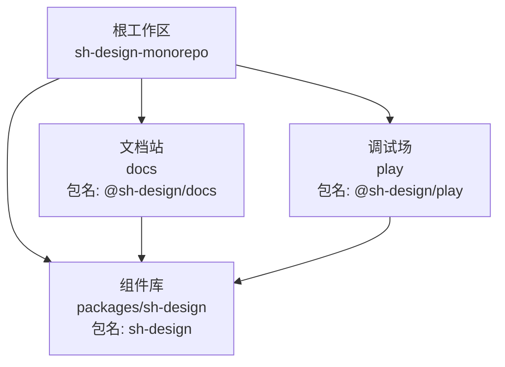

**图表来源**
- [pnpm-workspace.yaml:1-16](file://pnpm-workspace.yaml#L1-L16)
- [package.json:1-47](file://package.json#L1-L47)
- [docs/package.json:1-18](file://docs/package.json#L1-L18)
- [play/package.json:1-19](file://play/package.json#L1-L19)
- [packages/sh-design/package.json:1-62](file://packages/sh-design/package.json#L1-L62)

**章节来源**
- [pnpm-workspace.yaml:1-16](file://pnpm-workspace.yaml#L1-L16)
- [package.json:1-47](file://package.json#L1-L47)

## 项目结构总览
仓库采用按功能域划分的 monorepo 布局：

| 路径 | 角色 | 关键说明 |
|---|---|---|
| `packages/sh-design/` | 组件库源码 | 包含组件实现、样式变量、构建配置、导出入口和发布元数据 |
| `docs/` | 文档站 | VitePress 站点，导航、侧边栏、SEO 配置以及各主题页面 |
| `play/` | 调试场 | Vite + Vue 最小应用，提供复现用例和交互预览 |
| `scripts/` | 仓库级脚本 | 例如校验组件导出等辅助脚本 |
| `pnpm-workspace.yaml` | Workspace 定义 | 声明参与工作区的包，并配置 pnpm v11 构建白名单 |
| `tsconfig.json` | 根 TypeScript 配置 | 统一编译目标、模块解析方式，并把 `sh-design` 映射到组件库源码 |

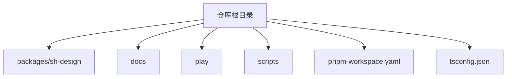

**图表来源**
- [pnpm-workspace.yaml:1-16](file://pnpm-workspace.yaml#L1-L16)
- [tsconfig.json:1-34](file://tsconfig.json#L1-L34)

**章节来源**
- [pnpm-workspace.yaml:1-16](file://pnpm-workspace.yaml#L1-L16)
- [tsconfig.json:1-34](file://tsconfig.json#L1-L34)

## 三大子项目职责

### 组件库：`packages/sh-design`
这是整个 monorepo 的核心产品。它对外暴露一个名为 `sh-design` 的 npm 包，内部组织多个业务组件，包括懒加载图片、无缝滚动、骨架屏、瀑布流等。其职责包括：

- 提供组件源码与类型定义；
- 提供全局样式与 CSS 变量驱动的主题系统；
- 使用 Vite library 模式输出 ESM、CJS 和逐文件 `.d.ts`；
- 通过 `exports` 字段分别暴露默认入口、样式入口和 `package.json`；
- 将 `vue` 声明为 peerDependency，要求消费方自行安装对应版本的 Vue；
- 通过 `publishConfig` 强制指向官方 npm 源并发布公开包。

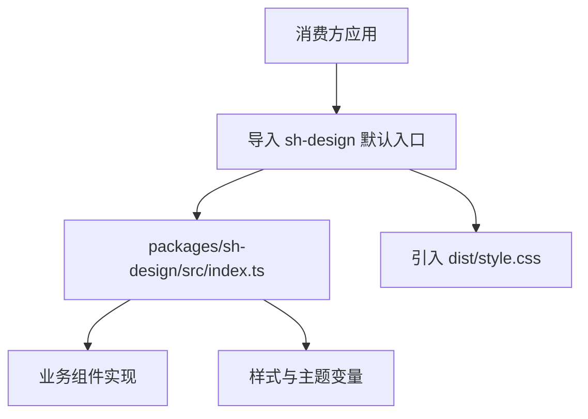

**图表来源**
- [packages/sh-design/package.json:1-62](file://packages/sh-design/package.json#L1-L62)

**章节来源**
- [packages/sh-design/package.json:1-62](file://packages/sh-design/package.json#L1-L62)

### 文档站：`docs`
`docs` 是面向用户的站点，基于 VitePress 构建。它的职责不是实现业务组件，而是：

- 编写组件介绍、安装指南、快速上手等文档；
- 在 Markdown 中直接使用组件做实时演示；
- 维护站点导航、侧边栏、SEO、Open Graph、sitemap 等站点配置；
- 在开发模式下直接引用组件库源码，避免每次修改组件都要先发布；
- 读取组件库 `package.json` 中的版本号，使导航栏显示当前发布版本。

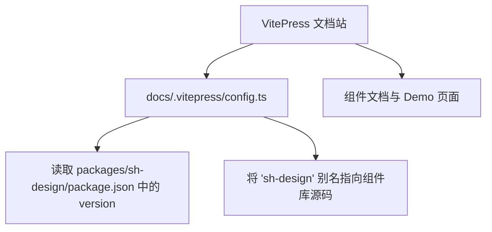

**图表来源**
- [docs/.vitepress/config.ts:1-179](file://docs/.vitepress/config.ts#L1-L179)
- [docs/package.json:1-18](file://docs/package.json#L1-L18)

**章节来源**
- [docs/package.json:1-18](file://docs/package.json#L1-L18)
- [docs/.vitepress/config.ts:1-179](file://docs/.vitepress/config.ts#L1-L179)

### 调试场：`play`
`play` 是一个轻量级的 Vite + Vue 应用，主要用于：

- 快速验证单个组件的行为；
- 复现 bug 或测试边界条件；
- 在组件改动后不进入完整文档站也能快速看到效果；
- 通过 alias 把 `sh-design` 精确指向组件库源码。

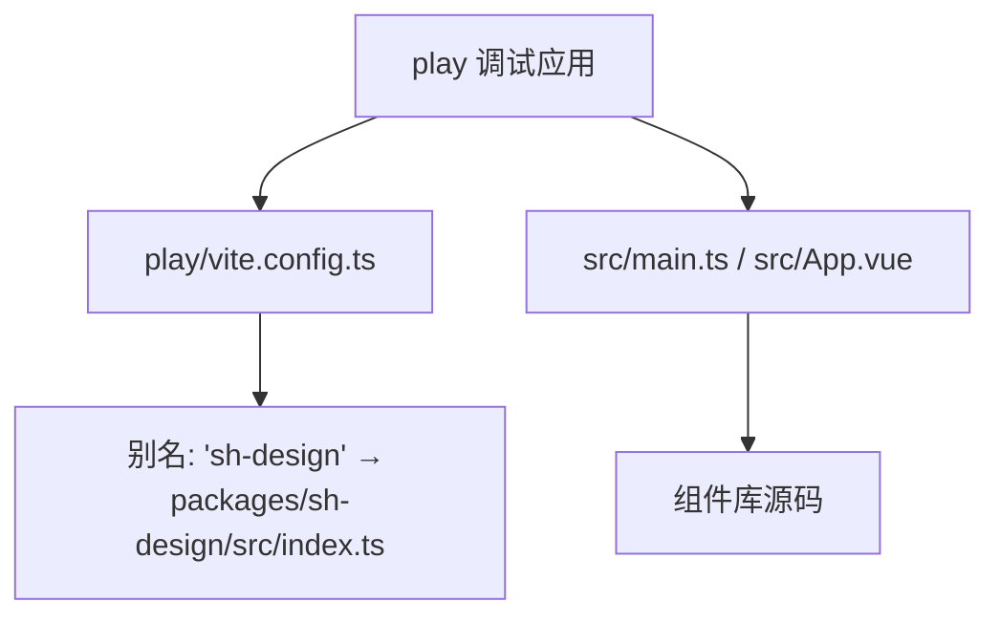

**图表来源**
- [play/vite.config.ts:1-15](file://play/vite.config.ts#L1-L15)
- [play/package.json:1-19](file://play/package.json#L1-L19)

**章节来源**
- [play/package.json:1-19](file://play/package.json#L1-L19)
- [play/vite.config.ts:1-15](file://play/vite.config.ts#L1-L15)

## 依赖关系与 workspace:* 链接方式

### Workspace 成员
根工作区通过 `pnpm-workspace.yaml` 声明三类成员：

| 匹配规则 | 含义 |
|---|---|
| `packages/*` | 所有位于 `packages/` 下的子包，目前主要是 `packages/sh-design` |
| `docs` | 文档站 |
| `play` | 调试场 |

此外，`allowBuilds` 为 pnpm v11 新增的构建脚本白名单，控制哪些依赖在安装时会执行 `postinstall` 或构建脚本。这里显式关闭 `esbuild` 的二进制安装脚本，因为二进制由可选依赖提供；同时允许 `vue-demi` 的安全纯 JS postinstall。

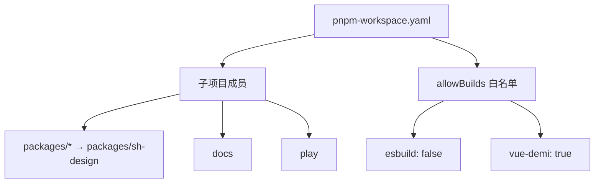

**图表来源**
- [pnpm-workspace.yaml:1-16](file://pnpm-workspace.yaml#L1-L16)

**章节来源**
- [pnpm-workspace.yaml:1-16](file://pnpm-workspace.yaml#L1-L16)

### 文档站对组件库的依赖
`docs/package.json` 中声明：

- 包名为 `@sh-design/docs`；
- 依赖 `sh-design: "workspace:*"`；
- 依赖 `sk-chart-duo: "^0.1.1"`；
- 开发依赖 `vitepress`。

这意味着文档站运行时使用的 `sh-design` 来自 workspace 内的组件库源码，而不是 npm 上的旧版本。

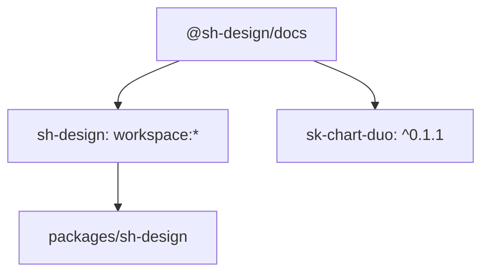

**图表来源**
- [docs/package.json:1-18](file://docs/package.json#L1-L18)
- [packages/sh-design/package.json:1-62](file://packages/sh-design/package.json#L1-L62)

**章节来源**
- [docs/package.json:1-18](file://docs/package.json#L1-L18)

### 调试场对组件库的依赖
`play/package.json` 中声明：

- 包名为 `@sh-design/play`；
- 依赖 `sh-design: "workspace:*"`；
- 依赖 `vue: "^3.5.13"`；
- 开发依赖 Vite 和 Vue 插件。

因此调试场可以直接运行 Vite dev server，并消费 workspace 内的组件库源码。

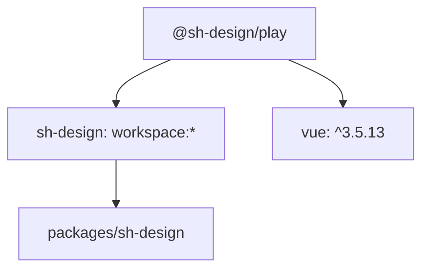

**图表来源**
- [play/package.json:1-19](file://play/package.json#L1-L19)
- [packages/sh-design/package.json:1-62](file://packages/sh-design/package.json#L1-L62)

**章节来源**
- [play/package.json:1-19](file://play/package.json#L1-L19)

### 整体依赖图
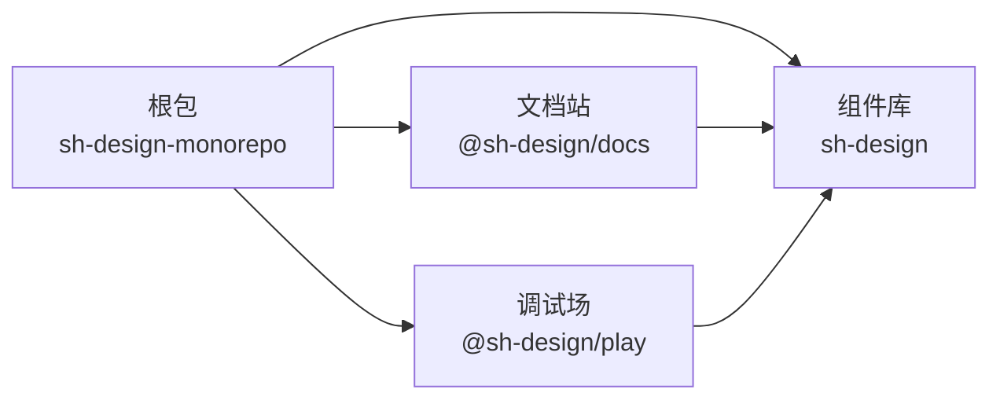

**图表来源**
- [package.json:1-47](file://package.json#L1-L47)
- [docs/package.json:1-18](file://docs/package.json#L1-L18)
- [play/package.json:1-19](file://play/package.json#L1-L19)
- [packages/sh-design/package.json:1-62](file://packages/sh-design/package.json#L1-L62)

## 开发期路径映射机制

Workspace 链接解决了“依赖哪个包”，而 alias 解决了“开发期用源码还是生产构建产物”。本项目在多处做了这个区分。

### 根 tsconfig.json 的类型映射
根 `tsconfig.json` 的 `paths` 把以下模块映射到组件库源码：

| 模块模式 | 映射目标 |
|---|---|
| `sh-design` | `packages/sh-design/src/index.ts` |
| `sh-design/*` | `packages/sh-design/src/*` |

这使 TypeScript 在类型检查和编辑器提示时直接定位源码，而不是 `node_modules` 中的构建产物。

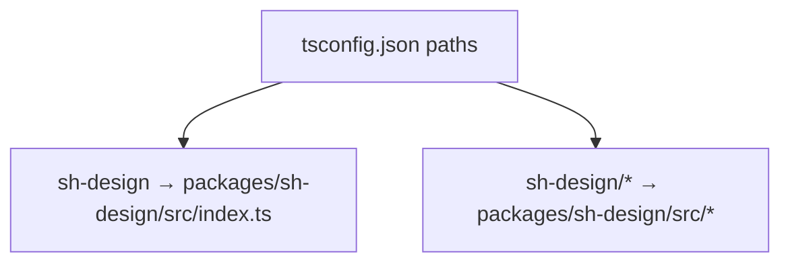

**图表来源**
- [tsconfig.json:1-34](file://tsconfig.json#L1-L34)

**章节来源**
- [tsconfig.json:1-34](file://tsconfig.json#L1-L34)

### 文档站的 VitePress alias
`docs/.vitepress/config.ts` 在 Vite 配置中将 `^sh-design$` 精确匹配到组件库源码入口。这样 VitePress 在 `dev`、`build`、`preview` 过程中都直接编译组件源码。

同时，该配置文件还：

- 从 `../../packages/sh-design/package.json` 读取版本号，注入站点导航；
- 支持通过环境变量启用本地图表库调试；
- 忽略 VitePress 构建输出目录，避免 Windows 下 watcher 崩溃。

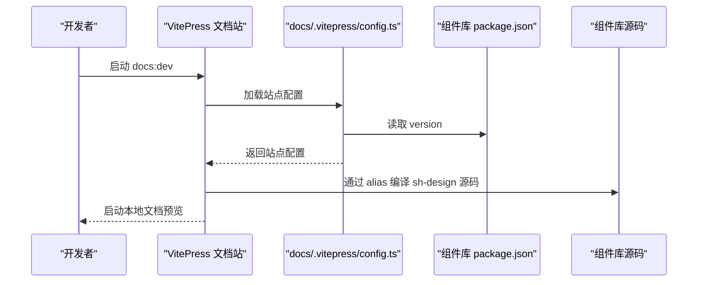

**图表来源**
- [docs/.vitepress/config.ts:1-179](file://docs/.vitepress/config.ts#L1-L179)
- [packages/sh-design/package.json:1-62](file://packages/sh-design/package.json#L1-L62)

**章节来源**
- [docs/.vitepress/config.ts:1-179](file://docs/.vitepress/config.ts#L1-L179)

### 调试场的 Vite alias
`play/vite.config.ts` 同样使用正则 `/^sh-design$/` 把 `sh-design` 精确映射到 `packages/sh-design/src/index.ts`。这使得 `pnpm --filter @sh-design/play dev` 启动的应用能直接消费组件源码。

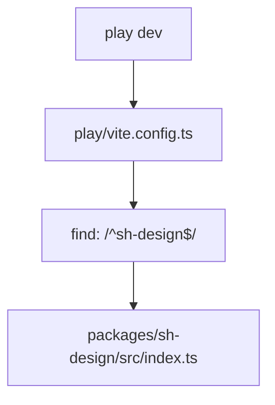

**图表来源**
- [play/vite.config.ts:1-15](file://play/vite.config.ts#L1-L15)

**章节来源**
- [play/vite.config.ts:1-15](file://play/vite.config.ts#L1-L15)

### 三种映射方式对比
| 位置 | 作用范围 | 用途 |
|---|---|---|
| `pnpm-workspace.yaml` | pnpm 依赖解析 | 声明工作区成员，让 `workspace:*` 生效 |
| `docs/package.json`、`play/package.json` | npm 依赖字段 | 声明消费方依赖 `sh-design`，且使用 workspace 内版本 |
| `tsconfig.json`、`docs/.vitepress/config.ts`、`play/vite.config.ts` | TypeScript 与 Vite 模块解析 | 开发期把 `sh-design` 指向源码，跳过已发布构建产物 |

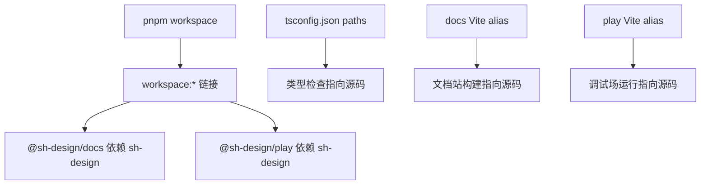

**图表来源**
- [pnpm-workspace.yaml:1-16](file://pnpm-workspace.yaml#L1-L16)
- [docs/package.json:1-18](file://docs/package.json#L1-L18)
- [play/package.json:1-19](file://play/package.json#L1-L19)
- [tsconfig.json:1-34](file://tsconfig.json#L1-L34)
- [docs/.vitepress/config.ts:1-179](file://docs/.vitepress/config.ts#L1-L179)
- [play/vite.config.ts:1-15](file://play/vite.config.ts#L1-L15)

## 构建产物与发布约定

### 组件库产物
`packages/sh-design/package.json` 定义了组件库的产物约定：

| 字段 | 值或含义 |
|---|---|
| `main` | `./dist/sh-design.cjs` |
| `module` | `./dist/sh-design.js` |
| `types` | `./dist/index.d.ts` |
| `exports["."]` | 同时暴露 types、import、require 入口 |
| `exports["./dist/style.css"]` | 样式单独暴露 |
| `exports["./style.css"]` | 兼容别名样式入口 |
| `sideEffects` | 包含 CSS，保证样式被正确 tree-shake 处理 |
| `peerDependencies.vue` | `^3.2.0` |
| `publishConfig.registry` | 强制使用 `https://registry.npmjs.org/` |
| `publishConfig.access` | `public` |

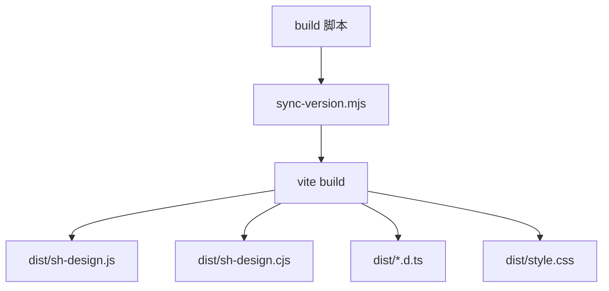

**图表来源**
- [packages/sh-design/package.json:1-62](file://packages/sh-design/package.json#L1-L62)

**章节来源**
- [packages/sh-design/package.json:1-62](file://packages/sh-design/package.json#L1-L62)

### 文档站与调试场不发布
`docs/package.json` 和 `play/package.json` 都是私有包（`private: true`），不会作为 npm 包发布。它们只服务于开发体验和本地构建。

**章节来源**
- [docs/package.json:1-18](file://docs/package.json#L1-L18)
- [play/package.json:1-19](file://play/package.json#L1-L19)

## 工作区脚本与命令入口

根 `package.json` 提供了统一的 workspace 命令入口，避免在子项目中重复书写复杂过滤逻辑：

| 脚本 | 实际执行 | 作用 |
|---|---|---|
| `dev` | `pnpm --filter @sh-design/play dev` | 启动调试场 |
| `play` | `pnpm --filter @sh-design/play dev` | 与 `dev` 等价，便于记忆 |
| `build` | `pnpm --filter sh-design build` | 构建组件库 |
| `docs:dev` | `pnpm --filter @sh-design/docs docs:dev` | 启动文档站开发服务器 |
| `docs:build` | `pnpm --filter @sh-design/docs docs:build` | 构建文档站 |
| `docs:preview` | `pnpm --filter @sh-design/docs docs:preview` | 预览文档站构建结果 |
| `typecheck` | `pnpm --filter sh-design typecheck` | 对组件库执行类型检查 |

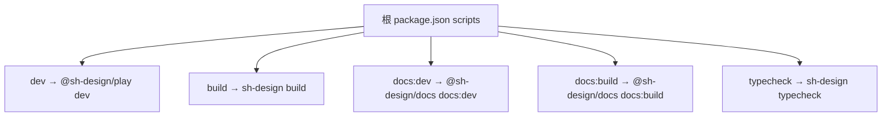

**图表来源**
- [package.json:1-47](file://package.json#L1-L47)

**章节来源**
- [package.json:1-47](file://package.json#L1-L47)

## 常见问题排查

### 问题一：文档站或调试场没有用到最新的组件源码
**现象**：修改了 `packages/sh-design` 后，`pnpm docs:dev` 或 `pnpm play` 仍看到旧行为。

**可能原因**：

1. 未正确安装 workspace 依赖；
2. Vite 缓存未清理；
3. 文档站启用了本地图表库调试环境变量，导致依赖预打包行为变化；
4. 构建阶段使用了 `node_modules` 中的已发布版本而非源码。

**处理建议**：

- 在工作区根目录重新执行依赖安装；
- 清理 VitePress 缓存目录；
- 确认 `docs/.vitepress/config.ts` 中 `sh-design` 的 alias 仍然指向 `packages/sh-design/src/index.ts`；
- 如果启用了本地图表调试，注意 `optimizeDeps.exclude` 的配置会影响依赖预打包行为。

**章节来源**
- [docs/.vitepress/config.ts:1-179](file://docs/.vitepress/config.ts#L1-L179)

### 问题二：TypeScript 找不到 `sh-design` 类型
**现象**：编辑器报无法找到 `sh-design` 模块或类型。

**可能原因**：

1. 编辑器未使用根 `tsconfig.json`；
2. `tsconfig.json` 未被 IDE 识别；
3. 子项目有自己的 `tsconfig.json`，但没有继承根配置或重复覆盖 `paths`。

**处理建议**：

- 确保编辑器加载的是仓库根 `tsconfig.json`；
- 检查根 `tsconfig.json` 的 `paths` 是否仍映射到 `packages/sh-design/src/index.ts`；
- 若子项目有独立 TypeScript 配置，应确认其 `baseUrl`、`paths`、`include` 与根配置一致。

**章节来源**
- [tsconfig.json:1-34](file://tsconfig.json#L1-L34)

### 问题三：误以为可以发布 `@sh-design/docs` 或 `@sh-design/play`
**现象**：尝试发布文档站或调试场包。

**原因**：这两个包都是私有包，仅用于本地开发。

**处理建议**：

- 不要尝试发布 `@sh-design/docs` 或 `@sh-design/play`；
- 需要对外发布的只有 `sh-design` 组件库；
- 组件库发布会走官方 npm 源，不受本机镜像影响。

**章节来源**
- [docs/package.json:1-18](file://docs/package.json#L1-L18)
- [play/package.json:1-19](file://play/package.json#L1-L19)
- [packages/sh-design/package.json:1-62](file://packages/sh-design/package.json#L1-L62)

## 结论
本 monorepo 通过三层机制协作：

1. **pnpm workspace** 声明 `packages/sh-design`、`docs`、`play` 三个子项目；
2. **`workspace:*`** 让文档站和调试场依赖组件库源码，而不是 npm 上的旧版本；
3. **TypeScript `paths` 与 Vite alias** 在开发期把 `sh-design` 精确映射到 `packages/sh-design/src/index.ts`，实现零发布成本的本地联调。

这种结构适合以组件库为核心、文档站和调试场为配套的开发模式：修改组件后可直接在文档站和调试场中看到效果，最终只发布 `sh-design` 包供外部消费。