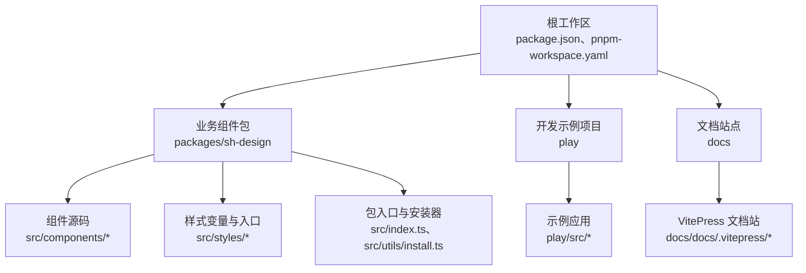
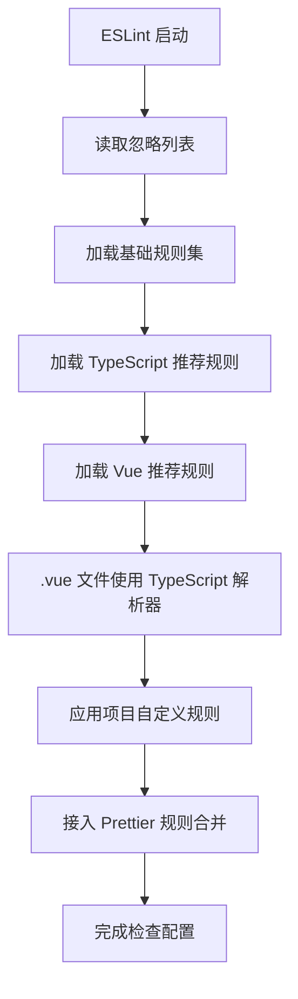
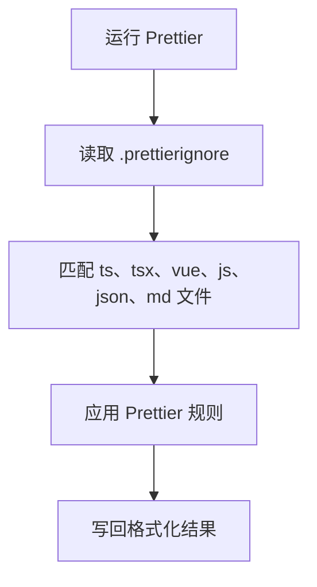
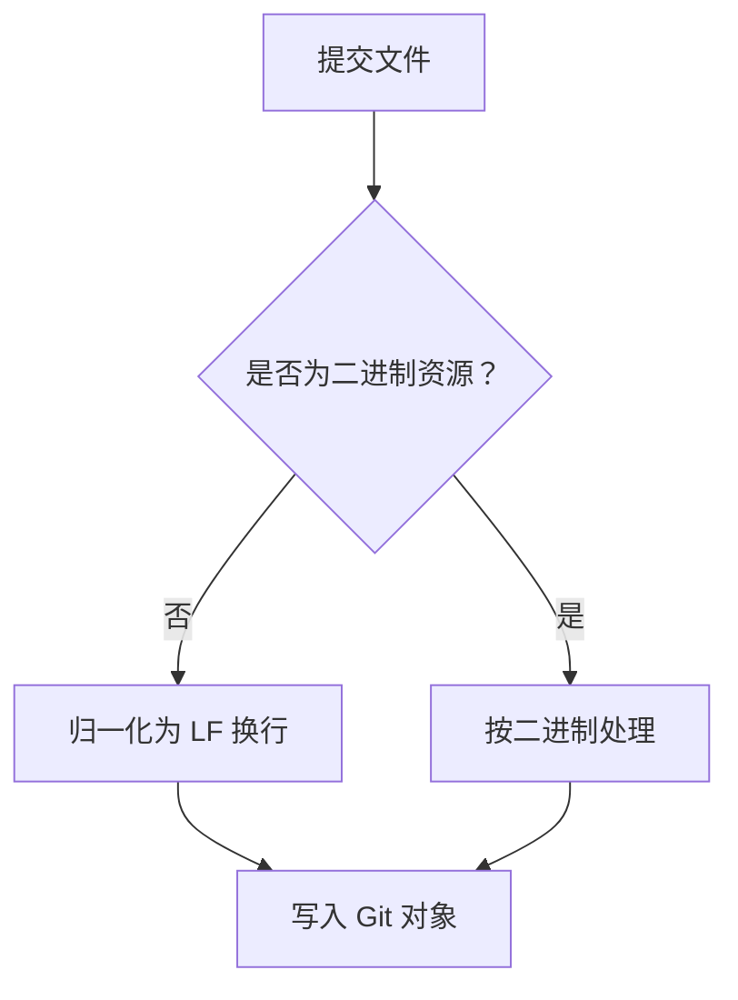
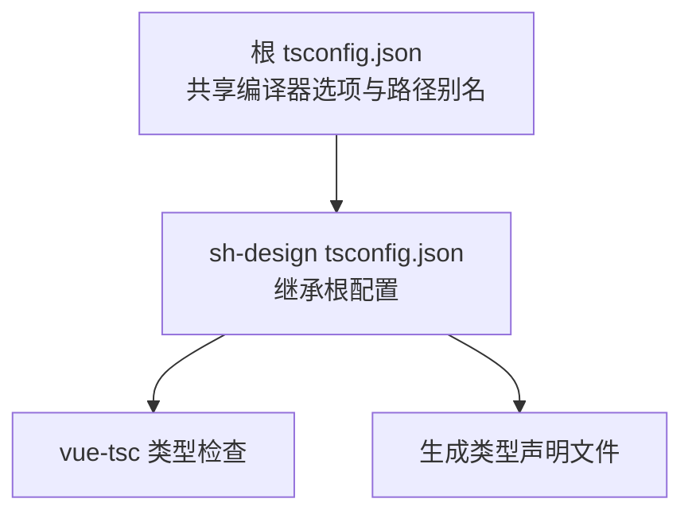
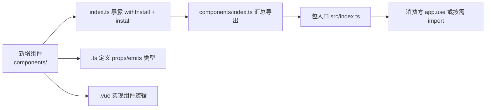
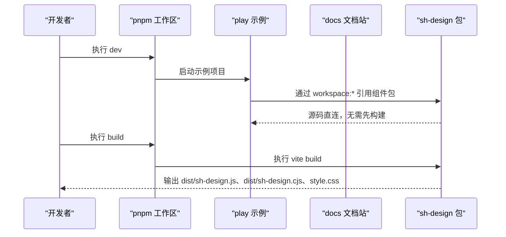

# 代码规范与工程工具链

<cite>
**本文引用的文件**   
- [eslint.config.js](file://eslint.config.js)
- [.prettierrc.json](file://.prettierrc.json)
- [.editorconfig](file://.editorconfig)
- [.gitattributes](file://.gitattributes)
- [.prettierignore](file://.prettierignore)
- [tsconfig.json](file://tsconfig.json)
- [packages/sh-design/tsconfig.json](file://packages/sh-design/tsconfig.json)
- [package.json](file://package.json)
- [pnpm-workspace.yaml](file://pnpm-workspace.yaml)
- [packages/sh-design/package.json](file://packages/sh-design/package.json)
</cite>

## 目录

1. [引言](#引言)
2. [工程结构总览](#工程结构总览)
3. [ESLint 规范](#eslint-规范)
4. [Prettier 格式化规则](#prettier-格式化规则)
5. [EditorConfig 编辑器约定](#editorconfig-编辑器约定)
6. [Git 文本与换行约定](#git-文本与换行约定)
7. [TypeScript 编译与类型检查配置](#typescript-编译与类型检查配置)
8. [组件命名与目录约定](#组件命名与目录约定)
9. [工作区与脚本工作流](#工作区与脚本工作流)
10. [贡献者清单](#贡献者清单)
11. [常见问题排查](#常见问题排查)
12. [结语](#结语)

## 引言

本仓库是一个面向「功能性 / 业务组件」的 Vue 3 组件库工程，核心产物为 `sh-design`。工程使用 pnpm monorepo 组织 `packages/sh-design`、`play` 和 `docs`；开发预览通过 Vite alias 将模块名 `sh-design` 精确映射到包源码，因此本地修改可直接在文档站和示例项目中验证，无需先执行构建。

本文聚焦贡献者需要遵守的代码规范与工程工具链：ESLint（flat config）、Prettier、EditorConfig、`.gitattributes`、根级 TypeScript 配置以及组件命名与目录约定。

## 工程结构总览



**图表来源**
- [package.json:1-47](file://package.json#L1-L47)
- [pnpm-workspace.yaml:1-16](file://pnpm-workspace.yaml#L1-L16)
- [packages/sh-design/package.json:1-62](file://packages/sh-design/package.json#L1-L62)

该结构中，所有代码规范与工具链配置集中在根目录，包内 TypeScript 配置继承根配置，避免重复定义。

**章节来源**
- [package.json:1-47](file://package.json#L1-L47)
- [pnpm-workspace.yaml:1-16](file://pnpm-workspace.yaml#L1-L16)

## ESLint 规范

### 配置文件与插件

ESLint 采用 flat config 形式，配置文件位于根目录 `eslint.config.js`。其加载顺序如下：

1. 忽略目录：构建产物、依赖、脚本、VitePress 缓存与部分工具生成目录。
2. 启用 JavaScript 推荐规则集。
3. 启用 TypeScript 推荐规则集。
4. 启用 Vue 推荐规则集。
5. 为 `.vue` 文件设置 TypeScript parser。
6. 覆盖项目特定规则。
7. 引入 `eslint-config-prettier`，关闭与 Prettier 冲突的规则。



**图表来源**
- [eslint.config.js:1-42](file://eslint.config.js#L1-L42)

### 忽略范围

以下路径不参与 ESLint 检查：

| 模式 | 说明 |
|---|---|
| `**/dist/**` | 构建输出目录 |
| `**/node_modules/**` | 第三方依赖 |
| `**/scripts/**` | 构建或发布脚本 |
| `**/.vitepress/cache/**` | VitePress 缓存 |
| `**/.vitepress/dist/**` | VitePress 构建产物 |
| `**/.qoder/**` | Qoder 工具产物 |
| `**/.zcode/**` | ZCode 工具产物 |

这些忽略策略确保检查只作用于源代码，而不是自动生成的文件或临时目录。

### Vue 文件解析

对于 `.vue` 文件，ESLint 明确指定使用 TypeScript 解析器，这样 `<script setup>` 中的 TypeScript 语法可以直接被检查，而不会退化为普通 JavaScript。

### 项目自定义规则

| 规则 | 值 | 含义 |
|---|---:|---|
| `vue/multi-word-component-names` | `off` | 允许单单词组件名，不强制多词组件名 |
| `@typescript-eslint/no-explicit-any` | `off` | 允许显式使用 `any` |
| `@typescript-eslint/no-unused-vars` | `error` | 未使用变量报错，但以下划线开头的参数和变量会被忽略 |

这一组规则体现了「严格但不僵化」的定位：禁止真正无用的代码，同时允许常见的前缀省略写法。

### 与 Prettier 的关系

ESLint 末尾引入 `eslint-config-prettier`，用于关闭会与 Prettier 冲突的 ESLint 规则。实际格式由 Prettier 决定，ESLint 主要负责语义和类型相关的质量检查。

**章节来源**
- [eslint.config.js:1-42](file://eslint.config.js#L1-L42)

## Prettier 格式化规则

### 核心格式约定

Prettier 配置位于 `.prettierrc.json`，主要行为如下：

| 选项 | 值 | 效果 |
|---|---|---|
| `semi` | `false` | 不使用分号结尾 |
| `singleQuote` | `true` | 字符串优先使用单引号 |
| `printWidth` | `100` | 单行最大宽度为 100 列 |
| `trailingComma` | `none` | 不添加尾随逗号 |
| `arrowParens` | `always` | 箭头函数参数始终加括号 |
| `endOfLine` | `lf` | 统一使用 LF 换行 |
| `vueIndentScriptAndStyle` | `false` | Vue 模板中 script/style 块不按额外缩进处理 |

这些规则共同形成简洁、紧凑且跨平台一致的代码风格。

### 排除文件

`.prettierignore` 排除了构建产物、依赖、VitePress 缓存及 `pnpm-lock.yaml`，避免对自动生成或锁定文件进行格式化。



**图表来源**
- [.prettierrc.json:1-9](file://.prettierrc.json#L1-L9)
- [.prettierignore:1-5](file://.prettierignore#L1-L5)

**章节来源**
- [.prettierrc.json:1-9](file://.prettierrc.json#L1-L9)
- [.prettierignore:1-5](file://.prettierignore#L1-L5)

## EditorConfig 编辑器约定

EditorConfig 位于根目录 `.editorconfig`，用于让不同编辑器保持一致的基础编辑行为：

| 属性 | 值 | 说明 |
|---|---|---|
| `root` | `true` | 当前文件为根配置 |
| `charset` | `utf-8` | 统一使用 UTF-8 编码 |
| `indent_style` | `space` | 使用空格缩进 |
| `indent_size` | `2` | 缩进宽度为 2 |
| `end_of_line` | `lf` | 换行符为 LF |
| `insert_final_newline` | `true` | 文件末尾保留换行 |
| `trim_trailing_whitespace` | `true` | 删除行尾空白 |
| `[*.md]` | `trim_trailing_whitespace = false` | Markdown 文件保留行尾空白，避免破坏渲染 |

注意：EditorConfig 的缩进设置是编辑器层面的默认值，不应与 Prettier 的格式规则产生矛盾。本项目中两者都使用空格缩进，逻辑一致。

**章节来源**
- [.editorconfig:1-12](file://.editorconfig#L1-L12)

## Git 文本与换行约定

`.gitattributes` 负责控制 Git 在提交和检出时如何处理换行：

- 对所有文本文件启用 `text=auto eol=lf`，保证仓库内部统一使用 LF。
- 对图片、字体、视频等二进制资源标记为 `binary`，避免 Git 错误地尝试归一化。



**图表来源**
- [.gitattributes:1-12](file://.gitattributes#L1-L12)

该约定能减少 Windows、macOS 和 Linux 之间因换行差异导致的无关 diff。

**章节来源**
- [.gitattributes:1-12](file://.gitattributes#L1-L12)

## TypeScript 编译与类型检查配置

### 根 tsconfig.json

根级 `tsconfig.json` 定义了工作区内共享的 TypeScript 行为：

| 配置项 | 值 | 作用 |
|---|---|---|
| `target` | `ES2020` | 目标 ECMAScript 版本 |
| `module` | `ESNext` | 使用 ESModule 模块系统 |
| `moduleResolution` | `Bundler` | 由打包工具解析模块 |
| `lib` | `ES2020, DOM, DOM.Iterable` | 包含运行时类型环境 |
| `strict` | `true` | 开启严格类型检查 |
| `noUnusedLocals` | `true` | 检测未使用的局部变量 |
| `noUnusedParameters` | `true` | 检测未使用的参数 |
| `noImplicitReturns` | `true` | 要求函数有明确的返回值路径 |
| `forceConsistentCasingInFileNames` | `true` | 强制文件名大小写一致 |
| `isolatedModules` | `true` | 每个文件独立编译，利于优化 |
| `jsx` | `preserve` | 保留 JSX/TSX 供后续工具处理 |
| `declaration` | `false` | 根项目不直接生成声明文件 |
| `sourceMap` | `true` | 生成 Source Map |
| `baseUrl` | `.` | 相对路径解析基准 |
| `paths` | `sh-design`、`sh-design/*` | 将模块别名映射到组件包源码 |

包含范围包括 `packages/**/*.ts`、`packages/**/*.vue`、`play/**/*.ts`、`play/**/*.vue`，并排除 `node_modules` 与 `dist`。

### 组件包 tsconfig.json

`packages/sh-design/tsconfig.json` 继承根配置，并覆盖以下内容：

| 配置项 | 值 | 作用 |
|---|---|---|
| `extends` | `../../tsconfig.json` | 复用根级 TypeScript 配置 |
| `baseUrl` | `.` | 包内相对路径以包根为准 |
| `outDir` | `dist` | 声明文件输出到包内 dist |
| `declaration` | `true` | 为组件包生成 `.d.ts` |
| `emitDeclarationOnly` | `true` | 仅输出类型声明，不重新编译 JS |
| `include` | `src`、`env.d.ts` | 限定包内源文件 |
| `exclude` | `dist`、`node_modules` | 排除产物和依赖 |

这使 `sh-design` 包既能在开发阶段参与类型检查，又能向消费者输出类型声明。



**图表来源**
- [tsconfig.json:1-34](file://tsconfig.json#L1-L34)
- [packages/sh-design/tsconfig.json:1-12](file://packages/sh-design/tsconfig.json#L1-L12)

**章节来源**
- [tsconfig.json:1-34](file://tsconfig.json#L1-L34)
- [packages/sh-design/tsconfig.json:1-12](file://packages/sh-design/tsconfig.json#L1-L12)

## 组件命名与目录约定

根据项目作者提示和本仓库结构，新增组件应遵循以下约定：

### 目录结构

新增组件放在 `packages/sh-design/src/components/<name>/` 下，典型结构为：

```
packages/sh-design/src/components/<name>/
├── index.ts
└── src/
    ├── <name>.vue
    └── <name>.ts
```

其中：

- `index.ts`：使用 `withInstall` 包裹组件并导出 `install` 方法。
- `<name>.vue`：单文件组件，使用 `defineOptions` 指定组件名称。
- `<name>.ts`：集中声明 props 和 emits 的类型。

### 汇总导出

新组件需要在 `packages/sh-design/src/components/index.ts` 中汇总导出，使整库注册和按需导入都能发现它。

### 组件命名

- 组件统一使用 `Sh` 前缀，例如 `ShCopyButton`。
- 包名、GitHub 仓库名均为 `sh-design`，但本地工作区目录名为 `sh-ui`，不要混淆。
- 消费方通过 `app.use(ShDesign)` 全量注册，或通过 `import { ShCopyButton }` 按需引入。

### 样式与主题

视觉风格由 `packages/sh-design/src/styles/var.css` 中以 `--sh-` 开头的 CSS 变量驱动，覆盖这些变量即可换肤。样式入口在 `packages/sh-design/src/styles/index.css`，并由主入口引入参与打包。



**图表来源**
- [packages/sh-design/package.json:1-62](file://packages/sh-design/package.json#L1-L62)

**章节来源**
- [packages/sh-design/package.json:1-62](file://packages/sh-design/package.json#L1-L62)

## 工作区与脚本工作流

### pnpm workspace

根 `pnpm-workspace.yaml` 定义了三个工作区：

| 路径 | 角色 |
|---|---|
| `packages/*` | 业务包，目前为 `sh-design` |
| `docs` | VitePress 文档站 |
| `play` | 本地示例应用 |

此外，`allowBuilds` 启用了 pnpm v11 的新白名单机制：

- `esbuild: false`：跳过 esbuild 的安装后脚本，因为预编译二进制由可选依赖提供。
- `vue-demi: true`：允许 vue-demi 的安全纯 JS 安装后脚本。

### 根脚本

根 `package.json` 提供常用命令：

| 脚本 | 用途 |
|---|---|
| `dev` | 启动 play 示例项目 |
| `play` | 与 `dev` 等价 |
| `build` | 构建 `sh-design` 包 |
| `docs:dev` | 启动文档站开发服务 |
| `docs:build` | 构建文档站 |
| `docs:preview` | 预览文档站构建产物 |
| `lint` | 执行 ESLint 检查 |
| `lint:fix` | 自动修复可修复问题 |
| `format` | 使用 Prettier 格式化指定扩展名 |
| `typecheck` | 调用 sh-design 包的类型检查脚本 |

### 包脚本

`packages/sh-design/package.json` 定义了：

| 脚本 | 用途 |
|---|---|
| `build` | 同步版本号并执行 Vite 构建 |
| `prepublishOnly` | 发布前自动构建 |
| `typecheck` | 使用 `vue-tsc --noEmit` 进行类型检查 |
| `version` | 更新版本后同步 `src/version.ts` |



**图表来源**
- [pnpm-workspace.yaml:1-16](file://pnpm-workspace.yaml#L1-L16)
- [package.json:1-47](file://package.json#L1-L47)
- [packages/sh-design/package.json:1-62](file://packages/sh-design/package.json#L1-L62)

**章节来源**
- [pnpm-workspace.yaml:1-16](file://pnpm-workspace.yaml#L1-L16)
- [package.json:1-47](file://package.json#L1-L47)
- [packages/sh-design/package.json:1-62](file://packages/sh-design/package.json#L1-L62)

## 贡献者清单

在提交代码前，建议按以下顺序自检：

1. **格式先行**：运行 `pnpm format`，确保代码符合 Prettier 规则。
2. **类型检查**：运行 `pnpm typecheck`，确认 TypeScript 和 Vue 类型无误。
3. **ESLint 检查**：运行 `pnpm lint`，必要时使用 `pnpm lint:fix`。
4. **本地预览**：运行 `pnpm dev` 或 `pnpm play`，确认组件在示例应用中正常显示。
5. **文档验证**：如需新增文档页，可在 `docs/components/` 或对应位置添加页面并通过 `pnpm docs:dev` 验证。
6. **新增组件**：按组件命名与目录约定创建文件，并在 `components/index.ts` 中导出。
7. **提交前换行**：确保文件末尾有换行，行尾空白已清理（EditorConfig 已定义）。
8. **避免无关 diff**：不要手动格式化 `pnpm-lock.yaml`、`dist`、`node_modules` 等忽略文件。

## 常见问题排查

| 现象 | 可能原因 | 处理方式 |
|---|---|---|
| `.vue` 文件中 TypeScript 报语法错误 | ESLint 未正确解析 Vue 中的 TypeScript | 检查是否使用 flat config，并确认 `.vue` 文件启用了 TypeScript 解析器 |
| ESLint 与 Prettier 冲突 | 未引入 `eslint-config-prettier` | 保持 `eslint.config.js` 末尾引入 Prettier 配置 |
| 提交后换行不一致 | 编辑器或 Git 换行策略不一致 | 使用 `.editorconfig` 和 `.gitattributes`，并确保编辑器支持 |
| 构建产物被 ESLint 扫描 | 忽略列表不完整 | 确认 `**/dist/**` 在 ESLint 忽略列表中 |
| 包内路径别名失效 | 包级 `tsconfig.json` 覆盖了 `baseUrl` 或 `paths` | 参考 `packages/sh-design/tsconfig.json`，仅在包内需要时调整 |
| `sh-design` 模块无法解析 | 开发环境依赖了构建产物而非源码 | 确认 Vite alias 将 `sh-design` 映射到 `packages/sh-design/src/index.ts` |
| 发布时报 registry 权限错误 | 使用了淘宝镜像但未切换到官方源 | 发布前在官方源执行 `npm login`，并发布配置指向 `registry.npmjs.org` |

**章节来源**
- [eslint.config.js:1-42](file://eslint.config.js#L1-L42)
- [.editorconfig:1-12](file://.editorconfig#L1-L12)
- [.gitattributes:1-12](file://.gitattributes#L1-L12)
- [packages/sh-design/tsconfig.json:1-12](file://packages/sh-design/tsconfig.json#L1-L12)
- [packages/sh-design/package.json:1-62](file://packages/sh-design/package.json#L1-L62)

## 结语

这套工程工具链的核心思想是：**ESLint 管质量，Prettier 管格式，EditorConfig 管编辑器体验，`.gitattributes` 管换行一致性，TypeScript 管类型安全，workspace 管理开发体验**。

贡献者在编写组件时，应优先关注业务价值与可复用性，同时遵守统一的命名、目录、风格和类型约束，以保证 `sh-design` 作为一个功能型 Vue 3 组件库长期可维护。