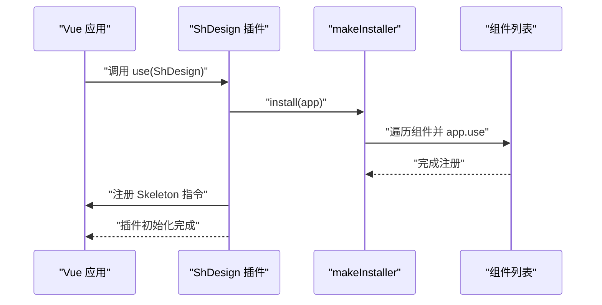
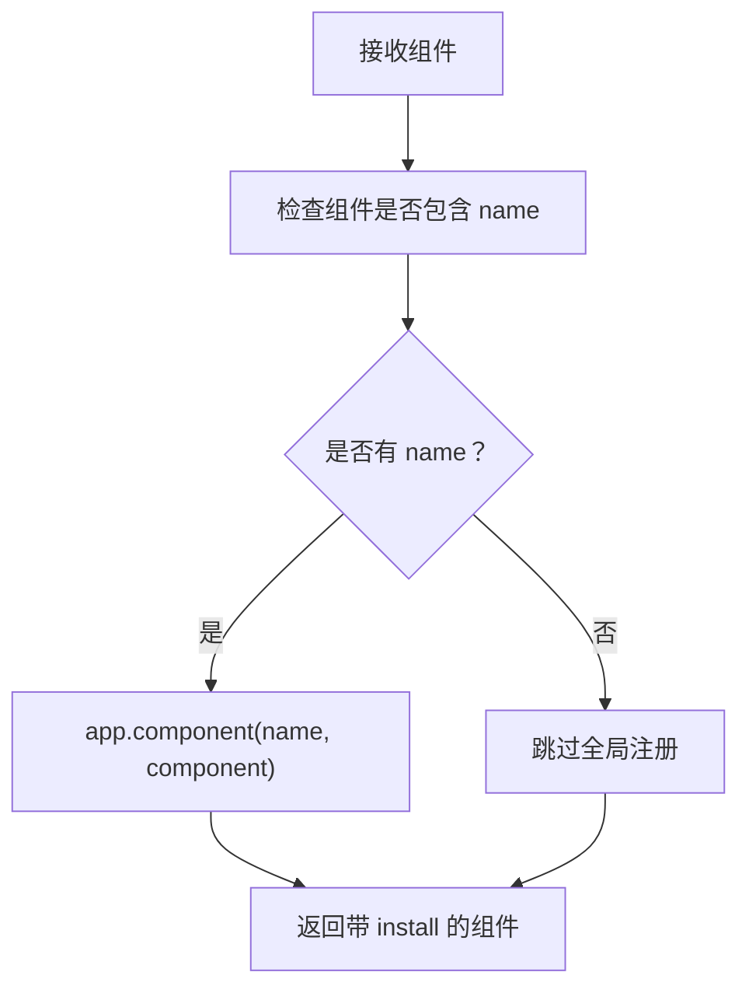
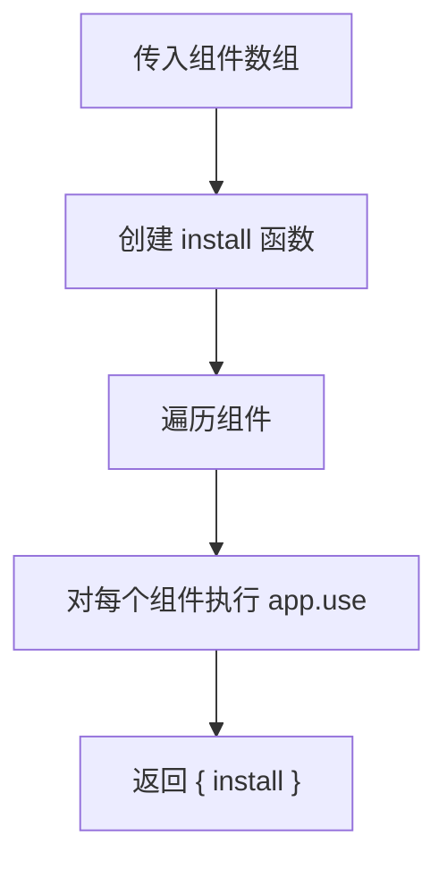

# 快速开始与两种使用方式

<cite>
**本文引用的文件**   
- [packages/sh-design/README.md](file://packages/sh-design/README.md)
- [docs/guide/installation.md](file://docs/guide/installation.md)
- [docs/guide/quickstart.md](file://docs/guide/quickstart.md)
- [packages/sh-design/src/index.ts](file://packages/sh-design/src/index.ts)
- [packages/sh-design/src/utils/install.ts](file://packages/sh-design/src/utils/install.ts)
- [packages/sh-design/src/components/index.ts](file://packages/sh-design/src/components/index.ts)
- [packages/sh-design/package.json](file://packages/sh-design/package.json)
</cite>

## 目录
1. [简介](#简介)
2. [安装与环境要求](#安装与环境要求)
3. [样式引入](#样式引入)
4. [全量注册：app.use](#全量注册appuse)
5. [按需引入：直接导入组件](#按需引入直接导入组件)
6. [组合式函数的独立用法](#组合式函数的独立用法)
7. [两种用法的差异与选择](#两种用法的差异与选择)
8. [常见问题排查](#常见问题排查)
9. [总结](#总结)

## 简介
sh-design 是一个面向功能性与业务场景的 Vue 3 组件库。它提供懒加载图片、无缝滚动、骨架屏、瀑布流等业务组件，并支持通过 `app.use(ShDesign)` 全量注册，也支持从包中按需导入单个组件。无论采用哪种方式，都需要单独引入样式文件。

本说明聚焦以下目标：
- 如何安装 sh-design。
- 为什么必须引入 `sh-design/dist/style.css`。
- 全量注册与按需引入的具体用法。
- 如何单独使用组合式函数或工具函数。

**章节来源**
- [packages/sh-design/README.md:1-53](file://packages/sh-design/README.md#L1-L53)
- [docs/guide/introduction.md](file://docs/guide/introduction.md)

## 安装与环境要求

### 环境要求
- Vue 版本需大于等于 3.2。
- 包通过 peerDependencies 声明对 Vue 的依赖，因此消费方项目需要自行安装对应版本的 Vue。

**章节来源**
- [docs/guide/installation.md:1-34](file://docs/guide/installation.md#L1-L34)
- [packages/sh-design/package.json:1-62](file://packages/sh-design/package.json#L1-L62)

### 使用包管理器安装
可以使用 npm、pnpm 或 yarn 安装 sh-design。常见命令如下：

| 包管理器 | 安装命令 |
|---|---|
| npm | `npm install sh-design` |
| pnpm | `pnpm add sh-design` |
| yarn | `yarn add sh-design` |

安装完成后，Vue 应用就可以从 `sh-design` 导入组件、插件和工具函数。

**章节来源**
- [docs/guide/installation.md:10-34](file://docs/guide/installation.md#L10-L34)
- [packages/sh-design/README.md:8-16](file://packages/sh-design/README.md#L8-L16)

## 样式引入

### 为什么必须引入样式
sh-design 在构建产物中输出独立的样式文件 `dist/style.css`。文档明确指出：**无论采用哪种使用方式，都需要引入一次样式文件**。

这意味着：
- 即使你只按需引入一个组件，也必须引入样式。
- 全量注册不会自动替你引入样式；样式仍需消费方显式导入。
- 样式文件路径为 `sh-design/dist/style.css`。

```ts
import 'sh-design/dist/style.css'
```

该约定由官方安装文档和快速上手文档共同强调，同时库入口也引入了内部样式资源，但对外暴露的仍是 `dist/style.css`。

**章节来源**
- [docs/guide/installation.md:22-34](file://docs/guide/installation.md#L22-L34)
- [packages/sh-design/README.md:18-37](file://packages/sh-design/README.md#L18-L37)
- [packages/sh-design/src/index.ts:1-45](file://packages/sh-design/src/index.ts#L1-L45)
- [packages/sh-design/package.json:1-62](file://packages/sh-design/package.json#L1-L62)

## 全量注册：app.use

### 适用场景
当你希望在整个应用中全局注册所有组件时，适合使用全量注册。这样可以在任意 `.vue` 模板中直接使用 `<ShLazyImage>`、`<ShSeamlessScroll>`、`<ShWaterfall>` 等组件，无需逐个导入。

### 基本用法
在应用入口文件中：
1. 从 `sh-design` 导入默认导出对象。
2. 引入样式文件。
3. 使用 `createApp(App).use(ShDesign).mount('#app')` 注册整个组件库。

示例路径参考：
- [快速上手的全量注册示例](file://docs/guide/quickstart.md#L1-L40)
- [包 README 的全量注册示例](file://packages/sh-design/README.md#L18-L37)

### 底层机制
库入口导出的默认对象是 Vue 插件，其 `install` 方法会调用 `makeInstaller(components)`，将所有组件逐一注册到当前 Vue 应用上。此外，还会注册名为 `Skeleton` 的指令。



**图示来源**
- [packages/sh-design/src/index.ts:1-45](file://packages/sh-design/src/index.ts#L1-L45)
- [packages/sh-design/src/utils/install.ts:1-29](file://packages/sh-design/src/utils/install.ts#L1-L29)

**章节来源**
- [docs/guide/quickstart.md:1-40](file://docs/guide/quickstart.md#L1-L40)
- [packages/sh-design/src/index.ts:1-45](file://packages/sh-design/src/index.ts#L1-L45)
- [packages/sh-design/src/utils/install.ts:1-29](file://packages/sh-design/src/utils/install.ts#L1-L29)

## 按需引入：直接导入组件

### 适用场景
当项目中只使用少数几个组件时，推荐按需引入。这样可以减少不必要的代码体积，同时避免全局污染。

### 基本用法
在组件脚本中：
1. 从 `sh-design` 导入需要的组件，例如 `ShLazyImage`。
2. 同样引入样式文件。
3. 在模板中使用对应组件标签。

示例路径参考：
- [快速上手的按需引入示例](file://docs/guide/quickstart.md#L22-L40)
- [包 README 的按需引入示例](file://packages/sh-design/README.md#L24-L37)

### 可导入内容
库入口会重新导出组件子模块，因此你可以从 `sh-design` 直接导入组件名称。组件聚合导出位于组件索引文件中，包含懒加载图片、无缝滚动、骨架屏、瀑布流等组件。

**章节来源**
- [docs/guide/quickstart.md:22-L40](file://docs/guide/quickstart.md#L22-L40)
- [packages/sh-design/src/index.ts:1-L45](file://packages/sh-design/src/index.ts#L1-L45)
- [packages/sh-design/src/components/index.ts:1-L4](file://packages/sh-design/src/components/index.ts#L1-L4)

## 组合式函数的独立用法

### 可以独立使用的工具
sh-design 不仅暴露组件，还暴露组合式函数和工具函数。库入口明确导出：
- `withInstall`
- `makeInstaller`
- 类型 `SFCWithInstall`

这些内容来自 utils 模块，并在组件库入口重新导出，因此消费者可以直接从 `sh-design` 导入它们，而不必引入任何组件。

**章节来源**
- [packages/sh-design/src/index.ts:1-L45](file://packages/sh-design/src/index.ts#L1-L45)

### withInstall：让组件支持 app.use
`withInstall` 的作用是为组件添加 `install` 方法，使组件既能作为普通组件被按需导入，又能作为 Vue 插件被 `app.use` 注册。

关键行为：
- 接收一个带有 `name` 属性的组件。
- 为该组件挂载 `install(app)`。
- 如果组件有 `name`，则通过 `app.component(name, component)` 注册。
- 返回增强后的组件对象。



**图示来源**
- [packages/sh-design/src/utils/install.ts:1-L29](file://packages/sh-design/src/utils/install.ts#L1-L29)

**章节来源**
- [packages/sh-design/src/utils/install.ts:1-L29](file://packages/sh-design/src/utils/install.ts#L1-L29)

### makeInstaller：批量注册组件
`makeInstaller` 接收一个插件数组，返回 `{ install }`。调用 `install(app)` 时，会遍历组件列表并对每个组件调用 `app.use`。

典型用途：
- 构建组件库级插件。
- 将多个组件统一注册到一个 `app.use` 调用中。
- 配合 `withInstall` 实现“单点注册、多点复用”。



**图示来源**
- [packages/sh-design/src/utils/install.ts:1-L29](file://packages/sh-design/src/utils/install.ts#L1-L29)

**章节来源**
- [packages/sh-design/src/utils/install.ts:1-L29](file://packages/sh-design/src/utils/install.ts#L1-L29)

### SFCWithInstall：类型定义
`SFCWithInstall<T>` 表示一个既像单文件组件，又像 Vue 插件的类型。它允许组件保留自身属性，同时具备 `install` 方法和可选 `name`。

这保证了组件在以下场景中保持一致：
- 作为普通组件按需导入。
- 作为插件被 `app.use` 注册。
- 被 `withInstall` 增强后参与全量注册。

**章节来源**
- [packages/sh-design/src/utils/install.ts:1-L29](file://packages/sh-design/src/utils/install.ts#L1-L29)
- [packages/sh-design/src/index.ts:1-L45](file://packages/sh-design/src/index.ts#L1-L45)

## 两种用法的差异与选择

| 维度 | 全量注册 | 按需引入 |
|---|---|---|
| 入口写法 | `createApp(App).use(ShDesign)` | 在组件中 `import { ShLazyImage } from 'sh-design'` |
| 组件可用性 | 所有已注册组件在模板中可直接使用 | 仅导入的组件可用 |
| 样式引入 | 仍须单独引入 `sh-design/dist/style.css` | 仍须单独引入 `sh-design/dist/style.css` |
| 适用场景 | 项目中大量使用组件 | 仅使用少量组件 |
| 内部机制 | 通过 `makeInstaller` 批量注册组件 | 直接从组件子模块导入 |

选择建议：
- 如果项目广泛使用多个组件，优先全量注册，减少重复导入。
- 如果项目只使用一两个组件，优先按需引入，提升打包体积可控性。
- 无论哪种方式，都要记住引入样式文件。

**章节来源**
- [docs/guide/quickstart.md:1-L40](file://docs/guide/quickstart.md#L1-L40)
- [packages/sh-design/README.md:18-L37](file://packages/sh-design/README.md#L18-L37)
- [packages/sh-design/src/index.ts:1-L45](file://packages/sh-design/src/index.ts#L1-L45)

## 常见问题排查

### 问题：组件没有样式
**现象**：组件能渲染，但没有视觉样式。  
**原因**：未引入 `sh-design/dist/style.css`。  
**解决**：在应用入口或组件中引入样式文件。

**章节来源**
- [docs/guide/installation.md:22-L34](file://docs/guide/installation.md#L22-L34)

### 问题：按组件名找不到组件
**现象**：模板中使用组件时报错。  
**可能原因**：
- 使用了全量注册，但组件未被正确注册。
- 组件本身没有 `name`，无法通过 `withInstall` 自动注册。
- 实际使用的是按需引入，但未导入该组件。

**解决**：
- 确认已使用 `app.use(ShDesign)`。
- 如需按需引入，请从 `sh-design` 导入对应组件。
- 检查组件是否在组件聚合导出中。

**章节来源**
- [packages/sh-design/src/utils/install.ts:1-L29](file://packages/sh-design/src/utils/install.ts#L1-L29)
- [packages/sh-design/src/components/index.ts:1-L4](file://packages/sh-design/src/components/index.ts#L1-L4)

### 问题：提示缺少 Vue 依赖
**现象**：运行时或类型检查报错，提示缺少 Vue。  
**原因**：sh-design 将 Vue 声明为 peerDependency。  
**解决**：确保消费方项目安装了符合要求的 Vue 3。

**章节来源**
- [packages/sh-design/package.json:1-L62](file://packages/sh-design/package.json#L1-L62)

### 问题：想单独使用工具函数却引入了不需要的组件
**现象**：只想用 `withInstall` 或 `makeInstaller`，但打包体积变大。  
**原因**：从 `sh-design` 导入工具函数时，可能随库入口一并引入相关代码。  
**建议**：评估是否需要真正使用这些工具；若只需组件，按需导入组件即可。

**章节来源**
- [packages/sh-design/src/index.ts:1-L45](file://packages/sh-design/src/index.ts#L1-L45)

## 总结
- 安装 sh-design 后，始终引入 `sh-design/dist/style.css`。
- 全量注册适合整体使用组件库，通过 `app.use(ShDesign)` 一次性注册。
- 按需引入适合只使用少量组件的场景，从 `sh-design` 直接导入组件。
- `withInstall`、`makeInstaller`、`SFCWithInstall` 可在组件库开发中复用，用于增强组件和批量注册。
- 选择全量注册还是按需引入，取决于项目中组件的使用范围与体积策略。