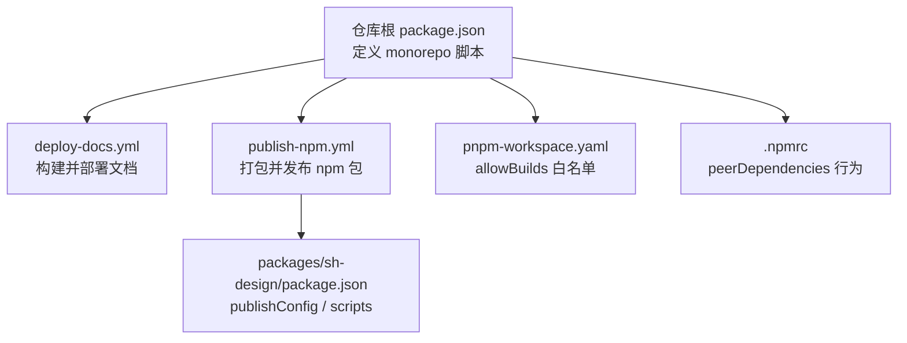
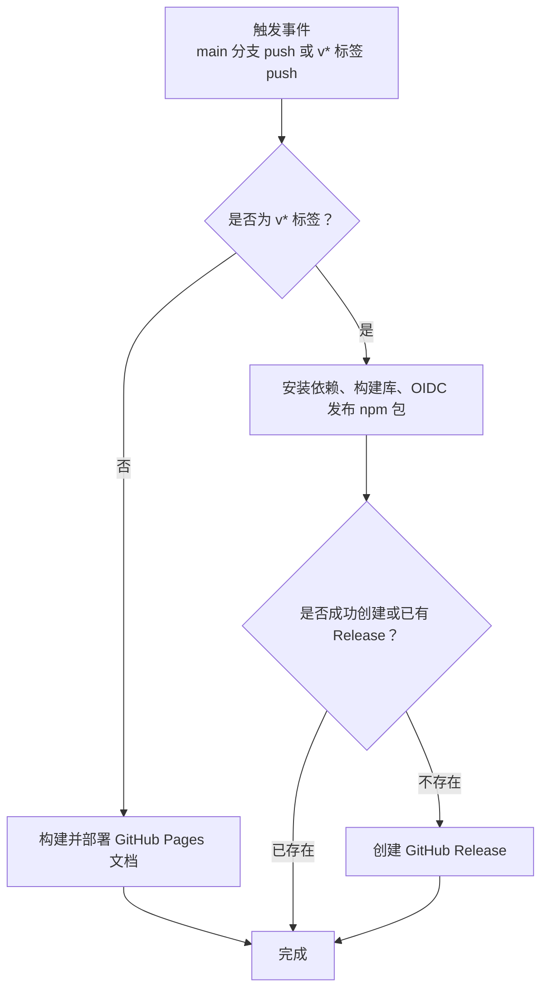
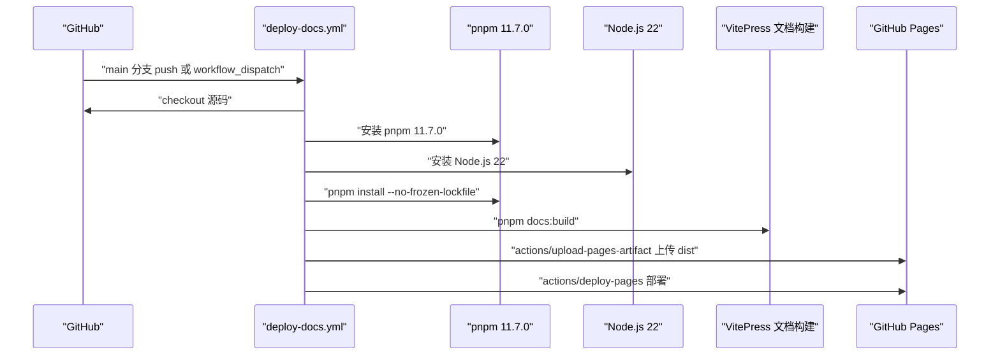
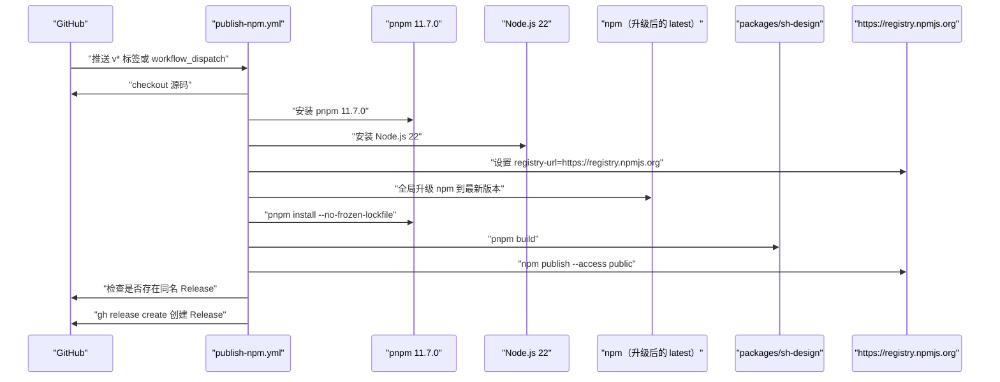
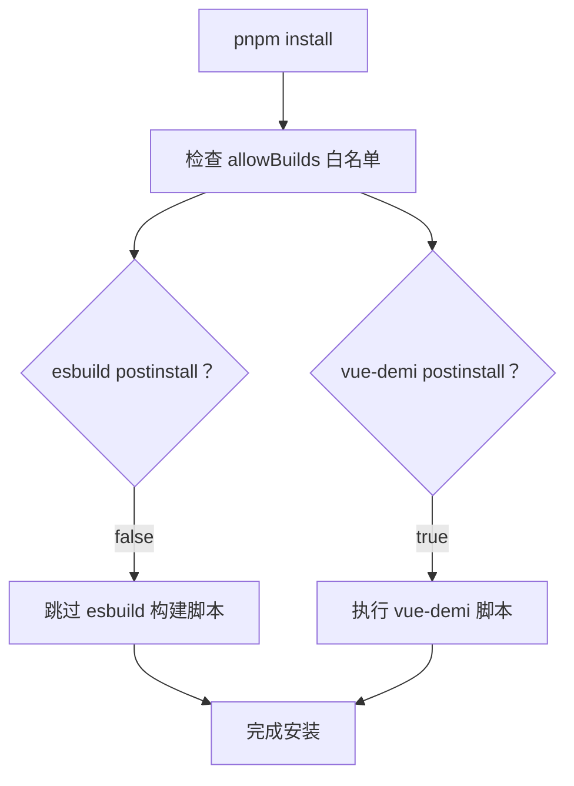
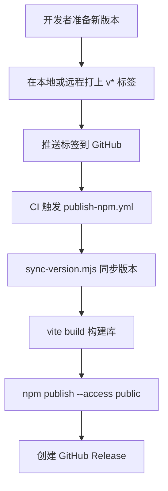

# 持续集成与 npm 发布

<cite>
**本文引用的文件**   
- [.github/workflows/deploy-docs.yml](file://.github/workflows/deploy-docs.yml)
- [.github/workflows/publish-npm.yml](file://.github/workflows/publish-npm.yml)
- [packages/sh-design/package.json](file://packages/sh-design/package.json)
- [pnpm-workspace.yaml](file://pnpm-workspace.yaml)
- [.npmrc](file://.npmrc)
- [package.json](file://package.json)
</cite>

## 目录

1. [引言](#引言)
2. [项目结构中与发布相关的文件](#项目结构中与发布相关的文件)
3. [两条 CI 流水线总览](#两条-ci-流水线总览)
4. [GitHub Pages 文档部署流水线](#github-pages-文档部署流水线)
5. [GitHub Release 触发 npm 发布流水线](#github-release-触发-npm-发布流水线)
6. [发布关键配置详解](#发布关键配置详解)
7. [版本管理与同步机制](#版本管理与同步机制)
8. [镜像源、权限与安全约束](#镜像源权限与安全约束)
9. [常见问题排查](#常见问题排查)
10. [结论](#结论)

## 引言

本项目是一个面向业务场景的 Vue 3 组件库，仓库根目录名为 sh-ui，但 npm 包名与 GitHub 仓库名均为 sh-design。仓库采用 pnpm monorepo 管理，核心产物位于 `packages/sh-design`，文档站点位于 `docs`，并通过 VitePress 构建后部署到 GitHub Pages。

本文聚焦两条持续集成流水线：

- **GitHub Pages 文档部署**：向 main 分支推送或手动触发时，构建文档并部署到 GitHub Pages。
- **GitHub Release 触发 npm 发布**：推送以 `v` 开头的标签时，使用 npm Trusted Publishing（OIDC）发布 `sh-design` 包，并在成功后自动创建 GitHub Release。

同时梳理以下发布关键配置：

- `publishConfig` 中的访问范围与 registry。
- 本地 `.npmrc` 与 CI 中 registry-url 的关系。
- NPM_TOKEN 与 OIDC 信任发布的区别。
- pnpm v11 的 `allowBuilds` 白名单。
- 版本同步脚本与 `prepublishOnly`、`version` 钩子。

## 项目结构中与发布相关的文件

| 路径 | 职责 |
|---|---|
| `.github/workflows/deploy-docs.yml` | GitHub Actions 工作流：main 分支 push 或手动触发后构建并部署文档。 |
| `.github/workflows/publish-npm.yml` | GitHub Actions 工作流：推送 `v*` 标签后通过 OIDC 发布 npm 包并创建 GitHub Release。 |
| `packages/sh-design/package.json` | npm 包元信息、入口字段、`files` 白名单、构建脚本、`publishConfig`、`prepublishOnly`、`version` 钩子。 |
| `pnpm-workspace.yaml` | monorepo 包列表及 pnpm v11 `allowBuilds` 构建脚本白名单。 |
| `.npmrc` | 本地 pnpm 对 peerDependencies 的安装策略。 |
| `package.json` | 仓库根脚本，统一暴露 `build`、`docs:build` 等命令。 |

**图表来源**
- [package.json:1-47](file://package.json#L1-L47)
- [.github/workflows/deploy-docs.yml:1-59](file://.github/workflows/deploy-docs.yml#L1-L59)
- [.github/workflows/publish-npm.yml:1-61](file://.github/workflows/publish-npm.yml#L1-L61)
- [packages/sh-design/package.json:1-62](file://packages/sh-design/package.json#L1-L62)
- [pnpm-workspace.yaml:1-16](file://pnpm-workspace.yaml#L1-L16)
- [.npmrc:1-2](file://.npmrc#L1-L2)

**章节来源**
- [.github/workflows/deploy-docs.yml:1-59](file://.github/workflows/deploy-docs.yml#L1-L59)
- [.github/workflows/publish-npm.yml:1-61](file://.github/workflows/publish-npm.yml#L1-L61)
- [packages/sh-design/package.json:1-62](file://packages/sh-design/package.json#L1-L62)
- [pnpm-workspace.yaml:1-16](file://pnpm-workspace.yaml#L1-L16)
- [.npmrc:1-2](file://.npmrc#L1-L2)
- [package.json:1-47](file://package.json#L1-L47)

## 两条 CI 流水线总览

### 文档部署流水线

该工作流名称为“Deploy Docs to GitHub Pages”，触发条件有两个：

1. 向 `main` 分支推送代码。
2. 在 GitHub Actions 页面手动运行 `workflow_dispatch`。

它具备以下安全与环境能力：

- `contents: read`：读取仓库内容。
- `pages: write`：写入 GitHub Pages 构建产物。
- `id-token: write`：用于 GitHub Pages 的 OIDC 身份验证。
- `concurrency.group: pages`：同一组任务并发限制，避免重复部署互相覆盖。
- `environment.name: github-pages`：部署到 GitHub Pages 环境。

执行流程大致为：检出代码 → 安装 pnpm 11.7.0 → 安装 Node.js 22 → 安装依赖 → 构建文档 → 配置 Pages → 上传 `docs/.vitepress/dist` → 部署到 GitHub Pages。

### npm 发布流水线

该工作流名称为“Publish to npm”，触发条件有两个：

1. 推送匹配 `v*` 的 Git 标签。
2. 手动运行 `workflow_dispatch`。

它的核心目标是：

- 使用 npm Trusted Publishing（OIDC）认证，而不是仓库密钥中的 `NPM_TOKEN`。
- 构建 `packages/sh-design`。
- 调用 `npm publish --access public`。
- 若 npm 发布成功且来自标签，则自动创建 GitHub Release。

**图表来源**
- [.github/workflows/deploy-docs.yml:1-59](file://.github/workflows/deploy-docs.yml#L1-L59)
- [.github/workflows/publish-npm.yml:1-61](file://.github/workflows/publish-npm.yml#L1-L61)

**章节来源**
- [.github/workflows/deploy-docs.yml:1-59](file://.github/workflows/deploy-docs.yml#L1-L59)
- [.github/workflows/publish-npm.yml:1-61](file://.github/workflows/publish-npm.yml#L1-L61)

## GitHub Pages 文档部署流水线

### 触发条件

| 触发方式 | 条件 |
|---|---|
| 自动触发 | 向 `main` 分支推送提交。 |
| 手动触发 | 在 GitHub Actions 中选择该工作流并点击 Run workflow。 |

### 权限模型

| 权限键 | 值 | 作用 |
|---|---:|---|
| `contents` | `read` | 拉取仓库源码。 |
| `pages` | `write` | 上传并部署 Pages 产物。 |
| `id-token` | `write` | 提供 GitHub Pages 所需的 OIDC token。 |

### 执行步骤

**图表来源**
- [.github/workflows/deploy-docs.yml:1-59](file://.github/workflows/deploy-docs.yml#L1-L59)

### 关键行为说明

- 文档构建产物路径为 `docs/.vitepress/dist`。
- `cancel-in-progress: false` 表示同一 `pages` 分组下不会取消正在进行的部署，适合防止误删线上文档。
- 该工作流不发布 npm 包，也不修改 `packages/sh-design` 的版本。

**章节来源**
- [.github/workflows/deploy-docs.yml:1-59](file://.github/workflows/deploy-docs.yml#L1-L59)

## GitHub Release 触发 npm 发布流水线

### 触发条件

| 触发方式 | 条件 |
|---|---|
| 自动触发 | 推送匹配 `v*` 的 Git 标签。 |
| 手动触发 | 在 GitHub Actions 中选择该工作流并点击 Run workflow。 |

### 权限模型

| 权限键 | 值 | 作用 |
|---|---|---|
| `contents` | `write` | 允许创建 GitHub Release。 |
| `id-token` | `write` | 启用 npm Trusted Publishing（OIDC）。 |

### 执行步骤

**图表来源**
- [.github/workflows/publish-npm.yml:1-61](file://.github/workflows/publish-npm.yml#L1-L61)

### 为什么需要升级 npm

工作流注释指出：Trusted Publishing（OIDC）要求 npm ≥ 11.5.1，而 GitHub Actions runner 自带 npm 10.x，因此工作流先执行 `npm install --global npm@latest`，再执行 `npm publish`。

### Release 创建逻辑

只有在 `npm publish` 成功后才会尝试创建 GitHub Release。如果 Release 已存在（例如重新运行工作流），会跳过创建；否则使用 `gh release create` 根据标签生成 Release 标题和说明。

**章节来源**
- [.github/workflows/publish-npm.yml:1-61](file://.github/workflows/publish-npm.yml#L1-L61)

## 发布关键配置详解

### `packages/sh-design/package.json`

该文件是 npm 包的唯一真实来源，决定包名、版本、入口、导出字段、发布文件和构建脚本。

| 字段 | 含义 |
|---|---|
| `name` | npm 包名 `sh-design`。 |
| `version` | 当前包版本，由构建前同步脚本更新。 |
| `main` | CommonJS 入口 `./dist/sh-design.cjs`。 |
| `module` | ESM 入口 `./dist/sh-design.js`。 |
| `types` | TypeScript 类型声明 `./dist/index.d.ts`。 |
| `exports` | 精确映射默认导入、样式文件和 package.json 本身。 |
| `files` | 只发布 `dist` 和 `README.md`，避免把源码或构建缓存发布出去。 |
| `sideEffects` | 标记 CSS 副作用，帮助 Tree Shaking 保留样式。 |
| `scripts.build` | 先执行版本同步脚本，再执行 `vite build`。 |
| `scripts.prepublishOnly` | 发布前自动执行构建，保证发布的是最新产物。 |
| `scripts.version` | 打 tag 时同步版本并暂存 `src/version.ts`。 |
| `peerDependencies.vue` | 要求消费方提供 Vue 3。 |
| `publishConfig.access` | 发布为公共包。 |
| `publishConfig.registry` | 强制指向官方 npm registry。 |

#### 重要风险点：`prepublishOnly` 中使用 `npm run build`

虽然 `publishConfig.registry` 指定了官方源，但 `prepublishOnly` 中直接调用 `npm run build`，而非 `pnpm build`。这可能导致：

- 在当前环境中找不到 pnpm 脚本代理。
- 忽略 workspace 根 `package.json` 定义的脚本约定。
- 在某些 CI 或开发环境下行为不一致。

建议改为调用包内脚本或直接调用构建命令，以保持与 monorepo 行为一致。

**章节来源**
- [packages/sh-design/package.json:1-62](file://packages/sh-design/package.json#L1-L62)

### `publishConfig` 的作用

`publishConfig` 是在发布阶段生效的配置，优先级高于用户本地 `.npmrc` 中相同字段。本项目的配置要点如下：

| 配置项 | 值 | 作用 |
|---|---|---|
| `access` | `public` | 发布公开包，不进入私有组织命名空间。 |
| `registry` | `https://registry.npmjs.org/` | 强制发布到官方 npm 源，不走淘宝镜像。 |

这与 CI 中 `setup-node` 的 `registry-url` 形成双重保障：

- CI 明确设置 registry 为官方源。
- `publishConfig` 在包层面再次锁定官方源。

**章节来源**
- [packages/sh-design/package.json:49-62](file://packages/sh-design/package.json#L49-L62)
- [.github/workflows/publish-npm.yml:1-61](file://.github/workflows/publish-npm.yml#L1-L61)

### `.npmrc` 与本地镜像源限制

`.npmrc` 当前仅包含两条 pnpm 行为配置：

| 配置项 | 值 | 含义 |
|---|---|---|
| `auto-install-peers` | `true` | 自动安装 peerDependencies。 |
| `strict-peer-dependencies` | `false` | 不严格校验 peerDependencies 缺失。 |

该文件中没有显式设置 `registry`。结合作者提示，本机全局 registry 通常指向淘宝镜像，但：

- CI 通过 `setup-node` 的 `registry-url` 覆盖为官方源。
- `packages/sh-design/package.json` 的 `publishConfig.registry` 也强制官方源。
- 本地开发安装依赖时可能走淘宝镜像，但发布仍会被锁定到官方源。

因此，本地镜像源主要影响安装速度和缓存命中，不影响最终发布目标。

**章节来源**
- [.npmrc:1-2](file://.npmrc#L1-L2)
- [.github/workflows/publish-npm.yml:1-61](file://.github/workflows/publish-npm.yml#L1-L61)
- [packages/sh-design/package.json:49-62](file://packages/sh-design/package.json#L49-L62)

### pnpm v11 `allowBuilds`

`pnpm-workspace.yaml` 定义了 monorepo 包路径和构建脚本白名单：

| 包名 | 值 | 原因 |
|---|---|---|
| `esbuild` | `false` | esbuild 的预编译二进制由可选依赖 `@esbuild/<platform>` 提供，不需要执行其 postinstall。 |
| `vue-demi` | `true` | vue-demi 的 postinstall 是安全的纯 JS 脚本，允许执行。 |

这与旧版 pnpm 的 `onlyBuiltDependencies` / `ignoredBuiltDependencies` 不同，属于 pnpm v11 的新语法。

**图表来源**
- [pnpm-workspace.yaml:1-16](file://pnpm-workspace.yaml#L1-L16)

**章节来源**
- [pnpm-workspace.yaml:1-16](file://pnpm-workspace.yaml#L1-L16)

## 版本管理与同步机制

### 版本来源

`packages/sh-design/package.json` 中的 `version` 是 npm 包版本。仓库根 `package.json` 中的 `version` 只是 monorepo 元信息，不会被发布到 npm。

### 版本同步脚本

`packages/sh-design/scripts/sync-version.mjs` 被两个地方调用：

1. `scripts.build`：构建前先同步版本。
2. `scripts.version`：npm 打 tag 时同步版本并暂存 `src/version.ts`。

这意味着版本同步发生在两个关键时机：

- 开发者执行构建时。
- npm 生命周期 `version` 钩子执行时。

### 推荐发布流程

**图表来源**
- [.github/workflows/publish-npm.yml:1-61](file://.github/workflows/publish-npm.yml#L1-L61)
- [packages/sh-design/package.json:28-48](file://packages/sh-design/package.json#L28-L48)

### 注意事项

- 版本号应与 Git 标签保持一致，因为工作流通过 `refs/tags/v*` 判断是否创建 Release。
- `version` 钩子会 `git add src/version.ts`，所以提交时应确保该文件状态正确。
- 如果只修改文档或不发布包，不应随意打 `v*` 标签，否则会触发 npm 发布。

**章节来源**
- [packages/sh-design/package.json:28-48](file://packages/sh-design/package.json#L28-L48)
- [.github/workflows/publish-npm.yml:1-61](file://.github/workflows/publish-npm.yml#L1-L61)

## 镜像源、权限与安全约束

### 镜像源控制点

| 位置 | 作用 | 是否影响发布 |
|---|---|---|
| 本机 `.npmrc` | 控制本地依赖安装行为，未显式设置 registry。 | 间接影响安装速度。 |
| CI `setup-node.registry-url` | 设置 npm 客户端默认 registry。 | 直接影响发布目标。 |
| `publishConfig.registry` | 包级发布 registry。 | 直接锁定官方源。 |
| 淘宝镜像 | 作者提示本机全局 registry 指向淘宝镜像，只读不可发布。 | 本地安装可用，但发布仍被锁定。 |

### NPM_TOKEN 与 OIDC

该工作流明确不使用 `NPM_TOKEN`，而是使用 npm Trusted Publishing（OIDC）。其前提条件包括：

- 在 npmjs.com 上为 `sh-design` 包配置 Trusted Publisher。
- Trusted Publisher 指向仓库 `KTBOY/sh-design`。
- Trusted Publisher 绑定工作流 `publish-npm.yml`。
- 工作流具备 `id-token: write` 权限。

这种方式避免了在 GitHub Secrets 中保存长期有效的 `NPM_TOKEN`，安全性更高。

### GitHub Release 权限

创建 Release 需要 `contents: write`，并由 `GH_TOKEN=${{ github.token }}` 提供临时令牌。工作流在执行 `gh release create` 前会先检查 Release 是否已存在，避免重复创建失败。

**章节来源**
- [.github/workflows/publish-npm.yml:1-61](file://.github/workflows/publish-npm.yml#L1-L61)
- [.npmrc:1-2](file://.npmrc#L1-L2)
- [packages/sh-design/package.json:49-62](file://packages/sh-design/package.json#L49-L62)

## 常见问题排查

### 问题一：本地可以发布，CI 无法发布

**可能原因：**

- npmjs.com 未配置 Trusted Publisher。
- Trusted Publisher 未绑定 `KTBOY/sh-design` 仓库和 `publish-npm.yml`。
- CI runner 自带的 npm 版本低于 OIDC 要求。
- 工作流缺少 `id-token: write` 权限。

**处理建议：**

- 确认 npmjs.com 上的 Trusted Publisher 配置正确。
- 确认工作流拥有 `contents: write` 和 `id-token: write`。
- 保留 `npm install --global npm@latest` 步骤，确保支持 OIDC。

**章节来源**
- [.github/workflows/publish-npm.yml:1-61](file://.github/workflows/publish-npm.yml#L1-L61)

### 问题二：发布到了错误 registry

**可能原因：**

- 本地 npm 或 pnpm 使用了非官方 registry。
- 手动执行 `npm publish` 时未继承 `publishConfig`。

**处理建议：**

- 优先使用 CI 发布，避免本地环境变量干扰。
- 如需本地调试，确保当前 npm 指向官方源。
- 不要依赖淘宝镜像进行发布。

**章节来源**
- [packages/sh-design/package.json:49-62](file://packages/sh-design/package.json#L49-L62)
- [.github/workflows/publish-npm.yml:1-61](file://.github/workflows/publish-npm.yml#L1-L61)

### 问题三：pnpm install 慢或失败

**可能原因：**

- 本机 registry 指向淘宝镜像导致缓存不一致。
- `allowBuilds` 中某些依赖的构建脚本被阻止。
- 网络不稳定导致 lockfile 校验失败。

**处理建议：**

- 使用 `pnpm install --no-frozen-lockfile` 重试。
- 保持 `pnpm-workspace.yaml` 中的 `allowBuilds` 配置不变。
- 区分“本地安装”和“CI 发布”的环境差异。

**章节来源**
- [pnpm-workspace.yaml:1-16](file://pnpm-workspace.yaml#L1-L16)
- [.github/workflows/deploy-docs.yml:1-59](file://.github/workflows/deploy-docs.yml#L1-L59)
- [.github/workflows/publish-npm.yml:1-61](file://.github/workflows/publish-npm.yml#L1-L61)

### 问题四：打 tag 后没有创建 GitHub Release

**可能原因：**

- npm publish 失败，后续步骤被跳过。
- Release 已存在，但输出看起来像未创建。
- 没有 `contents: write` 权限。
- `gh release view` 或 `gh release create` 因网络或权限失败。

**处理建议：**

- 查看 CI 日志中 npm publish 是否成功。
- 检查 GitHub Repository Settings 中是否允许 Actions 写 contents。
- 手动运行一次工作流复现问题。

**章节来源**
- [.github/workflows/publish-npm.yml:1-61](file://.github/workflows/publish-npm.yml#L1-L61)

## 结论

本项目的持续集成与发布体系围绕两条清晰流水线展开：

- **文档部署流水线**负责将 VitePress 文档部署到 GitHub Pages，适合日常文档迭代。
- **npm 发布流水线**负责通过 npm Trusted Publishing 发布 `sh-design` 包，并在成功后自动生成 GitHub Release。

关键发布约束如下：

1. 发布必须使用官方 npm registry，不能发布到淘宝镜像。
2. 推荐使用 OIDC 信任发布，避免在仓库中维护 `NPM_TOKEN`。
3. 包级 `publishConfig` 与 CI `registry-url` 共同锁定发布目标。
4. pnpm v11 使用 `allowBuilds` 白名单控制构建脚本执行。
5. 版本通过 `sync-version.mjs` 在构建和 npm version 钩子中同步。
6. 只有推送 `v*` 标签才会触发 npm 发布和 Release 创建。

在实际操作中，应优先通过 Git 标签驱动发布流程，而不是手动在本地执行发布命令；同时区分本地镜像加速安装与 CI 官方源发布的边界，降低发布事故概率。