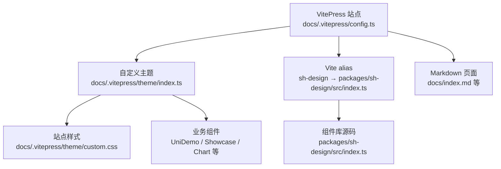
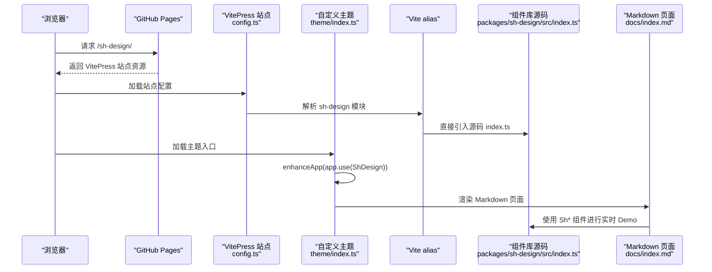
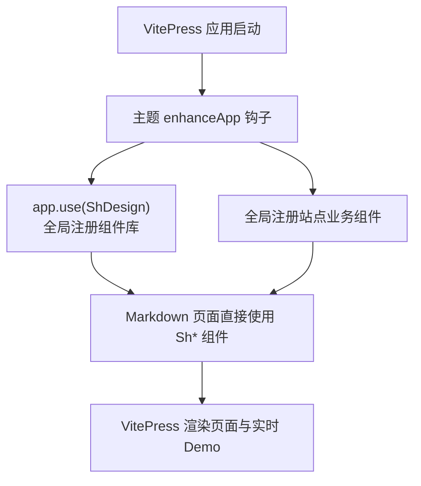
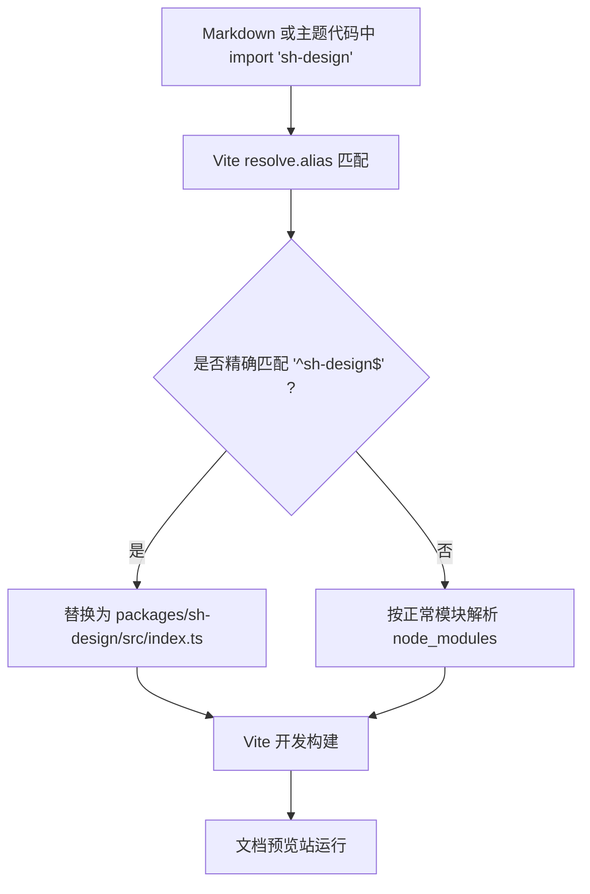
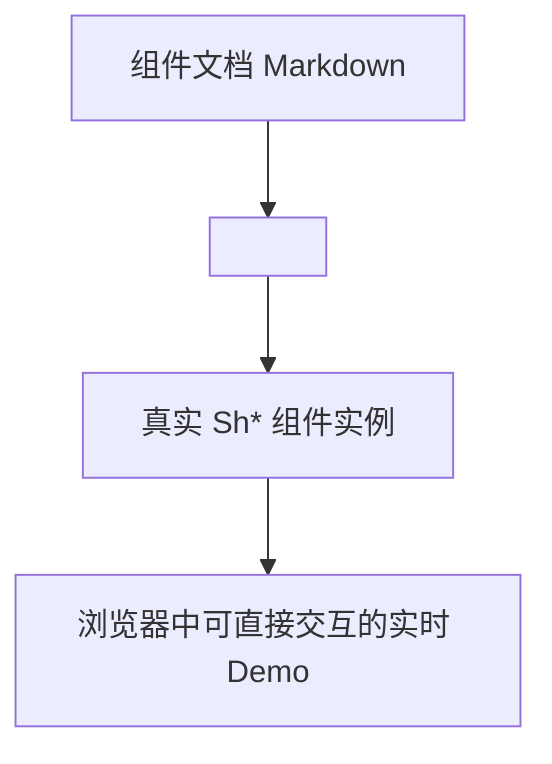
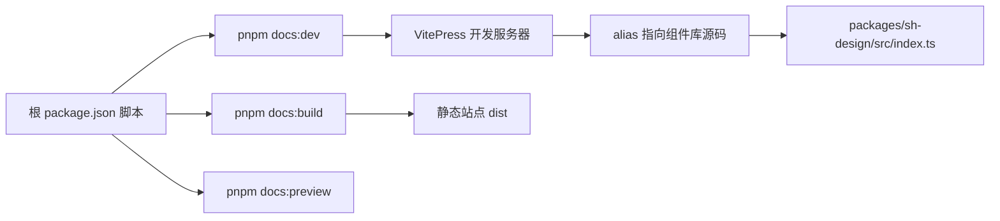

# 文档预览站（VitePress + GitHub Pages）

<cite>
**本文引用的文件**   
- [docs/.vitepress/config.ts](file://docs/.vitepress/config.ts)
- [docs/.vitepress/theme/index.ts](file://docs/.vitepress/theme/index.ts)
- [docs/.vitepress/theme/custom.css](file://docs/.vitepress/theme/custom.css)
- [docs/index.md](file://docs/index.md)
- [package.json](file://package.json)
</cite>

## 目录
1. [引言](#引言)
2. [项目结构](#项目结构)
3. [核心组件](#核心组件)
4. [架构总览](#架构总览)
5. [详细配置分析](#详细配置分析)
6. [依赖与构建关系](#依赖与构建关系)
7. [性能与开发体验](#性能与开发体验)
8. [故障排查](#故障排查)
9. [结论](#结论)

## 引言
本文聚焦 VitePress 文档站点的站点配置、主题实现、组件库注册方式、别名映射以及面向外部的实时 Demo 容器。该站点托管在 GitHub Pages，站点根路径为 `/sh-design/`；通过 Vite alias 将 `sh-design` 直接指向源码，使 Markdown 中的演示组件无需先构建组件库即可实时更新。

## 项目结构
文档站的核心由以下文件组成：

- `docs/.vitepress/config.ts`：VitePress 站点配置，包含导航、侧边栏、SEO、sitemap、base 路径、Vite alias、开发服务器 watch 规则等。
- `docs/.vitepress/theme/index.ts`：自定义 VitePress 主题入口，继承默认主题并全局注册 sh-design 组件及站点业务组件。
- `docs/.vitepress/theme/custom.css`：站点级样式覆盖，定义品牌色、正文宽度、右侧停靠面板、实时 Demo 容器等。
- `docs/index.md`：首页 Markdown，描述站点定位、英雄区、功能特性与跳转链接。
- `package.json`：工作区脚本，把 `pnpm docs:dev / docs:build / docs:preview` 转发到 `@sh-design/docs` 子包。

**图示来源**
- [docs/.vitepress/config.ts](file://docs/.vitepress/config.ts)
- [docs/.vitepress/theme/index.ts](file://docs/.vitepress/theme/index.ts)
- [docs/.vitepress/theme/custom.css](file://docs/.vitepress/theme/custom.css)
- [docs/index.md](file://docs/index.md)

**章节来源**
- [docs/.vitepress/config.ts](file://docs/.vitepress/config.ts)
- [docs/.vitepress/theme/index.ts](file://docs/.vitepress/theme/index.ts)
- [docs/.vitepress/theme/custom.css](file://docs/.vitepress/theme/custom.css)
- [docs/index.md](file://docs/index.md)
- [package.json](file://package.json)

## 核心组件
本节从“站点如何启动”的角度梳理关键入口。

| 文件 | 职责 | 关键行为 |
|---|---|---|
| `docs/.vitepress/config.ts` | 站点配置 | 设置 title、description、lang、base、lastUpdated、cleanUrls、sitemap、appearance、head SEO 信息、themeConfig、Vite alias、watch ignored |
| `docs/.vitepress/theme/index.ts` | 主题扩展 | extends DefaultTheme，enhanceApp 中 app.use(ShDesign)，并全局注册 UniDemo、Showcase、Chart 等业务组件 |
| `docs/.vitepress/theme/custom.css` | 站点样式 | 品牌变量、正文最大宽度、右侧 dock 布局、`.sh-demo` 实时演示容器、chart 表格 code 样式 |
| `docs/index.md` | 首页内容 | 首页 hero、actions、features，对外说明组件库定位 |
| `package.json` | 工作区脚本 | 提供 `docs:dev`、`docs:build`、`docs:preview` 脚本 |

**章节来源**
- [docs/.vitepress/config.ts](file://docs/.vitepress/config.ts)
- [docs/.vitepress/theme/index.ts](file://docs/.vitepress/theme/index.ts)
- [docs/.vitepress/theme/custom.css](file://docs/.vitepress/theme/custom.css)
- [docs/index.md](file://docs/index.md)
- [package.json](file://package.json)

## 架构总览
下图展示用户访问 GitHub Pages 上 `/sh-design/` 站点时，VitePress、主题、组件库源码和 Markdown 之间的调用链。

**图示来源**
- [docs/.vitepress/config.ts](file://docs/.vitepress/config.ts)
- [docs/.vitepress/theme/index.ts](file://docs/.vitepress/theme/index.ts)

## 详细配置分析

### 站点基础配置与 GitHub Pages 路径
`docs/.vitepress/config.ts` 中显式设置了 `base: '/sh-design/'`，这是 GitHub Pages Project Site 部署的关键：所有路由和资源都会以 `/sh-design/` 为前缀生成。同时开启 `cleanUrls: true`，关闭 `appearance` 以固定浅色主题，并通过 `sitemap.hostname` 指定公开域名，便于搜索引擎收录。

- `title`、`description`、`lang: 'zh-CN'` 决定站点标题、副标题与语言。
- `head` 注入 theme-color、keywords、author、Open Graph、Twitter Card 等元信息。
- `themeConfig` 定义导航、侧边栏、社交链接、搜索、页脚、目录与翻页文案。
- 导航版本直接从 `packages/sh-design/package.json` 读取，避免发版后手动同步。

**章节来源**
- [docs/.vitepress/config.ts](file://docs/.vitepress/config.ts)

### 主题入口与组件库注册
主题入口 `docs/.vitepress/theme/index.ts` 继承 VitePress 默认主题，并在 `enhanceApp` 钩子中执行两件事：

1. `app.use(ShDesign)`：全局注册 sh-design 组件库，使 Markdown 页面可以直接使用 `ShLazyImage`、`SeamlessScroll`、`Skeleton`、`Waterfall` 等组件，无需在每个页面单独 import。
2. 全局注册站点业务组件：包括 uni-app 手机演示组件 `UniDemo`、`UniDemoDock`，技能与 CSS 特效画廊组件 `ShowcaseGallery`、`ShowcaseDetail`，产品聚合组件 `ProductsGallery`、`ProductCard`、`HomeProducts`，个人主页展示组件 `AboutShowcase`，以及图表库演示组件 `FoldBarDemo`、`ChartPreview`、`ChartVersion`。

这意味着 Markdown 中的 `<ShLazyImage>` 或 `<FoldBarDemo>` 都能被直接识别和渲染。

**图示来源**
- [docs/.vitepress/theme/index.ts](file://docs/.vitepress/theme/index.ts)

**章节来源**
- [docs/.vitepress/theme/index.ts](file://docs/.vitepress/theme/index.ts)

### Vite alias：把 `sh-design` 精确指向源码
站点配置中通过 `vite.resolve.alias` 定义了正则匹配 `^sh-design$` 的别名，替换为 `packages/sh-design/src/index.ts`。这一设计有两个重要效果：

- 开发预览时无需先执行组件库构建，修改组件源码即可在文档站实时看到效果。
- 消费方不需要关心 npm 包名、dist 产物路径或 package.json 的 exports 字段。

此外，当环境变量 `SK_CHART_LOCAL=1` 时，还会追加一个针对 `sk-chart-duo` 的别名，指向本地兄弟仓库构建产物，用于在未发布状态下预览图表库改动。

**图示来源**
- [docs/.vitepress/config.ts](file://docs/.vitepress/config.ts)

**章节来源**
- [docs/.vitepress/config.ts](file://docs/.vitepress/config.ts)

### 实时 Demo 容器 `.sh-demo`
`docs/.vitepress/theme/custom.css` 定义了名为 `.sh-demo` 的通用演示容器，用于在组件文档中包裹真实运行的组件实例。其样式特点如下：

- 使用 flex 布局，允许换行。
- 元素之间用 `gap: 12px` 控制间距。
- 内边距 `24px`，外边距 `16px 0`。
- 边框采用 VitePress 分隔线颜色，圆角 `8px`。
- 背景使用 VitePress 软背景色，与文档正文区分开。

在组件文档中，开发者可以把实际组件放入 `
` 容器中，从而形成可交互的实时 Demo 区块。

**图示来源**
- [docs/.vitepress/theme/custom.css](file://docs/.vitepress/theme/custom.css)

**章节来源**
- [docs/.vitepress/theme/custom.css](file://docs/.vitepress/theme/custom.css)

### 首页与对外预览内容
`docs/index.md` 使用 VitePress 的 `layout: home`，提供：

- 站点描述：面向业务场景的 Vue 3 组件库，强调高性能瀑布流、图片懒加载、无缝滚动、TypeScript 友好与按需引入。
- Hero 区域：名称、主文案、副文案，以及快速上手、浏览组件、GitHub 三个动作按钮。
- Features 区域：业务组件优先、Vue 3 + Vite、TypeScript 优先、按需引入、主题可定制、灵活使用方式。

这些内容构成对外预览站的第一屏，帮助用户快速理解 sh-design 的定位与价值。

**章节来源**
- [docs/index.md](file://docs/index.md)

### 开发服务器与构建注意事项
`docs/.vitepress/config.ts` 还配置了开发服务器 watch 规则，忽略 `dist` 与 `.temp` 目录，避免在 Windows 上因文件占用导致 watcher 崩溃。同时，当启用 `SK_CHART_LOCAL` 时，会排除 `sk-chart-duo` 的依赖预打包，防止 optimizeDeps 缓存绕过 alias。

**章节来源**
- [docs/.vitepress/config.ts](file://docs/.vitepress/config.ts)

## 依赖与构建关系
工作区根 `package.json` 提供了文档相关脚本：

- `pnpm docs:dev`：启动 VitePress 开发预览。
- `pnpm docs:build`：构建静态文档站。
- `pnpm docs:preview`：预览构建产物。

由于 Vite alias 直接指向组件库源码，文档开发流程通常不需要先执行 `pnpm build`；但生产构建仍会由 VitePress 基于源码生成最终静态站点。

**图示来源**
- [package.json](file://package.json)
- [docs/.vitepress/config.ts](file://docs/.vitepress/config.ts)

**章节来源**
- [package.json](file://package.json)
- [docs/.vitepress/config.ts](file://docs/.vitepress/config.ts)

## 性能与开发体验
- **源码直连提升迭代速度**：通过 alias 直接引用 `packages/sh-design/src/index.ts`，组件修改后文档预览即时刷新，无需重复构建组件库。
- **按需引入能力**：组件库支持 ESM/CJS 输出与 Tree-Shaking，文档站只打包 Markdown 和主题用到的组件，减少运行时体积。
- **CSS 变量驱动的主题**：站点样式集中在 `custom.css`，通过覆盖 `--vp-*` 与自定义变量即可调整品牌色、正文宽度、dock 布局，无需重写整个主题。
- **开发期稳定性**：忽略 `dist` 与 `.temp` 目录可避免 Windows 下文件占用导致的 watcher 异常；`optimizeDeps.exclude` 确保本地未发布依赖不会被预打包缓存污染。

[本节为通用指导，不直接分析具体代码片段]

## 故障排查
| 现象 | 可能原因 | 处理方式 |
|---|---|---|
| 文档站点路由前缺少 `/sh-design/` | 本地预览未正确识别 base，或部署到非 Project Site 路径 | 确认 GitHub Pages 设置为 Project Site，且 `base` 保持为 `/sh-design/` |
| Markdown 中使用 `ShLazyImage` 等组件报找不到组件 | 主题未全局注册组件库 | 检查 `docs/.vitepress/theme/index.ts` 是否执行 `app.use(ShDesign)` |
| 修改组件源码后预览不更新 | alias 未生效或被依赖预打包缓存绕过 | 确认 `vite.resolve.alias` 中 `^sh-design$` 指向源码；必要时清理 Vite 缓存或使用 `SK_CHART_LOCAL` 场景下的 exclude 配置 |
| 实时 Demo 容器样式错位 | 未在 `.sh-demo` 中包裹组件，或自定义样式覆盖了容器 | 使用 `docs/.vitepress/theme/custom.css` 中的 `.sh-demo` 类，不要随意覆盖正文容器 |
| 右侧 dock 面板遮挡正文 | 屏幕尺寸处于 dock 生效区间但未应用样式 | 检查 `custom.css` 中 `min-width: 1440px` 的媒体查询与 `uni-demo-dock` 相关选择器 |

**章节来源**
- [docs/.vitepress/config.ts](file://docs/.vitepress/config.ts)
- [docs/.vitepress/theme/index.ts](file://docs/.vitepress/theme/index.ts)
- [docs/.vitepress/theme/custom.css](file://docs/.vitepress/theme/custom.css)

## 结论
该文档站以 VitePress 为核心，通过 `config.ts` 配置 GitHub Pages 所需的 `base=/sh-design/`、导航、侧边栏与 SEO，通过 `theme/index.ts` 在全局安装 sh-design 组件库并注册站点业务组件，再通过 Vite alias 将 `sh-design` 精确映射到组件库源码，从而实现「不改组件库构建也能实时更新文档预览」。`custom.css` 则提供 `.sh-demo` 等通用 Demo 容器与站点级视觉规范，配合 `docs/index.md` 的首页内容，共同构成面向外部用户的组件库预览站点。