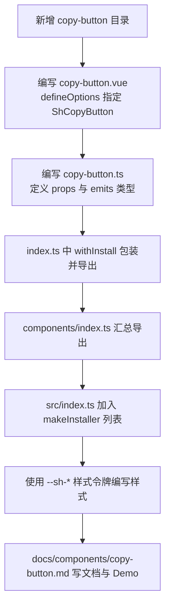
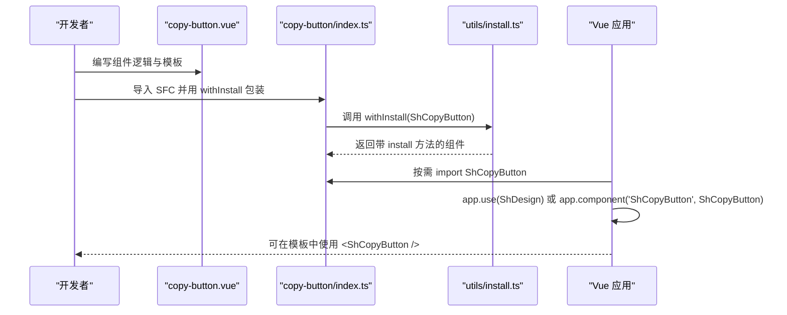
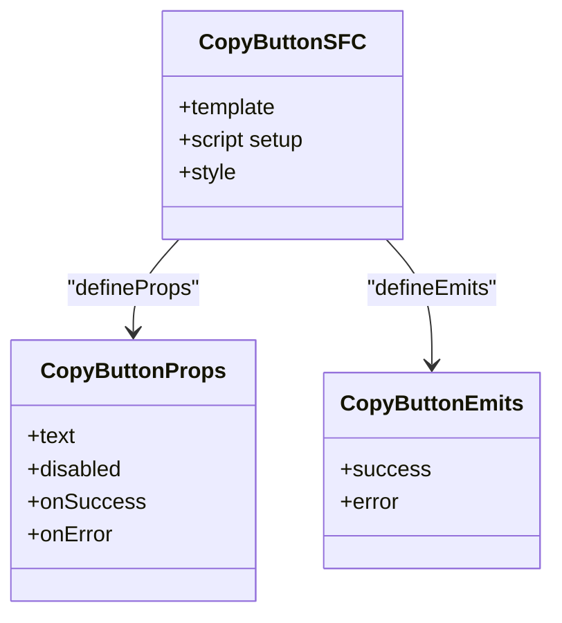
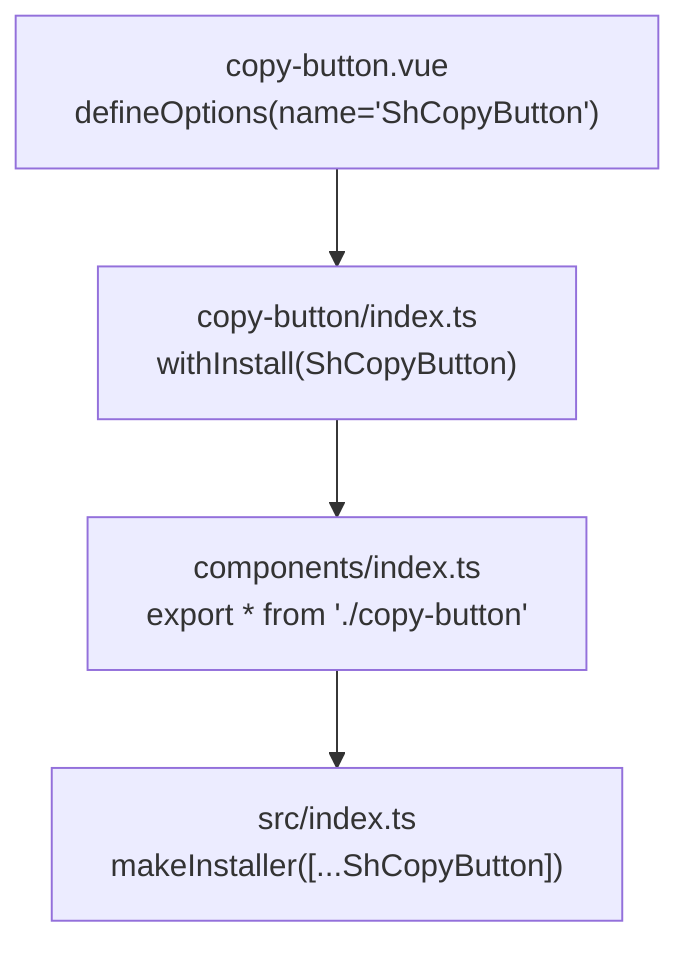
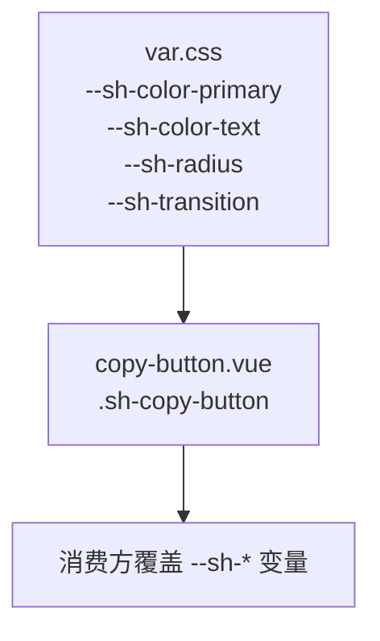
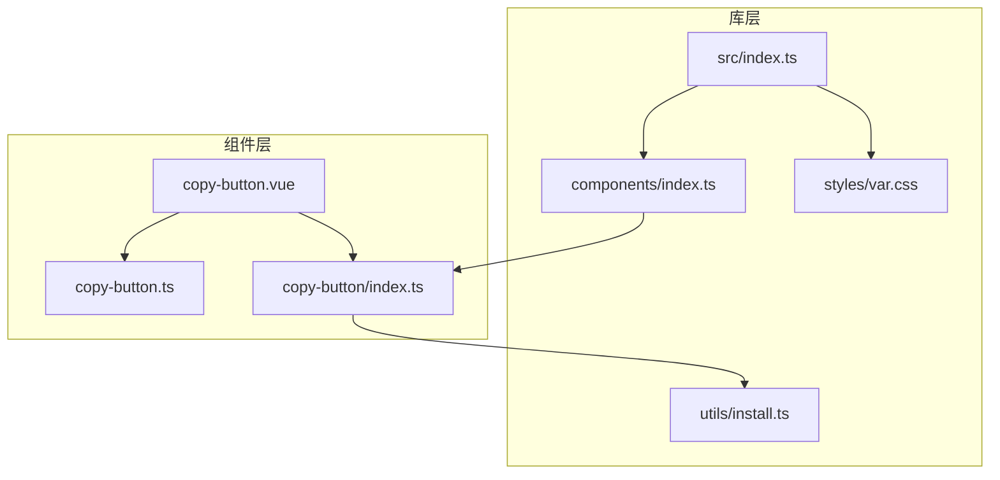

# 新增业务组件开发指南

<cite>
**本文引用的文件**   
- [packages/sh-design/src/components/lazy-image/index.ts](file://packages/sh-design/src/components/lazy-image/index.ts)
- [packages/sh-design/src/components/lazy-image/src/lazy-image.vue](file://packages/sh-design/src/components/lazy-image/src/lazy-image.vue)
- [packages/sh-design/src/components/lazy-image/src/lazy-image.ts](file://packages/sh-design/src/components/lazy-image/src/lazy-image.ts)
- [packages/sh-design/src/components/index.ts](file://packages/sh-design/src/components/index.ts)
- [packages/sh-design/src/utils/install.ts](file://packages/sh-design/src/utils/install.ts)
- [packages/sh-design/src/index.ts](file://packages/sh-design/src/index.ts)
- [packages/sh-design/src/styles/var.css](file://packages/sh-design/src/styles/var.css)
</cite>

## 目录
1. [引言](#引言)
2. [项目结构与定位](#项目结构与定位)
3. [端到端新增流程总览](#端到端新增流程总览)
4. [目录约定与 ShCopyButton 示例结构](#目录约定与-shcopybutton-示例结构)
5. [SFC 与 defineOptions](#sfc-与-defineoptions)
6. [Props 与 Emits 类型定义](#props-与-emits-类型定义)
7. [导出约定 withInstall](#导出约定-withinstall)
8. [汇总导出与整库注册](#汇总导出与整库注册)
9. [样式令牌与主题定制](#样式令牌与主题定制)
10. [文档页与实时演示](#文档页与实时演示)
11. [依赖关系与架构视图](#依赖关系与架构视图)
12. [常见问题排查](#常见问题排查)
13. [结论](#结论)

## 引言
本指南以 ShCopyButton 为范例，说明在 sh-design 中新增一个「功能性 / 业务组件」的完整流程。sh-design 不是通用按钮、输入框等基础原语库，而是面向业务场景的可复用组件集合；因此文档应强调组件能解决的业务问题、可复用能力以及与整体设计令牌的集成方式。

## 项目结构与定位
sh-design 使用 pnpm workspace monorepo：
- `packages/sh-design` 是 npm 包源码。
- `docs` 是 VitePress 文档站。
- `play` 是本地预览应用。
- 构建工具链基于 Vite library mode、TypeScript、VitePress。
- 组件统一使用 `Sh` 前缀命名（如 ShLazyImage、ShSeamlessScroll），并通过 `withInstall` 暴露 `install` 方法，支持按需引入和全量注册两种安装范式。

**章节来源**
- [packages/sh-design/src/index.ts:1-45](file://packages/sh-design/src/index.ts#L1-L45)
- [packages/sh-design/src/utils/install.ts:1-29](file://packages/sh-design/src/utils/install.ts#L1-L29)

## 端到端新增流程总览
新增一个名为 ShCopyButton 的业务组件，建议按以下顺序完成：
1. 创建组件目录 `packages/sh-design/src/components/copy-button/`。
2. 编写 SFC `src/copy-button.vue`，使用 `defineOptions({ name: 'ShCopyButton' })`。
3. 编写类型与 props/emits 描述文件 `src/copy-button.ts`。
4. 在 `index.ts` 中用 `withInstall` 包裹组件并导出。
5. 在 `src/components/index.ts` 中汇总导出该组件。
6. 如需全局插件式安装，将 ShCopyButton 加入 `makeInstaller` 列表。
7. 使用 CSS 变量定义样式令牌，并在组件类名中使用语义化前缀。
8. 在 `docs/components/copy-button.md` 添加文档页与真实 Demo。

**图示来源**
- [packages/sh-design/src/components/lazy-image/index.ts:1-9](file://packages/sh-design/src/components/lazy-image/index.ts#L1-L9)
- [packages/sh-design/src/components/lazy-image/src/lazy-image.vue:1-20](file://packages/sh-design/src/components/lazy-image/src/lazy-image.vue#L1-L20)
- [packages/sh-design/src/components/lazy-image/src/lazy-image.ts:1-181](file://packages/sh-design/src/components/lazy-image/src/lazy-image.ts#L1-L181)
- [packages/sh-design/src/components/index.ts:1-4](file://packages/sh-design/src/components/index.ts#L1-L4)
- [packages/sh-design/src/index.ts:1-45](file://packages/sh-design/src/index.ts#L1-L45)

## 目录约定与 ShCopyButton 示例结构
现有组件遵循统一目录模式。以 ShLazyImage 为例，其结构如下：
- `packages/sh-design/src/components/lazy-image/index.ts`：组件入口，负责 `withInstall` 导出。
- `packages/sh-design/src/components/lazy-image/src/lazy-image.vue`：单文件组件实现。
- `packages/sh-design/src/components/lazy-image/src/lazy-image.ts`：props、emits 及公共类型。

据此，ShCopyButton 应放在：
- `packages/sh-design/src/components/copy-button/index.ts`
- `packages/sh-design/src/components/copy-button/src/copy-button.vue`
- `packages/sh-design/src/components/copy-button/src/copy-button.ts`

这种约定的好处是：
- 每个组件职责单一，便于维护。
- props/emits 类型集中管理，方便外部消费方引用。
- `index.ts` 作为对外唯一导出点，避免重复包装或漏掉 `withInstall`。

**章节来源**
- [packages/sh-design/src/components/lazy-image/index.ts:1-9](file://packages/sh-design/src/components/lazy-image/index.ts#L1-L9)
- [packages/sh-design/src/components/lazy-image/src/lazy-image.vue:1-20](file://packages/sh-design/src/components/lazy-image/src/lazy-image.vue#L1-L20)
- [packages/sh-design/src/components/lazy-image/src/lazy-image.ts:1-181](file://packages/sh-design/src/components/lazy-image/src/lazy-image.ts#L1-L181)

## SFC 与 defineOptions
ShLazyImage 的 SFC 通过 `defineOptions({ name: 'ShLazyImage' })` 显式声明组件名称。这是关键约定，因为 `withInstall` 会读取组件的 `name`，并将其注册到 Vue 应用中，使消费者可以直接使用 `<ShLazyImage>` 标签。

对于 ShCopyButton：
- SFC 文件名建议使用 `copy-button.vue`。
- 组件内部必须使用 `defineOptions({ name: 'ShCopyButton' })`。
- props 通过 `defineProps` 接收，emits 通过 `defineEmits` 声明。
- 组件根节点建议使用带语义类名的容器，例如 `sh-copy-button`，用于样式隔离。

**图示来源**
- [packages/sh-design/src/components/lazy-image/src/lazy-image.vue:1-20](file://packages/sh-design/src/components/lazy-image/src/lazy-image.vue#L1-L20)
- [packages/sh-design/src/components/lazy-image/index.ts:1-9](file://packages/sh-design/src/components/lazy-image/index.ts#L1-L9)
- [packages/sh-design/src/utils/install.ts:1-29](file://packages/sh-design/src/utils/install.ts#L1-L29)

**章节来源**
- [packages/sh-design/src/components/lazy-image/src/lazy-image.vue:1-20](file://packages/sh-design/src/lazy-image/src/lazy-image.vue#L1-L20)
- [packages/sh-design/src/utils/install.ts:1-29](file://packages/sh-design/src/utils/install.ts#L1-L29)

## Props 与 Emits 类型定义
ShLazyImage 的 props 和 emits 集中在 `lazy-image.ts` 中，采用 TypeScript 对象形式定义，并通过 `ExtractPropTypes` 推导出组件 props 类型；emits 也通过函数签名表达事件载荷类型。

对于 ShCopyButton，建议：
- 在 `copy-button.ts` 中定义：
  - 业务相关类型，例如复制状态、目标内容类型等。
  - `copyButtonProps`：包含文本、是否禁用、复制成功回调、错误处理等。
  - `copyButtonEmits`：如 `success`、`error`、`click` 等业务事件。
- 在 `copy-button.vue` 中通过 `defineProps(copyButtonProps)` 和 `defineEmits(copyButtonEmits)` 使用。
- 如果组件需要被外部获取实例，可参考 lazy-image 的做法导出 `InstanceType<typeof CopyButton>`。

**图示来源**
- [packages/sh-design/src/components/lazy-image/src/lazy-image.ts:1-181](file://packages/sh-design/src/components/lazy-image/src/lazy-image.ts#L1-L181)
- [packages/sh-design/src/components/lazy-image/src/lazy-image.vue:1-20](file://packages/sh-design/src/components/lazy-image/src/lazy-image.vue#L1-L20)

**章节来源**
- [packages/sh-design/src/components/lazy-image/src/lazy-image.ts:1-181](file://packages/sh-design/src/components/lazy-image/src/lazy-image.ts#L1-L181)
- [packages/sh-design/src/components/lazy-image/src/lazy-image.vue:1-20](file://packages/sh-design/src/components/lazy-image/src/lazy-image.vue#L1-L20)

## 导出约定 withInstall
sh-design 的核心导出机制在 `utils/install.ts`：
- `withInstall` 给组件附加 `install` 方法，使其可作为 Vue 插件被 `app.use` 注册。
- `makeInstaller` 聚合多个组件，供整个库一次性注册。

ShLazyImage 的入口 `index.ts` 展示了标准写法：
- 导入 SFC。
- 使用 `withInstall` 导出 `ShLazyImage`。
- 同时导出默认值和类型。

对 ShCopyButton：
- `copy-button/index.ts` 应导出 `ShCopyButton = withInstall(CopyButton)`。
- 同时导出默认值与类型，保持与其他组件一致。

**图示来源**
- [packages/sh-design/src/components/lazy-image/index.ts:1-9](file://packages/sh-design/src/components/lazy-image/index.ts#L1-L9)
- [packages/sh-design/src/components/index.ts:1-4](file://packages/sh-design/src/components/index.ts#L1-L4)
- [packages/sh-design/src/index.ts:1-45](file://packages/sh-design/src/index.ts#L1-L45)
- [packages/sh-design/src/utils/install.ts:1-29](file://packages/sh-design/src/utils/install.ts#L1-L29)

**章节来源**
- [packages/sh-design/src/components/lazy-image/index.ts:1-9](file://packages/sh-design/src/components/lazy-image/index.ts#L1-L9)
- [packages/sh-design/src/utils/install.ts:1-29](file://packages/sh-design/src/utils/install.ts#L1-L29)
- [packages/sh-design/src/index.ts:1-45](file://packages/sh-design/src/index.ts#L1-L45)

## 汇总导出与整库注册
`src/components/index.ts` 是当前仓库已注册组件的汇总出口。目前已有 lazy-image、seamless-scroll、skeleton、waterfall。若新增 ShCopyButton，需在此处新增对应导出。

`src/index.ts` 则负责：
- 引入所有组件。
- 通过 `makeInstaller` 生成库级 installer。
- 将样式通过 `import './styles/index.css'` 参与打包。
- 暴露 `ShDesign` 默认导出，支持 `app.use(ShDesign)`。

因此，新增 ShCopyButton 后：
1. 在 `src/components/index.ts` 增加 `export * from './copy-button'`。
2. 在 `src/index.ts` 中引入 `ShCopyButton` 并加入 components 数组。
3. 确保 `style.css` 由 `styles/index.css` 引入，从而让 ShCopyButton 的样式随库输出。

**章节来源**
- [packages/sh-design/src/components/index.ts:1-4](file://packages/sh-design/src/components/index.ts#L1-L4)
- [packages/sh-design/src/index.ts:1-45](file://packages/sh-design/src/index.ts#L1-L45)

## 样式令牌与主题定制
sh-design 的视觉风格由 `var.css` 中以 `--sh-` 开头的 CSS 变量驱动，包括品牌色、中性色、状态色、圆角、字号、动效等。组件样式应优先使用这些变量，而不是硬编码颜色或尺寸。

对于 ShCopyButton：
- 建议使用语义化类名，例如 `.sh-copy-button`、`.sh-copy-button--loading`、`.sh-copy-button--disabled`。
- 主色使用 `--sh-color-primary`。
- 文字颜色使用 `--sh-color-text`。
- 背景色使用 `--sh-color-bg`。
- 圆角使用 `--sh-radius`。
- 过渡动效使用 `--sh-transition`。

这样覆盖 `--sh-*` 变量即可换肤，而不必修改组件源码。

**图示来源**
- [packages/sh-design/src/styles/var.css:1-30](file://packages/sh-design/src/styles/var.css#L1-L30)

**章节来源**
- [packages/sh-design/src/styles/var.css:1-30](file://packages/sh-design/src/styles/var.css#L1-L30)

## 文档页与实时演示
sh-design 文档站位于 `docs`，使用 VitePress。新增组件时应：
- 在 `docs/components/copy-button.md` 创建文档页。
- 说明组件的业务价值、适用场景、基本用法。
- 提供真实可用的 Demo，展示不同属性组合。
- 如涉及样式令牌，说明如何通过覆盖 `--sh-*` 变量进行主题定制。

虽然当前仓库尚未存在 `docs/components/copy-button.md`，但已有其他组件文档结构可供参考。文档页应与组件功能对齐，重点突出「功能性 / 业务组件」的价值，而非只罗列 props。

**章节来源**
- [packages/sh-design/src/index.ts:1-45](file://packages/sh-design/src/index.ts#L1-L45)

## 依赖关系与架构视图
从代码层面看，新增 ShCopyButton 后的依赖关系如下：

**图示来源**
- [packages/sh-design/src/components/lazy-image/index.ts:1-9](file://packages/sh-design/src/components/lazy-image/index.ts#L1-L9)
- [packages/sh-design/src/components/lazy-image/src/lazy-image.vue:1-20](file://packages/sh-design/src/components/lazy-image/src/lazy-image.vue#L1-L20)
- [packages/sh-design/src/components/lazy-image/src/lazy-image.ts:1-181](file://packages/sh-design/src/components/lazy-image/src/lazy-image.ts#L1-L181)
- [packages/sh-design/src/components/index.ts:1-4](file://packages/sh-design/src/components/index.ts#L1-L4)
- [packages/sh-design/src/index.ts:1-45](file://packages/sh-design/src/index.ts#L1-L45)
- [packages/sh-design/src/utils/install.ts:1-29](file://packages/sh-design/src/utils/install.ts#L1-L29)
- [packages/sh-design/src/styles/var.css:1-30](file://packages/sh-design/src/styles/var.css#L1-L30)

**章节来源**
- [packages/sh-design/src/components/index.ts:1-4](file://packages/sh-design/src/components/index.ts#L1-L4)
- [packages/sh-design/src/index.ts:1-45](file://packages/sh-design/src/index.ts#L1-L45)

## 常见问题排查
- **组件无法以 `<ShCopyButton>` 直接使用**  
  检查 `copy-button.vue` 是否设置了 `defineOptions({ name: 'ShCopyButton' })`；若缺失，`withInstall` 无法正确注册全局组件名。

- **`app.use(ShDesign)` 不生效**  
  确认 `src/index.ts` 已将 ShCopyButton 引入并加入 `makeInstaller` 的组件列表。

- **按需引入失败**  
  确认 `components/index.ts` 已新增 `export * from './copy-button'`，且 `copy-button/index.ts` 正确导出 `ShCopyButton`。

- **样式未生效**  
  确认消费方引入了 `sh-design/dist/style.css`，并确保组件类名使用了 `--sh-*` 样式令牌。

- **文档站找不到组件 Demo**  
  确认 `docs/components/copy-button.md` 已创建，并在其中使用真实可运行的 ShCopyButton 示例。

**章节来源**
- [packages/sh-design/src/components/lazy-image/index.ts:1-9](file://packages/sh-design/src/components/lazy-image/index.ts#L1-L9)
- [packages/sh-design/src/components/index.ts:1-4](file://packages/sh-design/src/components/index.ts#L1-L4)
- [packages/sh-design/src/index.ts:1-45](file://packages/sh-design/src/index.ts#L1-L45)
- [packages/sh-design/src/utils/install.ts:1-29](file://packages/sh-design/src/utils/install.ts#L1-L29)

## 结论
新增 ShCopyButton 这类业务组件时，核心不在于写出一个可用按钮，而在于：
- 遵循 `components/<name>/src/*.vue`、`*.ts`、`index.ts` 的目录约定。
- 使用 `defineOptions` 明确组件名。
- 将 props/emits 类型集中管理。
- 通过 `withInstall` 支持按需引入与全量注册。
- 在 `components/index.ts` 与 `src/index.ts` 中完成汇总与整库注册。
- 使用 `--sh-*` 样式令牌实现主题可定制。
- 在 `docs/components/copy-button.md` 中提供业务导向的文档与 Demo。

这套流程既能保证组件质量，也能让 sh-design 作为功能性业务组件库保持一致的架构、风格和发布体验。