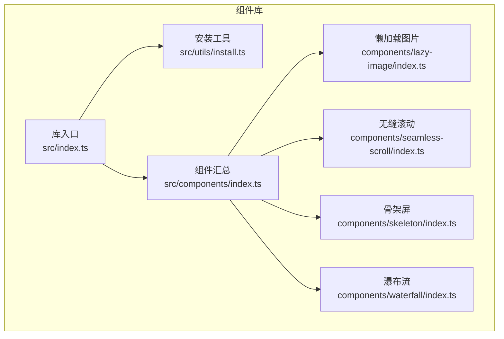
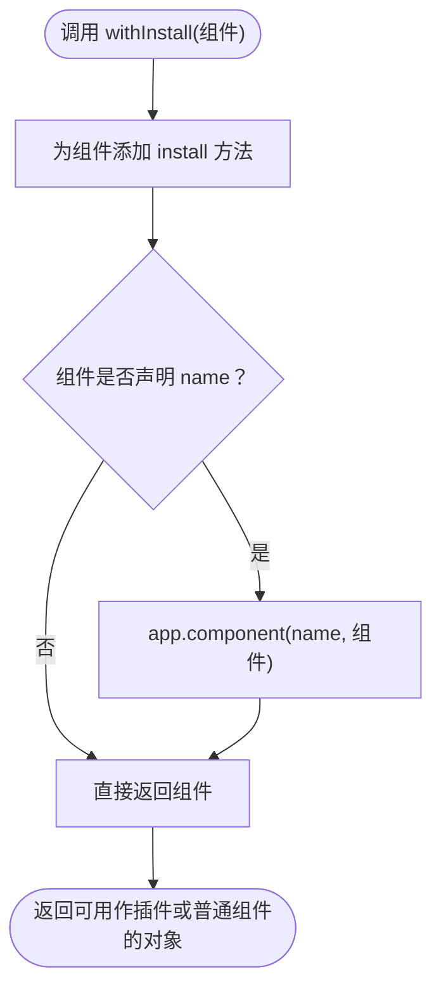
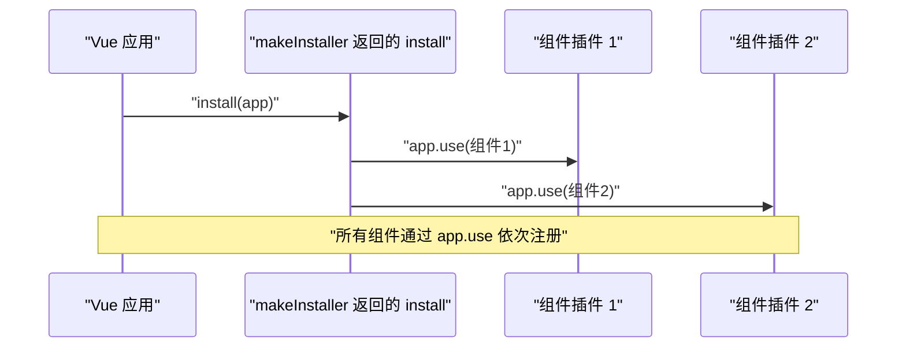
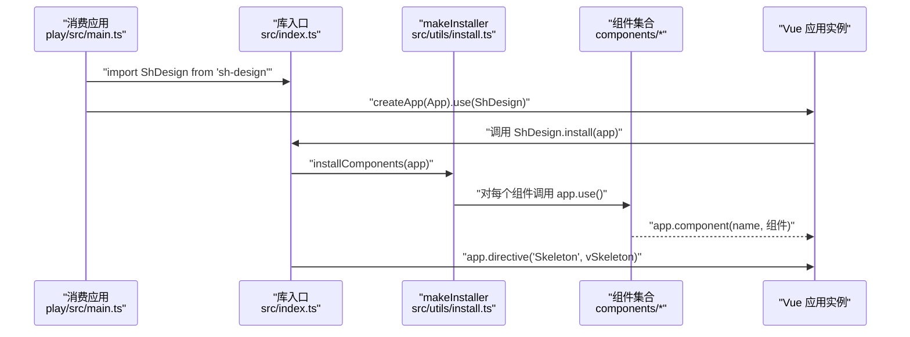
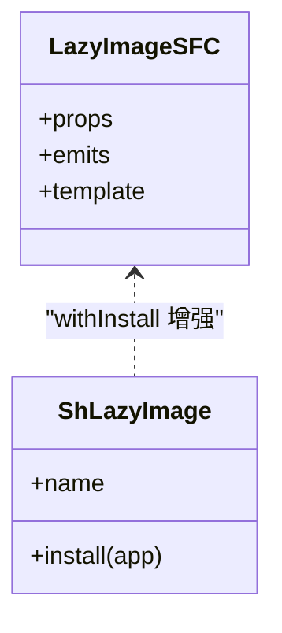
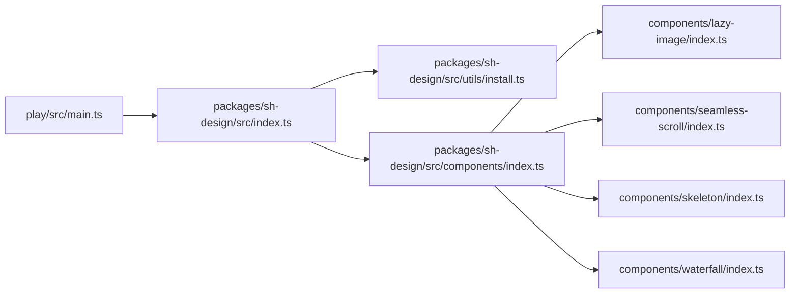

# 组件安装范式（withInstall / makeInstaller）

<cite>
**本文引用的文件**   
- [packages/sh-design/src/utils/install.ts](file://packages/sh-design/src/utils/install.ts)
- [packages/sh-design/src/index.ts](file://packages/sh-design/src/index.ts)
- [packages/sh-design/src/components/index.ts](file://packages/sh-design/src/components/index.ts)
- [packages/sh-design/src/components/lazy-image/index.ts](file://packages/sh-design/src/components/lazy-image/index.ts)
- [packages/sh-design/src/components/seamless-scroll/index.ts](file://packages/sh-design/src/components/seamless-scroll/index.ts)
- [packages/sh-design/src/components/skeleton/index.ts](file://packages/sh-design/src/components/skeleton/index.ts)
- [packages/sh-design/src/components/waterfall/index.ts](file://packages/sh-design/src/components/waterfall/index.ts)
- [play/src/main.ts](file://play/src/main.ts)
- [packages/sh-design/package.json](file://packages/sh-design/package.json)
</cite>

## 目录
1. [引言](#引言)
2. [项目结构](#项目结构)
3. [核心组件与安装工具](#核心组件与安装工具)
4. [架构总览](#架构总览)
5. [详细组件分析](#详细组件分析)
6. [依赖关系分析](#依赖关系分析)
7. [性能与打包特性](#性能与打包特性)
8. [常见问题排查](#常见问题排查)
9. [结论](#结论)

## 引言
sh-design 是一个面向功能性与业务场景的 Vue 3 组件库。它采用统一的组件安装范式：每个组件通过 `withInstall` 获得插件能力，整库通过 `makeInstaller` 聚合为单一插件对象，对外暴露默认导出的 `ShDesign` 插件，同时保留按组件按需导入的能力。

本文重点剖析以下问题：
- 组件如何通过 `withInstall` 具备 `app.use()` 插件能力；
- 整库如何借助 `makeInstaller` 完成组件聚合注册；
- Sh 前缀命名、默认导出与具名导出的组织方式；
- 样式、指令和版本信息在库入口中的装配位置。

## 项目结构
本项目的核心代码位于 `packages/sh-design` 子包中，其源码结构可以理解为三层：
- 组件层：每个业务组件位于 `src/components/<name>/`，包含 SFC、类型定义和 `index.ts` 包装器；
- 工具层：`src/utils/` 提供通用安装工具；
- 库入口层：`src/index.ts` 汇总组件、样式、指令、版本，并导出整库插件。

**图表来源**
- [packages/sh-design/src/index.ts:1-45](file://packages/sh-design/src/index.ts#L1-L45)
- [packages/sh-design/src/utils/install.ts:1-29](file://packages/sh-design/src/utils/install.ts#L1-L29)
- [packages/sh-design/src/components/index.ts:1-4](file://packages/sh-design/src/components/index.ts#L1-L4)
- [packages/sh-design/src/components/lazy-image/index.ts:1-9](file://packages/sh-design/src/components/lazy-image/index.ts#L1-L9)
- [packages/sh-design/src/components/seamless-scroll/index.ts:1-9](file://packages/sh-design/src/components/seamless-scroll/index.ts#L1-L9)
- [packages/sh-design/src/components/skeleton/index.ts:1-8](file://packages/sh-design/src/components/skeleton/index.ts#L1-L8)
- [packages/sh-design/src/components/waterfall/index.ts:1-9](file://packages/sh-design/src/components/waterfall/index.ts#L1-L9)

**章节来源**
- [packages/sh-design/src/index.ts:1-45](file://packages/sh-design/src/index.ts#L1-L45)
- [packages/sh-design/src/components/index.ts:1-4](file://packages/sh-design/src/components/index.ts#L1-L4)

## 核心组件与安装工具
本节聚焦两个关键工具函数和库入口职责。

### withInstall：让组件成为插件
`withInstall` 接收一个带有可选 `name` 属性的组件，为其挂载 `install(app)` 方法，使其满足 Vue 插件接口。当组件拥有 `name` 时，`install` 会调用 `app.component(name, component)` 完成全局注册。该函数返回增强后的组件实例，因此同一个对象既可被当作普通组件使用，又可作为插件传给 `app.use()`。

关键点：
- 类型层面通过 `SFCWithInstall<T>` 把组件与 `Plugin` 合并，保证类型安全；
- 运行时只检查 `name` 是否存在，存在才执行全局注册；
- 返回值仍是原组件，不影响按需导入行为。

**图表来源**
- [packages/sh-design/src/utils/install.ts:1-29](file://packages/sh-design/src/utils/install.ts#L1-L29)

**章节来源**
- [packages/sh-design/src/utils/install.ts:1-29](file://packages/sh-design/src/utils/install.ts#L1-L29)

### makeInstaller：聚合整库插件
`makeInstaller` 接收一个插件数组，返回一个具有 `install(app)` 方法的对象。该对象的 `install` 遍历组件列表并逐个调用 `app.use(component)`，从而让整库能够以单一对象形式被 `createApp().use(...)` 注册。

关键点：
- 输入是已带 `install` 的组件，即每个组件本身就是一个插件；
- 输出是一个新的插件对象 `{ install }`，用于代表整个库；
- 组件注册顺序由传入数组决定。

**图表来源**
- [packages/sh-design/src/utils/install.ts:1-29](file://packages/sh-design/src/utils/install.ts#L1-L29)

**章节来源**
- [packages/sh-design/src/utils/install.ts:1-29](file://packages/sh-design/src/utils/install.ts#L1-L29)

### 库入口：默认导出整库插件，具名导出按需能力
`src/index.ts` 是 sh-design 包的默认入口。它承担以下职责：
- 引入 `makeInstaller`；
- 从各组件模块引入 `ShLazyImage`、`ShSeamlessScroll`、`ShSkeleton`、`ShWaterfall`；
- 构建组件数组并调用 `makeInstaller(components)`；
- 创建库级 `install`，先注册组件，再注册指令 `vSkeleton`；
- 导出默认对象 `ShDesign`，以及 `install`、`version`；
- 通过 `export * from './components'` 暴露所有组件的具名导出；
- 重新导出 `withInstall`、`makeInstaller` 及 `SFCWithInstall` 类型。

这意味着消费方可以同时使用两种方式：
- 全量注册：`import ShDesign from 'sh-design'`，然后 `createApp(App).use(ShDesign)`；
- 按需注册：`import { ShCopyButton, ShLazyImage, ... } from 'sh-design'`。

注意：当前仓库示例组件包括懒加载图片、无缝滚动、骨架屏和瀑布流；`copy-button` 在提示中被提及，但当前组件索引未列出该组件。

**章节来源**
- [packages/sh-design/src/index.ts:1-45](file://packages/sh-design/src/index.ts#L1-L45)

## 架构总览
下图展示从消费应用到组件注册的完整链路。

**图表来源**
- [play/src/main.ts:1-5](file://play/src/main.ts#L1-L5)
- [packages/sh-design/src/index.ts:1-45](file://packages/sh-design/src/index.ts#L1-L45)
- [packages/sh-design/src/utils/install.ts:1-29](file://packages/sh-design/src/utils/install.ts#L1-L29)

## 详细组件分析

### 组件包装器模式：以 lazy-image 为例
每个组件的 `index.ts` 遵循统一模式：
1. 从 `../../utils/install` 引入 `withInstall`；
2. 从同级 `src/*.vue` 引入实际 SFC；
3. 用 `withInstall(SFC)` 包装后导出常量 `ShXxx`；
4. 同时导出同名默认值；
5. 使用 `export * from './src/...'` 暴露组件 props、emits、类型等；
6. 通常再导出一个基于 `InstanceType<typeof Xxx>` 的实例类型别名。

这种模式使组件既可作为普通组件按需导入，又可在整库注册时自动成为全局组件。

**图表来源**
- [packages/sh-design/src/components/lazy-image/index.ts:1-9](file://packages/sh-design/src/components/lazy-image/index.ts#L1-L9)

**章节来源**
- [packages/sh-design/src/components/lazy-image/index.ts:1-9](file://packages/sh-design/src/components/lazy-image/index.ts#L1-L9)

### 其他组件的一致性
- 无缝滚动：导出 `ShSeamlessScroll`，并通过 `withInstall` 赋予插件能力；
- 骨架屏：除组件外还导出指令相关内容；
- 瀑布流：导出 `ShWaterfall`，同样使用 `withInstall`。

这些组件的 `index.ts` 都遵循相同的结构与命名约定，便于库入口统一引用。

**章节来源**
- [packages/sh-design/src/components/seamless-scroll/index.ts:1-9](file://packages/sh-design/src/components/seamless-scroll/index.ts#L1-L9)
- [packages/sh-design/src/components/skeleton/index.ts:1-8](file://packages/sh-design/src/components/skeleton/index.ts#L1-L8)
- [packages/sh-design/src/components/waterfall/index.ts:1-9](file://packages/sh-design/src/components/waterfall/index.ts#L1-L9)

### Sh 前缀命名与导出策略
- 组件常量统一使用 `Sh` 前缀，例如 `ShLazyImage`、`ShSeamlessScroll`、`ShSkeleton`、`ShWaterfall`；
- 组件模块内部同时提供具名导出和默认导出，默认导出与具名导出指向同一对象；
- 库入口通过 `export * from './components'` 把所有组件的具名导出透传到包顶层；
- 因此消费方既能写 `import { ShLazyImage } from 'sh-design'`，也能写 `import ShLazyImage from 'sh-design'`。

这种设计兼顾了两种常见使用习惯：
- 现代工程化偏好具名导入；
- 部分用户仍习惯默认导入。

**章节来源**
- [packages/sh-design/src/components/lazy-image/index.ts:1-9](file://packages/sh-design/src/components/lazy-image/index.ts#L1-L9)
- [packages/sh-design/src/components/seamless-scroll/index.ts:1-9](file://packages/sh-design/src/components/seamless-scroll/index.ts#L1-L9)
- [packages/sh-design/src/components/skeleton/index.ts:1-8](file://packages/sh-design/src/components/skeleton/index.ts#L1-L8)
- [packages/sh-design/src/components/waterfall/index.ts:1-9](file://packages/sh-design/src/components/waterfall/index.ts#L1-L9)
- [packages/sh-design/src/index.ts:1-45](file://packages/sh-design/src/index.ts#L1-L45)

## 依赖关系分析
sh-design 的依赖关系分为三层：消费应用、库入口、组件与工具。

**图表来源**
- [play/src/main.ts:1-5](file://play/src/main.ts#L1-L5)
- [packages/sh-design/src/index.ts:1-45](file://packages/sh-design/src/index.ts#L1-L45)
- [packages/sh-design/src/components/index.ts:1-4](file://packages/sh-design/src/components/index.ts#L1-L4)

**章节来源**
- [play/src/main.ts:1-5](file://play/src/main.ts#L1-L5)
- [packages/sh-design/src/index.ts:1-45](file://packages/sh-design/src/index.ts#L1-L45)
- [packages/sh-design/src/components/index.ts:1-4](file://packages/sh-design/src/components/index.ts#L1-L4)

## 性能与打包特性
从包配置可以看出以下打包特征：
- 包名为 `sh-design`，主入口为 `dist/sh-design.cjs`，模块入口为 `dist/sh-design.js`；
- `exports` 字段映射默认导出、样式路径和包元数据；
- `sideEffects` 包含 CSS 文件，确保样式能被正确收集；
- `vue` 声明为 `peerDependencies`，避免重复打包 Vue；
- 类型声明通过 `types` 指向 `./dist/index.d.ts`，配合 `vite-plugin-dts` 生成；
- 消费方需要额外引入样式文件，如文档站所示。

结合库入口行为，建议消费方注意：
- 若使用全量 `app.use(ShDesign)`，仍需显式引入样式；
- 若仅按需导入组件，也应按需引入对应样式，避免视觉缺失；
- 由于 `vue` 是 peer dependency，消费方应自行安装兼容版本的 Vue。

**章节来源**
- [packages/sh-design/package.json:1-62](file://packages/sh-design/package.json#L1-L62)
- [packages/sh-design/src/index.ts:1-45](file://packages/sh-design/src/index.ts#L1-L45)

## 常见问题排查

### 为什么 `app.use(Component)` 能注册组件？
因为组件通过 `withInstall` 获得了 `install(app)` 方法，符合 Vue 插件接口。当组件声明了 `name`，`install` 会调用 `app.component(name, component)`，实现全局注册。

**章节来源**
- [packages/sh-design/src/utils/install.ts:1-29](file://packages/sh-design/src/utils/install.ts#L1-L29)

### 为什么整库只需要一次 `app.use(ShDesign)`？
因为 `makeInstaller` 将多个组件插件聚合成一个 `install` 函数。库入口创建 `ShDesign` 对象并导出，消费方调用一次 `app.use(ShDesign)` 即可触发所有组件注册。

**章节来源**
- [packages/sh-design/src/index.ts:1-45](file://packages/sh-design/src/index.ts#L1-L45)
- [packages/sh-design/src/utils/install.ts:1-29](file://packages/sh-design/src/utils/install.ts#L1-L29)

### 为什么样式没有生效？
库入口虽然引入了样式，但 `package.json` 的 `exports` 和文档说明均强调消费方需额外引入样式文件。如果只导入 JS 而未引入 CSS，组件可能缺少视觉样式。

**章节来源**
- [packages/sh-design/src/index.ts:1-45](file://packages/sh-design/src/index.ts#L1-L45)
- [packages/sh-design/package.json:1-62](file://packages/sh-design/package.json#L1-L62)

### 为什么找不到 copy-button 组件？
当前组件汇总索引仅导出懒加载图片、无缝滚动、骨架屏和瀑布流四个组件。虽然文档提示参考 `copy-button`，但该组件在当前 `components/index.ts` 中并未出现，因此不能假设它已纳入当前发布版本。

**章节来源**
- [packages/sh-design/src/components/index.ts:1-4](file://packages/sh-design/src/components/index.ts#L1-L4)

## 结论
sh-design 的安装范式可以概括为：
- 每个组件通过 `withInstall` 同时具备普通组件和 Vue 插件双重身份；
- 整库通过 `makeInstaller` 把组件列表聚合为一个 `install` 方法；
- 库入口导出默认 `ShDesign` 插件，同时透传所有组件的具名导出；
- Sh 前缀贯穿组件常量命名，保持 API 风格一致；
- 样式、指令和版本信息在库入口集中装配，形成清晰的“组件—工具—库”分层。

这套设计既支持 `app.use(ShDesign)` 的全量注册，也支持 `import { ShXxx } from 'sh-design'` 的按需引入，适合面向业务组件的 Vue 3 组件库。