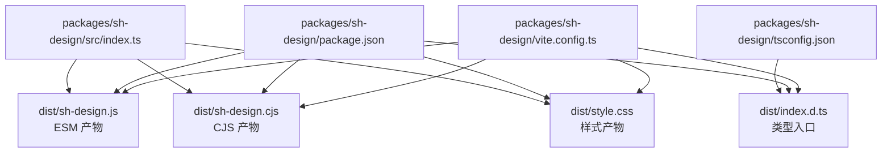
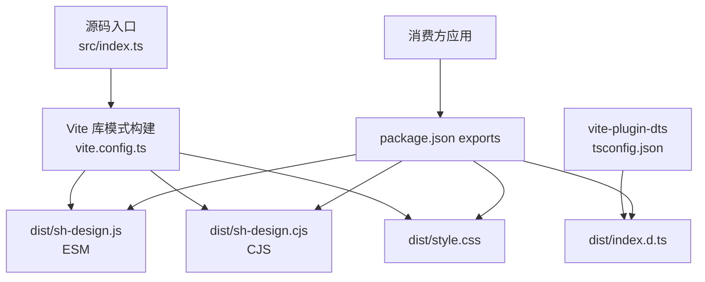
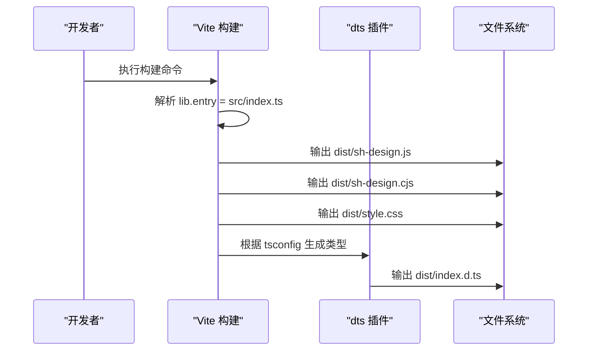
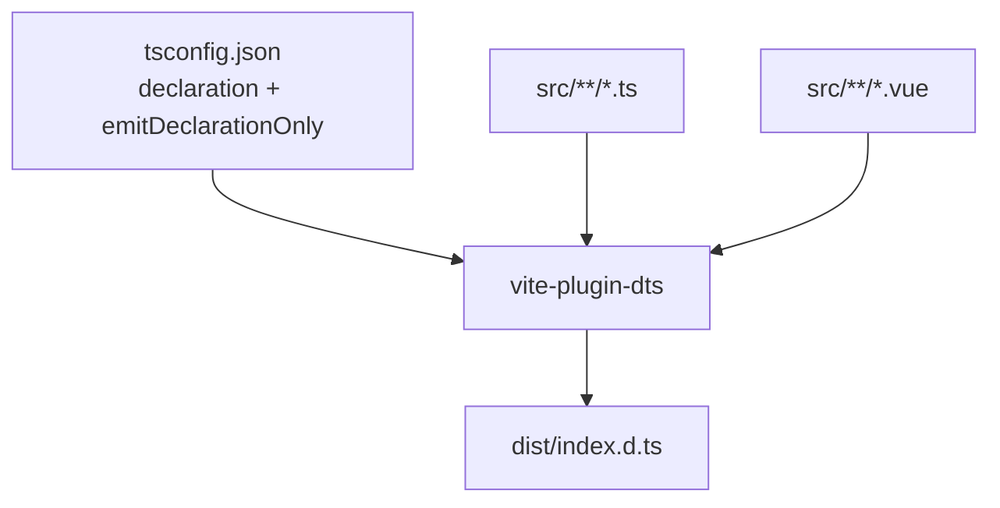
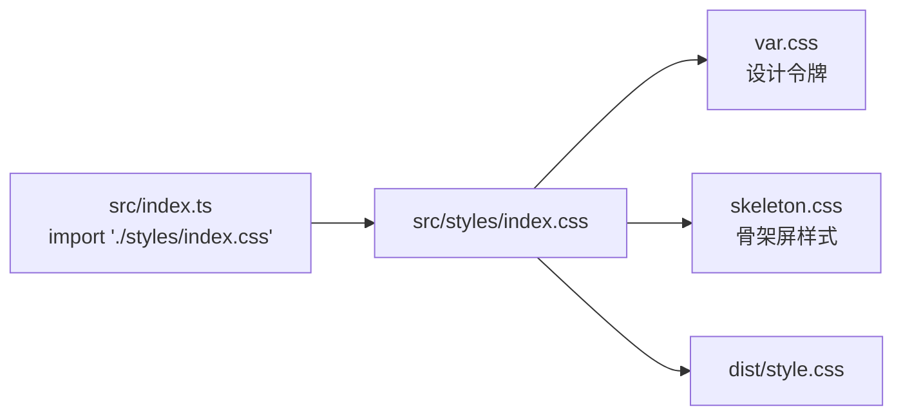
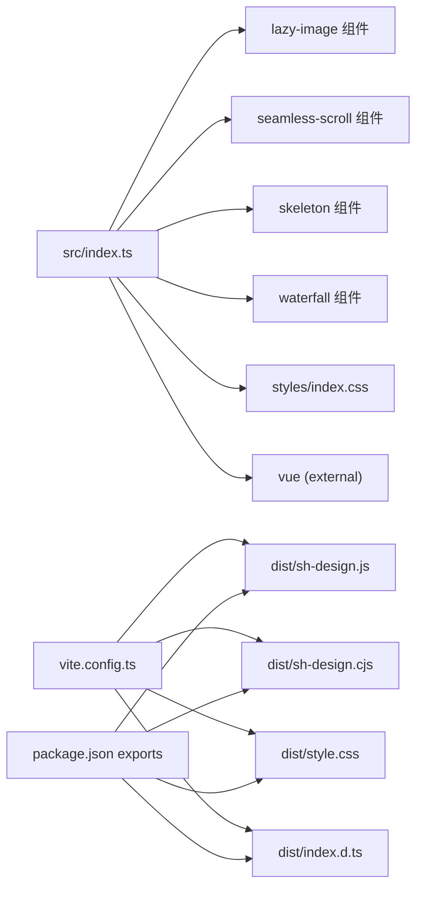

# 组件库构建与产物

<cite>
**本文引用的文件**   
- [packages/sh-design/vite.config.ts](file://packages/sh-design/vite.config.ts)
- [packages/sh-design/package.json](file://packages/sh-design/package.json)
- [packages/sh-design/tsconfig.json](file://packages/sh-design/tsconfig.json)
- [packages/sh-design/src/index.ts](file://packages/sh-design/src/index.ts)
- [packages/sh-design/src/styles/index.css](file://packages/sh-design/src/styles/index.css)
</cite>

## 目录
1. [引言](#引言)
2. [项目结构](#项目结构)
3. [核心组件](#核心组件)
4. [架构总览](#架构总览)
5. [详细构建流程分析](#详细构建流程分析)
6. [依赖关系分析](#依赖关系分析)
7. [性能与体积考量](#性能与体积考量)
8. [常见问题排查](#常见问题排查)
9. [结论](#结论)

## 引言
本文件聚焦 sh-design 组件库的 Vite 库模式构建，围绕以下要点展开：
- 构建入口、ESM/CJS 输出文件名与命名空间
- Vue 作为 external 的策略与全局变量映射
- vite-plugin-dts 的类型声明生成
- package.json 中 exports/types/sideEffects 的作用
- style.css 在打包与消费方引入路径中的位置

该组件库定位为面向功能性/业务场景的 Vue 3 组件集合，而非 Button/Input 级别的基础 UI 原语；因此文档强调可复用性与业务集成方式。npm 包名与仓库名均为 sh-design，本地工作区目录为 packages/sh-design。

## 项目结构
sh-design 的构建相关代码集中在 packages/sh-design 下，关键文件如下：
- vite.config.ts：Vite 库模式配置、插件、Rollup 选项
- package.json：包元数据、导出字段、sideEffects、peerDependencies
- tsconfig.json：类型声明输出到 dist
- src/index.ts：库默认导出、组件聚合、样式引入
- src/styles/index.css：设计令牌与组件样式入口

**图示来源**
- [packages/sh-design/vite.config.ts:1-42](file://packages/sh-design/vite.config.ts#L1-L42)
- [packages/sh-design/package.json:1-62](file://packages/sh-design/package.json#L1-L62)
- [packages/sh-design/tsconfig.json:1-12](file://packages/sh-design/tsconfig.json#L1-L12)
- [packages/sh-design/src/index.ts:1-45](file://packages/sh-design/src/index.ts#L1-L45)

**章节来源**
- [packages/sh-design/vite.config.ts:1-42](file://packages/sh-design/vite.config.ts#L1-L42)
- [packages/sh-design/package.json:1-62](file://packages/sh-design/package.json#L1-L62)
- [packages/sh-design/tsconfig.json:1-12](file://packages/sh-design/tsconfig.json#L1-L12)
- [packages/sh-design/src/index.ts:1-45](file://packages/sh-design/src/index.ts#L1-L45)

## 核心组件
本节从“构建系统”视角拆解关键构件及其职责。

- Vite 库模式配置
  - 入口：src/index.ts
  - 输出格式：es、cjs
  - 文件名：sh-design.js（ESM）、sh-design.cjs（CJS）
  - CSS 文件名：style.css
  - 最小化：关闭（由消费方决定）
  - Rollup external：vue
  - 全局变量映射：vue -> Vue
  - 导出策略：named

- vite-plugin-dts
  - entryRoot：src
  - outDir：dist
  - insertTypesEntry：true，生成单个 index.d.ts
  - include：src/**/*.ts、src/**/*.vue
  - tsconfigPath：指向 tsconfig.json

- TypeScript 配置
  - declaration：true
  - emitDeclarationOnly：true
  - outDir：dist
  - include：src、env.d.ts
  - exclude：dist、node_modules

- package.json
  - type：module
  - main：./dist/sh-design.cjs
  - module：./dist/sh-design.js
  - types：./dist/index.d.ts
  - exports：分别映射 .、./dist/style.css、./style.css、./package.json
  - sideEffects：**/*.css
  - peerDependencies.vue：^3.2.0

- 库源码入口
  - src/index.ts 聚合组件、注册指令、引入样式、暴露默认导出 ShDesign 与按需导出项

**章节来源**
- [packages/sh-design/vite.config.ts:1-42](file://packages/sh-design/vite.config.ts#L1-L42)
- [packages/sh-design/tsconfig.json:1-12](file://packages/sh-design/tsconfig.json#L1-L12)
- [packages/sh-design/package.json:1-62](file://packages/sh-design/package.json#L1-L62)
- [packages/sh-design/src/index.ts:1-45](file://packages/sh-design/src/index.ts#L1-L45)

## 架构总览
下图展示了从源码到发布产物的整体链路，以及消费端通过 package.json 的 exports 解析导出的过程。

**图示来源**
- [packages/sh-design/vite.config.ts:1-42](file://packages/sh-design/vite.config.ts#L1-L42)
- [packages/sh-design/package.json:1-62](file://packages/sh-design/package.json#L1-L62)
- [packages/sh-design/tsconfig.json:1-12](file://packages/sh-design/tsconfig.json#L1-L12)
- [packages/sh-design/src/index.ts:1-45](file://packages/sh-design/src/index.ts#L1-L45)

## 详细构建流程分析

### 构建入口与产物命名
- 入口文件：src/index.ts
  - 负责聚合组件、注册指令、引入样式，并暴露默认导出 ShDesign 与按需导出项。
  - 同时引入 styles/index.css，使样式参与打包。
- 输出命名：
  - ESM：sh-design.js
  - CJS：sh-design.cjs
  - CSS：style.css
  - 类型入口：index.d.ts（由 dts 插件生成）

**图示来源**
- [packages/sh-design/vite.config.ts:1-42](file://packages/sh-design/vite.config.ts#L1-L42)
- [packages/sh-design/src/index.ts:1-45](file://packages/sh-design/src/index.ts#L1-L45)

**章节来源**
- [packages/sh-design/vite.config.ts:1-42](file://packages/sh-design/vite.config.ts#L1-L42)
- [packages/sh-design/src/index.ts:1-45](file://packages/sh-design/src/index.ts#L1-L45)

### External vue 与全局变量映射
- external：['vue']
  - 不将 Vue 打入 bundle，避免重复依赖和体积膨胀。
  - 消费方需自行提供 Vue 运行时。
- globals：{ vue: 'Vue' }
  - 非模块环境下的全局变量映射，用于兼容 UMD/IIFE 等运行上下文。
- peerDependencies.vue：'^3.2.0'
  - 提示消费方安装匹配版本的 Vue。

注意：由于外部化了 vue，生产构建不会把 Vue 代码写入 sh-design.js 或 sh-design.cjs。若消费方未提供 Vue，则会在运行时抛出引用错误。

**章节来源**
- [packages/sh-design/vite.config.ts:1-42](file://packages/sh-design/vite.config.ts#L1-L42)
- [packages/sh-design/package.json:1-62](file://packages/sh-design/package.json#L1-L62)

### vite-plugin-dts 类型声明生成
- entryRoot：src
- outDir：dist
- insertTypesEntry：true
- include：src/**/*.ts、src/**/*.vue
- tsconfigPath：resolve(__dirname, 'tsconfig.json')

配合 tsconfig.json：
- declaration：true
- emitDeclarationOnly：true
- outDir：dist
- include：src、env.d.ts
- exclude：dist、node_modules

最终产出：
- dist/index.d.ts：类型入口，对应 package.json 的 types 字段
- 其他类型文件按 src 结构镜像生成

**图示来源**
- [packages/sh-design/vite.config.ts:1-42](file://packages/sh-design/vite.config.ts#L1-L42)
- [packages/sh-design/tsconfig.json:1-12](file://packages/sh-design/tsconfig.json#L1-L12)

**章节来源**
- [packages/sh-design/vite.config.ts:1-42](file://packages/sh-design/vite.config.ts#L1-L42)
- [packages/sh-design/tsconfig.json:1-12](file://packages/sh-design/tsconfig.json#L1-L12)

### package.json 的 exports、types 与 sideEffects
- exports
  - ".": 
    - types: ./dist/index.d.ts
    - import: ./dist/sh-design.js
    - require: ./dist/sh-design.cjs
  - "./dist/style.css": "./dist/style.css"
  - "./style.css": "./dist/style.css"
  - "./package.json": "./package.json"
- types: ./dist/index.d.ts
- sideEffects: ["**/*.css"]
  - 确保样式文件被正确识别和处理，避免被 Tree-shaking 误删。
- main/module
  - main: ./dist/sh-design.cjs
  - module: ./dist/sh-design.js

消费方导入行为：
- 全量注册：import ShDesign from 'sh-design'
- 按需引入：import { ShLazyImage } from 'sh-design'
- 样式引入：import 'sh-design/dist/style.css' 或 'sh-design/style.css'

**章节来源**
- [packages/sh-design/package.json:1-62](file://packages/sh-design/package.json#L1-L62)

### 样式处理与 design tokens
- src/index.ts 引入 src/styles/index.css
- src/styles/index.css 通过 @import 聚合 var.css 与 skeleton.css
- 构建后输出 dist/style.css
- 消费方需要额外引入 sh-design/dist/style.css，以获取设计令牌与组件样式

**图示来源**
- [packages/sh-design/src/index.ts:1-45](file://packages/sh-design/src/index.ts#L1-L45)
- [packages/sh-design/src/styles/index.css:1-2](file://packages/sh-design/src/styles/index.css#L1-L2)

**章节来源**
- [packages/sh-design/src/index.ts:1-45](file://packages/sh-design/src/index.ts#L1-L45)
- [packages/sh-design/src/styles/index.css:1-2](file://packages/sh-design/src/styles/index.css#L1-L2)

## 依赖关系分析
下图展示构建期与运行期的依赖关系。

**图示来源**
- [packages/sh-design/src/index.ts:1-45](file://packages/sh-design/src/index.ts#L1-L45)
- [packages/sh-design/vite.config.ts:1-42](file://packages/sh-design/vite.config.ts#L1-L42)
- [packages/sh-design/package.json:1-62](file://packages/sh-design/package.json#L1-L62)

**章节来源**
- [packages/sh-design/src/index.ts:1-45](file://packages/sh-design/src/index.ts#L1-L45)
- [packages/sh-design/vite.config.ts:1-42](file://packages/sh-design/vite.config.ts#L1-L42)
- [packages/sh-design/package.json:1-62](file://packages/sh-design/package.json#L1-L62)

## 性能与体积考量
- minify: false
  - 库产物保持可读性，便于调试；消费方自行决定是否压缩。
- external vue
  - 避免将 Vue 打入 bundle，减少重复依赖与体积。
- sideEffects: ["**/*.css"]
  - 保证样式不被误删，但应仅包含必要样式以提升打包效率。
- formats: ['es', 'cjs']
  - 双格式输出兼顾不同打包工具链与 Node 环境。

建议：
- 新增组件时遵循 withInstall/makeInstaller 约定，避免无谓的运行时开销。
- 仅在必要时引入样式文件，防止 dist/style.css 体积增长。

[本节为通用建议，不直接分析具体文件]

## 常见问题排查
- 运行时报 Vue 未定义
  - 原因：Vue 被 external，消费方未提供运行时。
  - 解决：确保消费方安装并注入 Vue。
- 样式缺失
  - 原因：未引入 dist/style.css。
  - 解决：在应用入口引入 'sh-design/dist/style.css' 或 'sh-design/style.css'。
- 类型找不到
  - 原因：exports.types 或 types 未正确指向 dist/index.d.ts。
  - 解决：确认 package.json 的 types 与 exports.types 一致，且已执行构建。
- 按需引入失败
  - 原因：未使用 withInstall 包裹或未在 components/index.ts 汇总导出。
  - 解决：遵循新增组件目录约定，完善 index.ts 汇总导出。

**章节来源**
- [packages/sh-design/vite.config.ts:1-42](file://packages/sh-design/vite.config.ts#L1-L42)
- [packages/sh-design/package.json:1-62](file://packages/sh-design/package.json#L1-L62)
- [packages/sh-design/src/index.ts:1-45](file://packages/sh-design/src/index.ts#L1-L45)

## 结论
sh-design 的构建体系以 Vite 库模式为核心，明确区分 ESM/CJS 产物、外部化 Vue、集中管理样式输出，并通过 vite-plugin-dts 与 tsconfig 协同生成类型声明。package.json 的 exports、types、sideEffects 精确控制消费方的导入路径与副作用，保证库在多种工程环境下的一致体验。遵循作者约定的组件组织与安装范式，可进一步降低集成成本并提升可维护性。