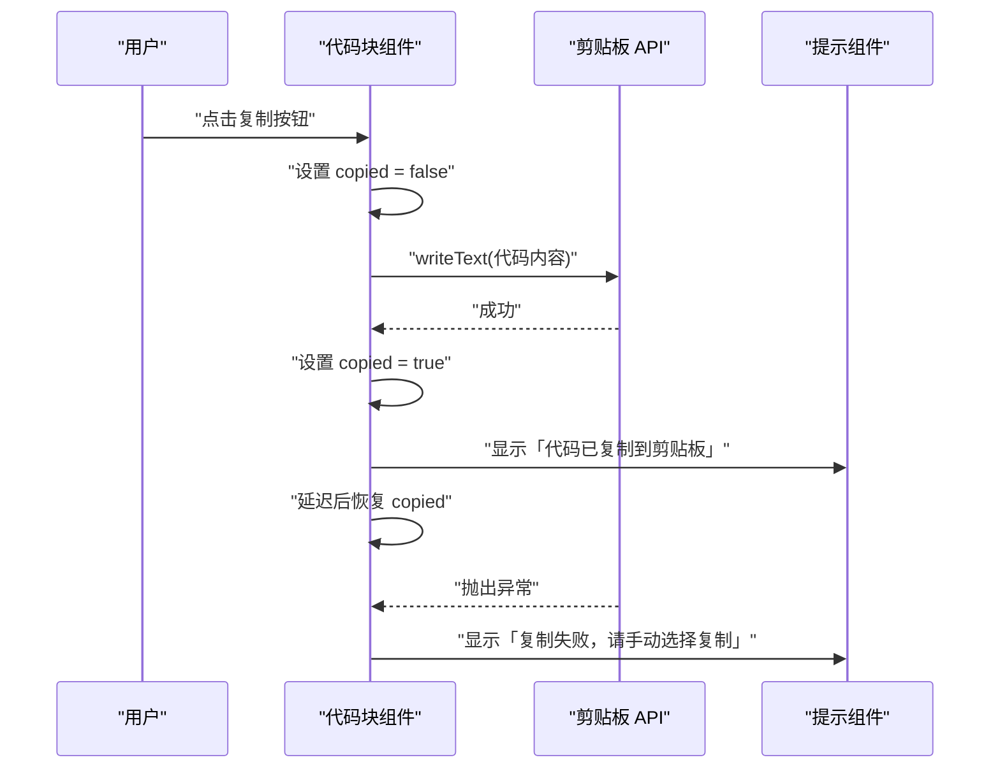
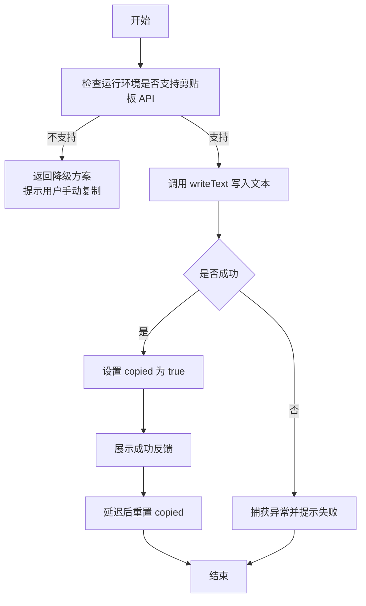
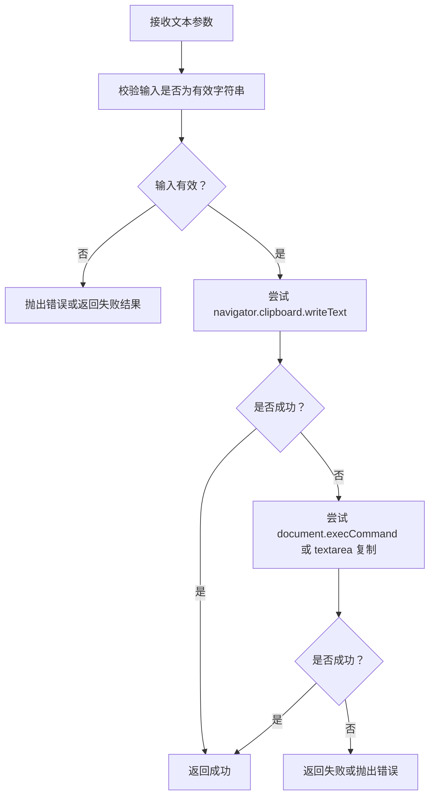
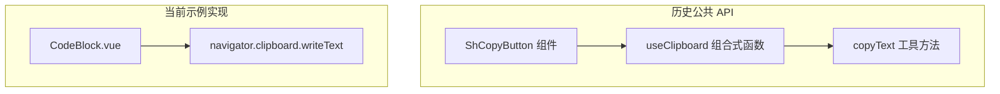

# 组合式函数（Composables）

<cite>
**本文引用的文件**   
- [changelog.md](file://docs/guide/changelog.md)
- [CodeBlock.vue](file://docs/.vitepress/theme/components/showcase/CodeBlock.vue)
</cite>

## 目录
1. [引言](#引言)
2. [项目结构与 hooks 目录约定](#项目结构与-hooks-目录约定)
3. [useClipboard 与 copyText 的历史定位](#useclipboard-与-copytext-的历史定位)
4. [当前代码库中的复制实现现状](#当前代码库中的复制实现现状)
5. [推荐实践：响应式 copied、错误处理与 SSR 安全](#推荐实践响应式-copied错误处理与-ssr-安全)
6. [底层 copyText 工具的降级策略建议](#底层-copytext-工具的降级策略建议)
7. [架构总览](#架构总览)
8. [故障排查](#故障排查)
9. [结论](#结论)

## 引言
sh-design 是面向功能性 / 业务组件的 Vue 3 组件库，其文档与知识卡应突出业务场景价值与可复用性。组合式函数（composables）在该项目中用于封装跨组件复用的状态与行为；就剪贴板能力而言，仓库记录显示 `useClipboard` 曾作为独立组合式函数提供响应式 `copied` 状态与复制能力，但后续版本已将其移除。当前示例站点仍保留本地复制逻辑，并直接基于浏览器原生 API 实现。

## 项目结构与 hooks 目录约定
从当前仓库快照看，`packages/sh-design/src` 下主要包含组件、样式、工具与入口文件，并未存在独立的 `hooks` 目录或 `use-clipboard.ts` 文件。项目的组合式函数若需要扩展，通常遵循作者约定的目录模式：

- 新增组合式函数时，应在包内合适位置创建对应的 TypeScript 源文件；
- 组合式函数暴露响应式状态与操作方法，供组件或演示页面使用；
- 若需对外导出，应通过包的聚合入口统一暴露；
- 组件与组合式函数的命名保持清晰语义，避免与通用 UI 原语混淆。

本仓库当前实际体现的是“剪贴板能力被移出公共 API”的状态：早期版本提供过 `useClipboard`，之后在变更日志中明确移除了该组合式函数与配套 `copyText` 工具方法。

**章节来源**
- [changelog.md:60-66](file://docs/guide/changelog.md#L60-L66)

## useClipboard 与 copyText 的历史定位
根据文档变更记录：

- 首次发布时新增了 `ShCopyButton` 复制按钮组件，并同时新增了 `useClipboard` 组合式函数，提供响应式 `copied` 状态与复制能力。
- 后续版本将 `ShCopyButton` 移除，原因是它属于早期验证工程链路的示例组件，不符合 sh-design 面向功能性 / 业务组件的定位。
- 与 `ShCopyButton` 绑定的 `useClipboard` 组合式函数和 `copyText` 工具方法也被同步移除，二者原本从包根导出。
- 官方升级提示建议：仍需复制能力的项目直接使用原生 `navigator.clipboard.writeText()`，或者锁定旧版本。

这说明 `useClipboard` 的设计目标是把“复制文本 + 成功反馈 + 失败处理”这类常见交互抽象为可复用组合式函数；而 `copyText` 则是更底层的文本写入工具。

**章节来源**
- [changelog.md:130-143](file://docs/guide/changelog.md#L130-L143)
- [changelog.md:60-66](file://docs/guide/changelog.md#L60-L66)

## 当前代码库中的复制实现现状
当前示例站点的代码块组件仍然实现了复制功能，但它没有依赖 `useClipboard` 或 `copyText`，而是：

- 使用 Vue 的 `ref(false)` 维护本地 `copied` 状态；
- 点击复制时调用 `navigator.clipboard.writeText(props.code)`；
- 成功时把 `copied` 置为 `true`，并通过 toast 提示“代码已复制到剪贴板”，随后用定时器恢复；
- 捕获异常后提示“复制失败，请手动选择复制”。

这种实现体现了组合式函数拆分前的典型思路：把状态、副作用和用户反馈放在一个组件内完成。如果未来需要跨多个组件复用，则可以把这段逻辑抽成组合式函数。

**图表来源**
- [CodeBlock.vue:1-197](file://docs/.vitepress/theme/components/showcase/CodeBlock.vue#L1-L197)

**章节来源**
- [CodeBlock.vue:1-197](file://docs/.vitepress/theme/components/showcase/CodeBlock.vue#L1-L197)

## 推荐实践：响应式 copied、错误处理与 SSR 安全
虽然 `useClipboard` 当前不在包内，但结合现有实现与 sh-design 的技术栈（Vue 3、Vite、TypeScript），可以总结出一套合理的组合式函数设计原则：

### 响应式 copied 状态
- 使用 `ref(false)` 维护布尔状态，表示是否刚刚成功复制。
- 返回状态给调用方，使按钮文案、图标或视觉反馈能跟随状态变化。
- 可选地提供自动恢复机制，例如在成功一段时间后重置为 `false`。

### 错误处理
- 调用剪贴板 API 时应包裹异步错误处理。
- 成功路径更新状态并给出正向反馈。
- 失败路径不应阻断主流程，应给出降级提示，例如引导用户手动复制。
- 对非网络型错误（权限不足、上下文不可用等）与用户操作取消做兼容。

### SSR 安全
- 剪贴板 API 只在浏览器环境可用；在服务端渲染或 Web Worker 中访问 `navigator` 可能报错。
- 组合式函数应避免在模块顶层直接读取 `navigator`，而应在运行时判断环境后再调用。
- 对不支持的环境，可返回空操作或降级到用户手动复制提示。

[本图为概念流程图，不直接映射具体源码]

## 底层 copyText 工具的降级策略建议
`copyText` 作为底层工具，应当尽量屏蔽上层差异，只暴露“复制一段文本”的语义接口。结合当前仓库示例与浏览器 API 现状，合理降级策略包括：

| 层级 | 行为 | 说明 |
|---|---|---|
| 首选策略 | 使用 `navigator.clipboard.writeText(text)` | 现代浏览器推荐 API，语义清晰，适合 Promise 风格调用 |
| 第一级降级 | 使用 `document.execCommand('copy')` | 旧版浏览器仍可工作，但已被标记为过时，不应作为唯一实现 |
| 第二级降级 | 创建隐藏 `<textarea>`，赋值并执行选中复制 | 兼容更多旧环境，同时避免直接依赖已废弃命令 |
| 最终降级 | 提示用户手动复制 | 当所有自动化方式都不可用时，保证用户体验不被阻断 |

此外，`copyText` 还应满足：

- 输入校验：拒绝 `undefined`、`null` 或空字符串，或按策略转为空串处理；
- 类型安全：使用 TypeScript 声明 `text: string`；
- 返回值：优先返回 Promise，让调用方可等待结果；
- 环境隔离：不在模块加载期访问 `navigator`；
- 可测试性：将环境判断与浏览器 API 调用解耦，便于单元测试替换。

[本图为概念流程图，不直接映射具体源码]

## 架构总览
从当前仓库可见，sh-design 的剪贴板相关能力经历了从“组件 + 组合式函数 + 工具方法”到“仅由示例代码直接使用原生 API”的收敛过程。下图展示了这一演进关系：

**图表来源**
- [changelog.md:60-66](file://docs/guide/changelog.md#L60-L66)
- [changelog.md:130-143](file://docs/guide/changelog.md#L130-L143)
- [CodeBlock.vue:1-197](file://docs/.vitepress/theme/components/showcase/CodeBlock.vue#L1-L197)

**章节来源**
- [changelog.md:60-66](file://docs/guide/changelog.md#L60-L66)
- [changelog.md:130-143](file://docs/guide/changelog.md#L130-L143)
- [CodeBlock.vue:1-197](file://docs/.vitepress/theme/components/showcase/CodeBlock.vue#L1-L197)

## 故障排查
常见问题与对应建议如下：

| 问题现象 | 可能原因 | 处理建议 |
|---|---|---|
| 复制后立即报错 | 在非浏览器环境访问 `navigator.clipboard` | 增加环境判断，SSR 时跳过剪贴板逻辑 |
| 复制失败但没有提示 | 未捕获异步异常 | 使用 try/catch 包裹 `writeText`，并在 catch 中提示用户 |
| 复制成功但状态没有恢复 | 缺少自动重置逻辑 | 成功后设置短暂延迟，将 `copied` 重置为 `false` |
| 用户看到“复制失败”但剪贴板实际可用 | 权限被拒绝或上下文不安全 | 提示用户允许剪贴板权限，或在 HTTPS 环境下重试 |
| 升级后找不到 `useClipboard` | 包版本升级导致公共 API 移除 | 参考变更日志，改用原生 API 或锁定旧版本 |

**章节来源**
- [changelog.md:60-66](file://docs/guide/changelog.md#L60-L66)
- [CodeBlock.vue:1-197](file://docs/.vitepress/theme/components/showcase/CodeBlock.vue#L1-L197)

## 结论
在当前仓库中，`useClipboard` 与 `copyText` 已不再是 sh-design 的公开组合式函数与工具方法。代码库保留了示例站点内的复制实现，作为理解“响应式 copied 状态 + 错误处理 + 降级策略”的良好参考。

如果需要继续以组合式函数形式复用剪贴板能力，建议：

- 封装响应式 `copied` 状态；
- 对 `navigator.clipboard.writeText` 做 SSR 安全与错误处理；
- 提供 `copyText` 风格的底层降级策略；
- 明确何时返回 Promise、何时抛出错误、何时降级为用户手动复制；
- 通过变更日志与升级提示向使用者说明迁移路径。

这样既能保持 sh-design 的业务组件定位，又能让复制类交互具备一致、可测试、可回退的实现基础。