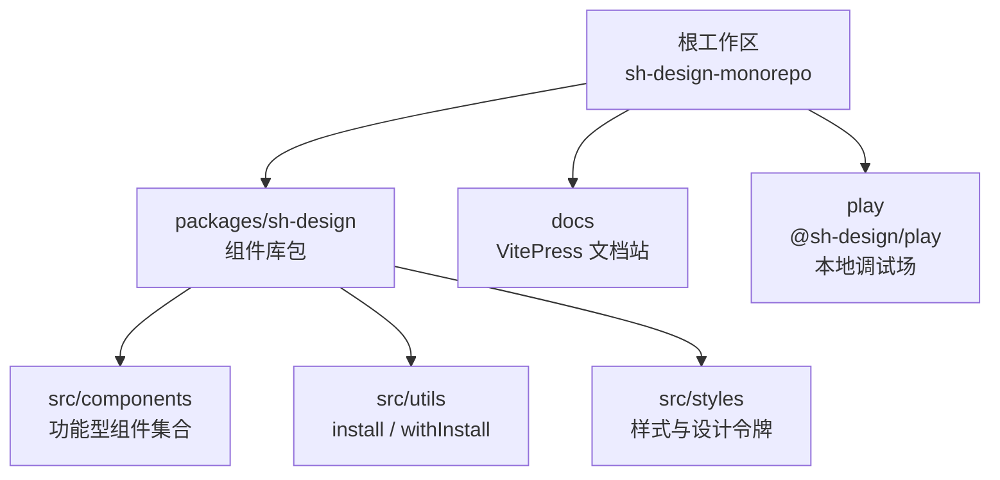
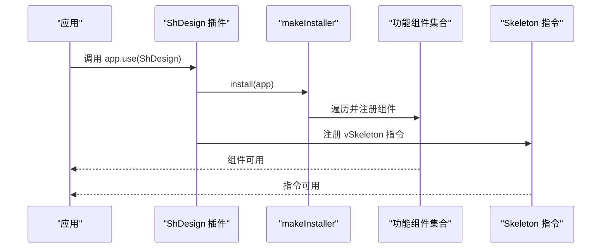
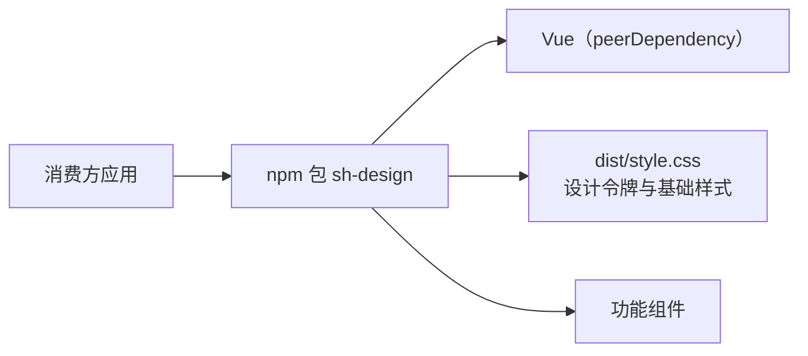

# 项目概览与定位

<cite>
**本文引用的文件**   
- [README.md](file://README.md)
- [package.json](file://package.json)
- [pnpm-workspace.yaml](file://pnpm-workspace.yaml)
- [packages/sh-design/package.json](file://packages/sh-design/package.json)
- [packages/sh-design/src/index.ts](file://packages/sh-design/src/index.ts)
- [packages/sh-design/src/components/index.ts](file://packages/sh-design/src/components/index.ts)
- [packages/sh-design/src/utils/install.ts](file://packages/sh-design/src/utils/install.ts)
- [play/package.json](file://play/package.json)
</cite>

## 目录
1. [简介](#简介)
2. [项目结构](#项目结构)
3. [核心特性](#核心特性)
4. [技术栈与环境](#技术栈与环境)
5. [包名、仓库名与工作区命名区分](#包名仓库名与工作区命名区分)
6. [组件注册与使用方式](#组件注册与使用方式)
7. [依赖关系总览](#依赖关系总览)
8. [新成员快速上手](#新成员快速上手)
9. [结论](#结论)

## 简介
sh-design 是一个面向业务场景的 Vue 3 组件库。它不聚焦于 Button、Input 这类通用 UI 原语，而是优先提供懒加载图片、无缝滚动、骨架屏、虚拟瀑布流等真实业务中反复出现的“功能性组件”，目标是开箱即用、类型友好、可主题化、支持按需引入。

根 README 将产品定位为“面向业务场景的 Vue 3 组件库”，并强调功能性、TypeScript 友好、CSS 变量驱动的主题能力以及全量注册与按需引入两种用法。

**章节来源**
- [README.md:1-105](file://README.md#L1-L105)

## 项目结构
仓库采用 pnpm workspace 管理的 monorepo：

- `packages/sh-design`：业务组件库源码与构建产物入口。
- `docs`：基于 VitePress 的文档站点。
- `play`：用于调试组件的本地演示应用，依赖 `sh-design` 的 workspace 引用。
- 根目录脚本通过 `pnpm --filter` 调度各子包的 dev/build/lint/typecheck。

**图表来源**
- [pnpm-workspace.yaml:1-16](file://pnpm-workspace.yaml#L1-L16)
- [packages/sh-design/src/index.ts:1-45](file://packages/sh-design/src/index.ts#L1-L45)
- [packages/sh-design/src/components/index.ts:1-4](file://packages/sh-design/src/components/index.ts#L1-L4)

**章节来源**
- [pnpm-workspace.yaml:1-16](file://pnpm-workspace.yaml#L1-L16)
- [package.json:1-47](file://package.json#L1-L47)

## 核心特性
- **业务组件优先**：重点覆盖懒加载图片、无缝滚动、骨架屏、虚拟瀑布流等业务高频需求。
- **现代且轻量**：Vue 3 `<script setup>` + Vite 库模式构建，输出 ESM/CJS，利于 Tree-Shaking。
- **TypeScript 优先**：提供 `.d.ts` 类型声明，Props、Emits、Slots 全程可推导。
- **主题可定制**：由 CSS 变量驱动的设计令牌，覆盖即换肤。
- **双安装范式**：`app.use(ShDesign)` 全量注册；或 `import { ShLazyImage }` 按需引入。

这些特性在根 README 与组件库入口中均有直接体现。

**章节来源**
- [README.md:1-105](file://README.md#L1-L105)
- [packages/sh-design/src/index.ts:1-45](file://packages/sh-design/src/index.ts#L1-L45)

## 技术栈与环境
- **前端框架**：Vue 3（根 devDependencies 为 `^3.5.13`）。
- **构建工具**：Vite（根 devDependencies 为 `^5.4.11`），组件库使用 Vite library mode。
- **类型系统**：TypeScript（根 devDependencies 为 `^5.6.3`）。
- **包管理**：pnpm workspace/monorepo。
- **文档站**：VitePress（见 docs 与 scripts 中的 docs:* 命令）。
- **运行环境**：Node >= 18。

根 package.json 的 engines 字段要求 Node >= 18，scripts 中集中暴露 play、build、docs:dev、docs:build、lint、typecheck 等工作流入口。

**章节来源**
- [package.json:1-47](file://package.json#L1-L47)

## 包名、仓库名与工作区命名区分
- **npm 包名**：`sh-design`。
- **GitHub 仓库地址**：`KTBOY/sh-design`。
- **本地工作区/目录名**：`packages/sh-design`，但对外发布名称不是 `sh-ui`。
- **文档站 base**：`/sh-design/`。

务必注意：不要把本地目录名误解为包名。消费方通过 `npm install sh-design` 引入，而不是某个名为 `sh-ui` 的包。

**章节来源**
- [packages/sh-design/package.json:1-62](file://packages/sh-design/package.json#L1-L62)
- [package.json:1-47](file://package.json#L1-L47)

## 组件注册与使用方式
sh-design 同时支持两种使用方式：

1. **全量注册**：默认导出 `ShDesign` 插件，调用 `app.use(ShDesign)` 一次性注册所有组件和指令。
2. **按需引入**：从包中导入具体组件，例如 `ShLazyImage`、`ShSeamlessScroll`、`ShSkeleton`、`ShWaterfall`。

内部实现上：
- `src/index.ts` 汇总组件列表，并通过 `makeInstaller` 生成统一 install 逻辑。
- `utils/install.ts` 提供 `withInstall`，给单个 SFC 注入 `install` 方法，使其既可单独 import，也可被整体安装。
- 组件目录集中在 `src/components`，每个组件有自己的 index 入口，再由 `components/index.ts` 统一聚合导出。

**图表来源**
- [packages/sh-design/src/index.ts:1-45](file://packages/sh-design/src/index.ts#L1-L45)
- [packages/sh-design/src/utils/install.ts:1-29](file://packages/sh-design/src/utils/install.ts#L1-L29)

当前已注册的组件包括：
- `ShLazyImage`：懒加载图片，支持骨架屏、淡入、失败兜底、loader 取图、视口懒加载等。
- `ShSeamlessScroll`：高性能无缝滚动，支持多方向、悬停暂停、滚轮手动滚动、步进滚动。
- `ShSkeleton`：骨架屏，支持组件与 `v-skeleton` 指令双用法。
- `ShWaterfall`：虚拟瀑布流，支持瀑布流/网格布局、虚拟列表、触底分页。

**章节来源**
- [README.md:1-105](file://README.md#L1-L105)
- [packages/sh-design/src/index.ts:1-45](file://packages/sh-design/src/index.ts#L1-L45)
- [packages/sh-design/src/components/index.ts:1-4](file://packages/sh-design/src/components/index.ts#L1-L4)
- [packages/sh-design/src/utils/install.ts:1-29](file://packages/sh-design/src/utils/install.ts#L1-L29)

## 依赖关系总览
sh-design 作为 npm 包，对 Vue 使用 peerDependency 形式声明依赖，避免把 Vue 重复打包进库产物；消费方需要自行安装 Vue，并在引入组件库时额外引入样式文件。

**图表来源**
- [packages/sh-design/package.json:1-62](file://packages/sh-design/package.json#L1-L62)
- [packages/sh-design/src/index.ts:1-45](file://packages/sh-design/src/index.ts#L1-L45)

**章节来源**
- [packages/sh-design/package.json:1-62](file://packages/sh-design/package.json#L1-L62)
- [packages/sh-design/src/index.ts:1-45](file://packages/sh-design/src/index.ts#L1-L45)

## 新成员快速上手
建议按以下顺序建立全局认知：

1. 阅读根 README，理解 sh-design 是“业务组件优先”的定位，而非通用 UI 原语库。
2. 查看 `packages/sh-design/src/index.ts`，了解组件如何被汇总、注册以及插件导出。
3. 查看 `packages/sh-design/src/utils/install.ts`，理解 `withInstall` 与 `makeInstaller` 的安装机制。
4. 查看 `packages/sh-design/src/components/index.ts`，确认当前已导出的功能组件集合。
5. 在本地通过根脚本启动文档或 play 工程，验证组件行为。
6. 如需新增组件，遵循 `packages/sh-design/src/components/<name>/index.ts` 约定，并在 `components/index.ts` 汇总导出。

根 package.json 提供的常用脚本包括：
- `pnpm dev` / `pnpm play`：启动本地调试场。
- `pnpm build`：构建组件库。
- `pnpm docs:dev` / `pnpm docs:build`：开发或构建文档站。
- `pnpm lint` / `pnpm typecheck`：代码检查与类型检查。

**章节来源**
- [README.md:1-105](file://README.md#L1-L105)
- [packages/sh-design/src/index.ts:1-45](file://packages/sh-design/src/index.ts#L1-L45)
- [packages/sh-design/src/utils/install.ts:1-29](file://packages/sh-design/src/utils/install.ts#L1-L29)
- [packages/sh-design/src/components/index.ts:1-4](file://packages/sh-design/src/components/index.ts#L1-L4)
- [package.json:1-47](file://package.json#L1-L47)

## 结论
sh-design 的核心价值在于把业务场景中反复出现的复杂交互封装成可直接复用的组件，而不是停留在按钮、输入框等基础控件层。其 monorepo 结构清晰，以 `packages/sh-design` 为发布包，配合 Vite、Vue 3 与 TypeScript，形成现代、轻量、类型友好的业务组件库。新成员应首先明确“业务组件优先”的定位，再结合插件安装机制、组件目录约定与文档/调试工作流开展开发与贡献。