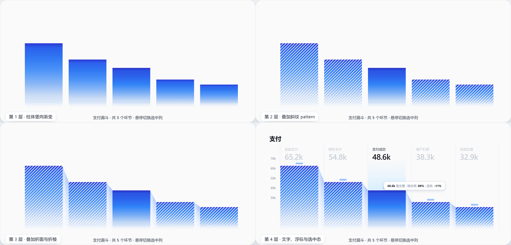

# sk-chart-duo 图表库

`sk-chart-duo` 是一个**轻量、SVG-first** 的图表库，主打手工打磨的视觉风格。零依赖、gzip **~8KB**，viewBox 设计空间任意容器宽度自适应，G2Plot 风格命令式 API（`new Chart(el, config)` + `update` / `resize` / `destroy` / `on`），TypeScript strict，几何与比例尺全部纯函数 + 单测覆盖。

<ChartVersion />



## 特性

<!--@include: ../node_modules/sk-chart-duo/README.md#features -->

## 安装

::: code-group

```bash
npm install sk-chart-duo
```

```bash
pnpm add sk-chart-duo
```

```bash
yarn add sk-chart-duo
```

:::

也可直接引入构建产物：`dist/index.js`（ESM）/ `dist/index.cjs`（CJS）/ `dist/index.d.ts`（类型）。

## 快速上手

首版提供 **FoldBarChart**：折纸漏斗柱状图——渐变柱体由"折面"相连，闲置列呈条纹纸感，高亮列浮起 wash 与 tooltip。

<!--@include: ../node_modules/sk-chart-duo/README.md#quickstart -->

## 在线体验

下面是一张**实时挂载**的真实 `FoldBarChart`（非图片）：可悬停/点击切换高亮列，用 `随机数据`/`还原` 体验 `update`，用 `深色主题` 切换内置 `theme` 预设，用 `导出 PNG` 触发 `download`。

<FoldBarDemo />

## 示例

以下每个案例都是**实时挂载**的真实 `FoldBarChart`（非截图），复用同一个 `<ChartPreview :config="..." />` 预览单元，只换 config 即可渲染不同图表。

<script setup>
const PAYMENTS = [
  { label: '发起支付', value: 65.2 },
  { label: '授权支付', value: 54.8 },
  { label: '支付成功', value: 48.6 },
  { label: '商户打款', value: 38.3 },
  { label: '完成交易', value: 32.9 }
]

const WEEK = [
  { label: '周一', value: 12.4 },
  { label: '周二', value: 18.2 },
  { label: '周三', value: 15.7 },
  { label: '周四', value: 24.9 },
  { label: '周五', value: 31.5 },
  { label: '周六', value: 27.8 },
  { label: '周日', value: 21.3 }
]

// 折痕自适应的最坏情况：首两列断崖落差（斜率约 6.6:1）
const SHARP_DROP = [
  { label: '发起支付', value: 65.2 },
  { label: '授权支付', value: 12.6 },
  { label: '支付成功', value: 9.4 },
  { label: '商户打款', value: 6.1 },
  { label: '完成交易', value: 3.8 }
]

// 反向：后一列比前一列高，验折痕反向起坡
const SPIKE_UP = [
  { label: '曝光', value: 6.0 },
  { label: '点击', value: 65.2 },
  { label: '加购', value: 48.6 },
  { label: '下单', value: 38.3 },
  { label: '成交', value: 32.9 }
]

// 转化率 tooltip：数值 + 相对上一列的环节转化率
const convFormatter = (d, i, data) => {
  const prev = i > 0 ? data[i - 1].value : null
  const conv = prev ? Math.round((d.value / prev) * 100) : 100
  return [
    { text: `${d.value.toFixed(1)}k`, tone: 'b' },
    { text: ' 笔交易', tone: 'n' },
    { text: '  |  ', tone: 's' },
    { text: '环节转化 ', tone: 'n' },
    { text: `${conv}%`, tone: 'b' }
  ]
}

// 底部语义行：阶段序号 + 环节转化率（返回数组则逐行渲染）
const stageLabels = (d, i, data) => {
  const prev = i > 0 ? data[i - 1].value : d.value
  const pct = prev > 0 ? Math.round((d.value / prev) * 100) : 0
  return [`第 ${i + 1} 阶段`, `${pct}%`]
}

// 青绿（teal）换肤：柱体渐变 / 折面 / pill 全部可换
const TEAL_ACTIVE = [[0, '#0E7A6C'], [0.42, '#17A38F'], [0.82, '#BDEBE2'], [1, '#EAFBF7']]
const TEAL_NORMAL = [[0, '#0F8A7A'], [0.42, '#27B39D'], [0.82, '#C8EFE7'], [1, '#EDFCF9']]
const TEAL_FOLD = [[0, '#8ADCD0'], [0.38, '#BDEAE2'], [1, '#F1FAF8']]
const TEAL_PILL = {
  gradient: [[0, '#F1FEFB'], [0.45, '#B5F0E4'], [1, '#34C4AC']],
  shadow: { color: '#2E8F7F', opacity: 0.75 }
}

const funnelCfg = { data: PAYMENTS, scale: { exponent: 2 }, state: { defaultActive: 2 }, title: { text: 'exponent: 2 —— 折纸漏斗轮廓' } }
const linearCfg = { data: PAYMENTS, scale: { exponent: 1 }, state: { defaultActive: 2 }, title: { text: 'exponent: 1 —— 线性高度' } }
const cleanCfg = { data: PAYMENTS, scale: { exponent: 1 }, title: { text: '普通柱状图（关闭装饰）' }, style: { stripePattern: { enabled: false }, pill: { enabled: false }, washEnabled: false, fadeMask: { enabled: false } } }
const tealCfg = { data: WEEK, title: { text: '一周活跃（自定义配色）' }, style: { barGradient: { active: TEAL_ACTIVE, normal: TEAL_NORMAL }, foldGradient: TEAL_FOLD, pill: TEAL_PILL } }
const axisCfg = { data: PAYMENTS, height: 430, scale: { exponent: 2 }, title: { text: '支付（含坐标轴）' }, tooltip: { formatter: convFormatter }, xAxis: { showLine: true, showTick: true, bottomLabels: stageLabels, title: { text: '支付阶段 →' } } }
const tooltipCfg = { data: PAYMENTS, scale: { exponent: 2 }, state: { defaultActive: 2 }, title: { text: '自定义 tooltip（环节转化率）' }, tooltip: { formatter: convFormatter } }
const darkCfg = { data: PAYMENTS, scale: { exponent: 2 }, state: { defaultActive: 2 }, title: { text: '暗色主题' }, theme: 'dark' }
const cliffCfg = { data: SHARP_DROP, scale: { exponent: 1 }, title: { text: '断崖落差 65.2 → 12.6' } }
const spikeCfg = { data: SPIKE_UP, scale: { exponent: 1 }, title: { text: '反向尖峰 6.0 → 65.2' } }
</script>

### 折纸轮廓与线性映射（`scale.exponent`）

同一组数据，`exponent` 决定柱高映射的幂次：`2` 还原折纸漏斗的加速收窄轮廓，`1` 是普通线性高度。

<ChartPreview :config="funnelCfg" />
<ChartPreview :config="linearCfg" />

```ts
{ scale: { exponent: 2 } } // 折纸漏斗轮廓（默认 1 = 线性）
```

### 大落差折痕自适应

折面水平跨度固定，相邻两列高差过大时直线折痕会被拉成近垂直的窄条。折痕按斜率 `Δy / fold.run` 自动弯成 S 形（斜率 ≤ 1 保持直线、≥ 4 完全成型），折面渐变区间同步收拢到折痕带。下面两张都是最坏情况：第一张正向断崖，第二张反向起坡。

<ChartPreview :config="cliffCfg" />
<ChartPreview :config="spikeCfg" />

```ts
{ data: SHARP_DROP, scale: { exponent: 1 } } // 用线性高度，把高差诚实暴露出来
```

### 普通柱状图（关闭装饰）

把 `style` 里的条纹 / pill / wash / 渐隐遮罩逐项 `enabled: false`，就得到一张干净的普通柱状图——同一套 API，既能做折纸风也能做常规风。

<ChartPreview :config="cleanCfg" />

```ts
{
  scale: { exponent: 1 },
  style: {
    stripePattern: { enabled: false },
    pill: { enabled: false },
    washEnabled: false,
    fadeMask: { enabled: false }
  }
}
```

### 自定义配色换肤（`style`）

柱体渐变（`barGradient.active` / `normal`）、折面渐变（`foldGradient`）、pill 与阴影全部可换，示例用青绿主题渲染一周活跃数据。

<ChartPreview :config="tealCfg" />

```ts
style: {
  barGradient: { active: TEAL_ACTIVE, normal: TEAL_NORMAL },
  foldGradient: TEAL_FOLD,
  pill: { gradient: TEAL_PILL_GRADIENT, shadow: { color: '#2E8F7F', opacity: 0.75 } }
}
```

### 完整坐标轴（`xAxis`）

`showLine` / `showTick` 打开柱底基线与列刻度，`bottomLabels` 在渐隐带下方渲染语义行（阶段序号 + 环节转化率），`title` 补一行轴标题。

<ChartPreview :config="axisCfg" />

```ts
{
  height: 430, // 给底部坐标轴带预留空间
  xAxis: {
    showLine: true,
    showTick: true,
    bottomLabels: (d, i, data) => [`第 ${i + 1} 阶段`, `${pct}%`],
    title: { text: '支付阶段 →' }
  }
}
```

### 自定义 tooltip（`tooltip.formatter`）

`formatter` 返回 `TooltipPart[]`，`tone` 用 `'b'`（加粗墨色）/ `'s'`（分隔符）/ `'n'`（常规）排版——悬停高亮列即显示数值与相对上一列的环节转化率。

<ChartPreview :config="tooltipCfg" />

```ts
tooltip: {
  formatter: (d, i, data) => {
    const prev = i > 0 ? data[i - 1].value : null
    const conv = prev ? Math.round((d.value / prev) * 100) : 100
    return [
      { text: `${d.value.toFixed(1)}k`, tone: 'b' },
      { text: ' 笔交易  |  环节转化 ', tone: 'n' },
      { text: `${conv}%`, tone: 'b' }
    ]
  }
}
```

### 暗色主题（`theme`）

`theme: 'dark'` 一键切到内置暗色预设（SVG 本身透明，这里给容器铺了深色底）。

<ChartPreview :config="darkCfg" dark />

```ts
{ theme: 'dark' } // 内置 light / dark 预设；也可传主题包名或内联 token
```

## API

<!--@include: ../node_modules/sk-chart-duo/README.md#api -->

## 相关链接

- 源码与示例：[KTBOY/sk-chart-duo](https://github.com/KTBOY/sk-chart-duo)
- npm 包：[sk-chart-duo](https://www.npmjs.com/package/sk-chart-duo)
